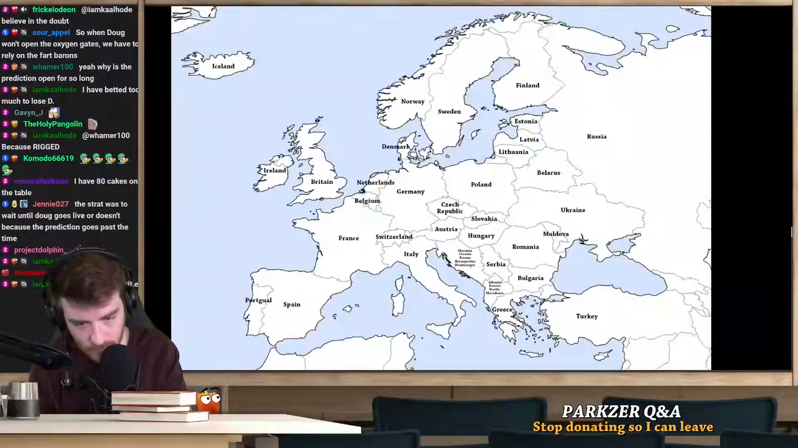
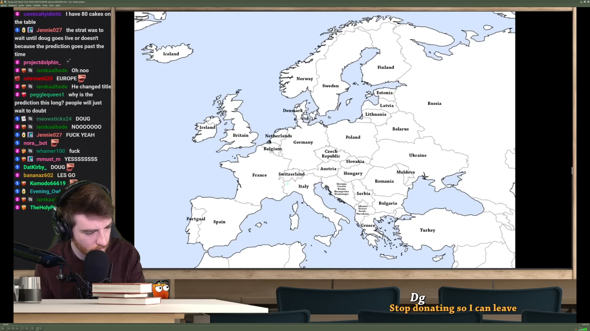

# 2026-01-12
## overall progress
- [ ] extracting frames 
- [ ] debugging issues with opencv for av1 issues

## extracting frames

After some success with the vlm extraction for a given frame, I now want to write a python function to get the next frame

From the first frame, I want to track the message `corneilluutrotic I have 80 cakes on the table` 

## debugging issues with opencv for av1 issues
While trying to do the frame extraction, I kept getting opencv import errors. When I fixed the import issues, it didn't work for av1 videos, and kept throwing `Your platform doesn't suppport hardware accelerated AV1 decoding` errors when ffmpeg had the video codecs.

I think I'll move on towards ffmpeg

