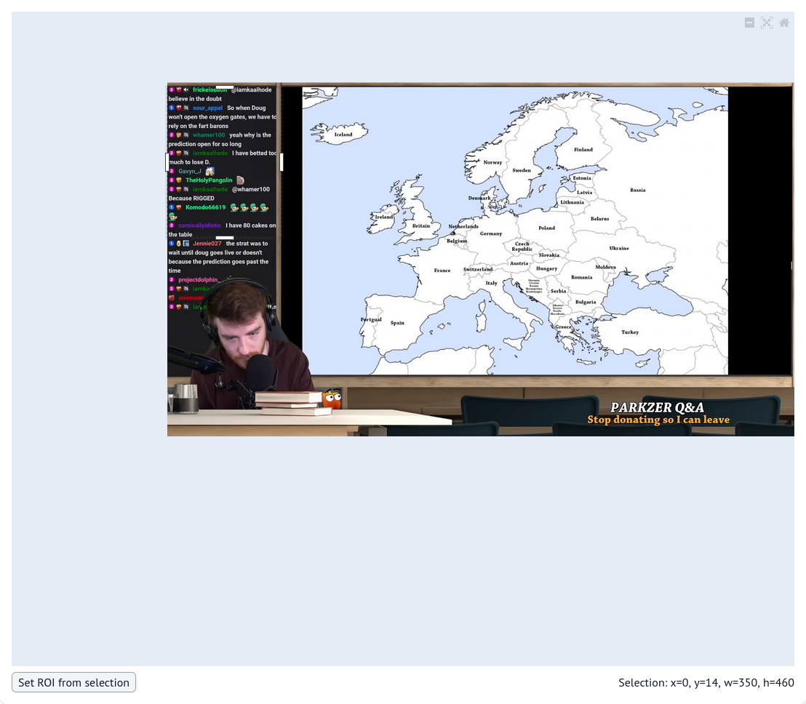
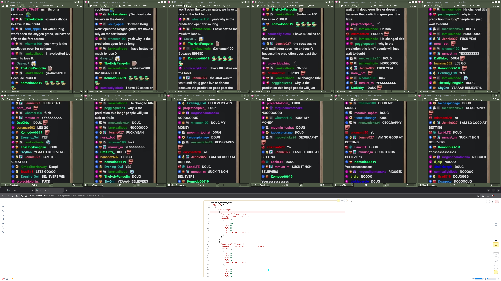

# 2026-01-18
## overall progress
- [ ] fixing an error with qwen vl extraction 
- [ ] exploring key frames

## fixing an error with qwen vl extraction
This works, but the username `comicallyidiotic` seems to be failing to extract


I didn't notice from the previous update I was impressed that qwen-vl managed to extract it
![[2026-01-06#investigating vlms]]

I suspect that the ffmpeg compression caused the issue, so I had chatgpt give me the ffmpeg command to get me the first frame
```sh
ffmpeg -ss 00:00:05.2 -i "Doug and Twitch Chat TAKE OVER EUROPE-VpmmuHlLPM0.mkv" -frames:v 1 frame.png
```


The output is 
<blockquote>
Based on the provided image, here are all the visible chat messages along with the usernames:

*   **frickelodeon @iamkaalhode**: believe in the doubt
*   **sour_appel**: So when Doug won't open the oxygen gates, we have to rely on the fart barons
*   **whamer100**: yeah why is the prediction open for so long
*   **iamkaalhode**: I have betted too much to lose D.
*   **Gavyn_J**: (No message text visible)
*   **TheHolyPangolin**: (No message text visible)
*   **iamkaalhode @whamer100**: Because RIGGED
*   **Komodo66619**: (No message text visible, only emojis)
*   **comedicallyidiotic**: I have 80 cakes on the table
*   **Jennie027**: the strat was to wait until doug goes live or doesn't because the prediction goes past the time
*   **projectdolphin**: (No message text visible)
*   **iamkaalhode**: (No message text visible)
*   **crismant**: (No message text visible)
*   **iar_k**: (No message text visible)

Note: The chat appears to be from a live stream or Twitch-like platform. The usernames are displayed next to their respective messages. Some messages are partially cut off or have no visible text. The bottom text "PARKZER Q&A Stop donating so I can leave" is not part of the chat but appears to be a stream overlay or banner.

</blockquote>

## exploring key frames
I was talking about this project to one of my IRL friends. They suggested I shouldn't get too hung up on extracting all chat messages, as it would digress me from getting my ultimate goal of making a twitch chat ai for ai invasion.  I still felt it was important for the dataset to have all chat messages and a function to extract it from video, as a compromise, I would investigate key frames.

I initially asked chatgpt
<blockquote>
### What a “keyframe” is (in Twitch/FFmpeg terms)

In compressed video, frames come in types:

* **I-frame (keyframe / intra)**: self-contained image. No other frames needed to decode it.
* **P-frame (predicted)**: stores changes relative to a previous frame (usually the last I/P).
* **B-frame (bi-predicted)**: stores changes relative to both previous *and* future reference frames.

So the stream is typically organized as a **GOP** (group of pictures), e.g.:

`I  B  B  P  B  B  P  ...  I  ...`

Keyframes (I-frames) are the “reset points” that enable random access and segmenting.

### Why Twitch cares about keyframe interval

For streaming, Twitch recommends a **keyframe interval of 2 seconds**. That’s primarily to support efficient segmenting (HLS/DASH), fast join/start, and quality switching. ([Twitch Help][1])

At 60 fps, “2 seconds” is typically **keyint ≈ 120** frames; at 30 fps, **keyint ≈ 60**.

### How keyframes help (and don’t help) when tracking Twitch chat in a video

#### 1) Keyframes help you **seek**

If you want “the frame at time T”, the decoder usually:

1. jumps to the **nearest previous keyframe**, then
2. decodes forward (P/B frames) until it reaches time **T**.

This is why short keyframe intervals make “grab frame at timestamp” faster. ([FFmpeg Trac][2])

#### 2) Keyframes do **not** line up with chat events

Chat messages arriving/scrolling are independent of the encoder’s keyframe placement (often fixed every N seconds, sometimes extra on scene changes). So “look only at keyframes” means you’re sampling the chat state every ~2 seconds (typical Twitch settings), which can easily miss:

* the exact moment a message appears,
* the exact moment it reaches a screen position,
* intermediate scroll states.

#### 3) You can’t reconstruct intermediate frames from keyframes alone

If your goal is pixel-accurate tracking (bounding boxes, motion, “when did this line cross Y=…?”), you need **decoded full frames** at a high enough cadence. P/B frames still become full images after decoding, but they **depend on references**, so you don’t get them “for free” without decoding.

### Practical patterns for chat tracking

#### Pattern A: Coarse scan on keyframes, then refine locally

1. Extract/inspect only keyframes to find the rough time window where the change occurs.
2. Decode **all frames** only within that window to pinpoint the exact frame.

This often gives the best speed/accuracy tradeoff.

FFmpeg examples:

* **List keyframe timestamps (ffprobe)**:

```bash
ffprobe -select_streams v:0 -show_frames \
  -show_entries frame=pkt_pts_time,key_frame,pict_type \
  -of csv input.mp4 | head
```

* **Extract only keyframes as images** (fast sampling):

```bash
ffmpeg -skip_frame nokey -i input.mp4 -vsync vfr -frame_pts true out-%d.jpg
```

(Techniques like this are commonly used for “I-frame only” extraction.) ([jdhao's digital space][3])

#### Pattern B: Make seeking cheap by re-encoding with shorter GOP (or all-I)

If you control the recording/transcode, you can make analysis easier:

* **Short GOP** (more keyframes) → faster random access and less “decode-from-last-keyframe” work.
* **All I-frames** → every frame is independently seekable (large files, but simplest for analysis).

Twitch’s live ingest recommendation remains ~2 seconds, but for *offline analysis* you can choose whatever helps your pipeline. ([Twitch Help][1])

### Rule of thumb for Twitch chat overlays

* If you just need “roughly when did the chat change?” → keyframes can be enough.
* If you need “exact frame when message crosses a line / becomes fully visible” → keyframes are only a starting index; you’ll still decode intervening frames to be accurate.

If you tell me whether you’re analyzing a VOD file, a local OBS recording, or captured HLS segments, I can suggest a concrete extraction strategy (seek pattern + ffmpeg filters) optimized for that format.

[1]: https://help.twitch.tv/s/article/broadcasting-guidelines?language=bg&utm_source=chatgpt.com "Broadcasting Guidelines"
[2]: https://trac.ffmpeg.org/wiki/Seeking?utm_source=chatgpt.com "Seeking – FFmpeg"
[3]: https://jdhao.github.io/2021/12/25/ffmpeg-extract-key-frame-video/?utm_source=chatgpt.com "How to Extract Key Frames from A Video with FFmpeg"

</blockquote>

Effectively someone has already thought about the issue of finding changes in video compression. Looking at the twitch subreddit reddit ["Whats Keyframe interval?"](https://old.reddit.com/r/Twitch/comments/5crtgk/whats_keyframe_interval/d9yxd2w/), someone quoted this reply [" Best Explanation how Keyframe Interval works?"](https://forum.videohelp.com/threads/371973-Best-Explanation-how-Keyframe-Interval-works#post2391592)
<blockquote>
Keyframes are frames that don't rely on data from other frames to be displayed fully, so they're the most expensive in respect to bitrate and the highest quality, although if the encoder is doing a good job you shouldn't be able to see a huge difference between keyframes and other types of frames.
Ever played a video where for a little bit blocks of the picture don't change from frame to frame, then suddenly the picture comes good? That'd be because some initial frames required data from other frames and the decoder wasn't getting it right, then you hit a keyframe which is a "standalone" frame and things goes back to normal.

By default, the x264 encoder sets the maximum keyframe interval to 250, which would be 10 seconds for 25fps video. Changing it to 240 for 24fps wouldn't be unusual. Some GUI's do it automatically to keep the maximum keyint (keyframe interval) setting to 10 seconds. For x264 the default minimum keyint is 25 or one second. The x264 encoder tends to be very good at detecting scene changes and puts a keyframe at the beginning of a scene. Having a minimum keyint stops it from using a bunch of keyframes in a row when it thinks each new frame is a new scene (it might happen if there's a strobing effect in the video). If the first frame of each scene is a keyframe chances are the maximum keyint of ten seconds won't be reached all that often. The x264 encoder handles it all very well and probably should be left at the default settings. I'm not really sure about other encoders and how clever they may or may not be in respect to keyframes, scene changes and keyframe interval, although the only Nvenc encode I've seen appeared to put keyframes in the logical places (at the beginning of scenes).

The Bluray spec requires a maximum keyframe interval of one second, so if you're encoding to create Bluray compliant video it might pay to change it to keyint 24 and minimum keyint 1, but other than that, what sort of keyframe options can you set? Anything you like? For a given quality smaller keyframe intervals will increase the biitrate. There's also a phenomenon called "keyframe pumping" where the quality is fine for a keyframe, then slowly deteriorates through the proceeding group of pictures, then suddenly improves again at the next keyframe and the cycle continues. That's another reason for an encoder to put keyframes at the beginning of scenes. If the quality changes at the same time as the scene, it's much less noticeable. For a decent encoder at decent bitrates though, keyframe pumping shouldn't be an issue no matter where the keyframes are. 
</blockquote>

I tried it out `keyframe extraction` section of the chat-extraction file. I started by having chatgpt generate code to use ffprobe to get the key frame stats. This was the first output
```json
{
  "input": "/home/bedhedd/Documents/development_projects/bedhedd_projects/dougpt/large-files/Doug and Twitch Chat TAKE OVER EUROPE-VpmmuHlLPM0.mkv",
  "stream": "v:0",
  "mode_used": "packets",
  "keyframes": 2920,
  "timestamps": [
    0.0,
    6.033,
    12.033,
    16.033,
    22.167,
    28.033,
    32.033,
    36.033,
    42.033,
    48.033,
    52.033,
    56.033,
    62.033,
    68.033,
    74.033,
    80.033,
    84.033,
    90.033,
    96.033,
    102.033,
    108.033,
    114.033,
    120.033,
    124.033,
    130.933,
    136.033,
    142.033,
    148.033,
    152.033,
    158.033,
    164.033,
    168.033,
    174.133,
    180.033,
    184.033,
    190.033,
    196.033,
    200.033,
    204.033,
    210.033,
    216.033,
    220.033,
    226.033,
    232.033,
    236.033,
    242.033,
    248.033,
    252.033,
    256.033,
    262.167,
    268.033,
    274.033,
    280.033,
    284.033,
    288.033,
    294.033,
    300.033,
    306.033,
    312.033,
    317.1,
    324.033,
    330.033,
    336.033,
    342.767,
    348.033,
    354.767,
    361.633,
    368.033,
    372.033,
    376.033,
    382.033,
    388.033,
    394.033,
    400.033,
    404.033,
    410.033,
    416.033,
    420.033,
    426.033,
    432.033,
    436.033,
    442.033,
    448.033,
    454.033,
    460.033,
    467.0,
    473.933,
    480.033,
    484.033,
    488.033,
    494.033,
    500.033,
    506.033,
    512.033,
    518.033,
    524.033,
    528.033,
    534.033,
    541.033,
    548.033,
    554.033,
    558.033,
    564.033,
    570.033,
    576.033,
    580.033,
    586.033,
    592.033,
    596.033,
    600.033,
    604.033,
    610.033,
    616.033,
    620.033,
    625.3,
    632.033,
    638.033,
    644.033,
    648.033,
    654.033,
    660.033,
    666.033,
    670.033,
    676.033,
    682.033,
    686.033,
    690.033,
    696.033,
    702.033,
    706.033,
    712.033,
    718.033,
    725.033,
    732.033,
    736.033,
    740.033,
    745.2,
    750.033,
    756.033,
    762.033,
    768.033,
    774.033,
    781.033,
    788.033,
    792.033,
    798.7,
    804.033,
    808.033,
    814.033,
    820.033,
    824.033,
    828.033,
    832.033,
    838.033,
    844.033,
    850.967,
    856.033,
    860.033,
    864.033,
    870.033,
    876.033,
    880.033,
    886.333,
    892.033,
    898.033,
    904.033,
    910.567,
    917.467,
    924.033,
    928.033,
    932.033,
    938.033,
    944.033,
    950.033,
    956.033,
    960.033,
    965.1,
    972.033,
    976.033,
    980.033,
    986.033,
    992.033,
    998.033,
    1004.033,
    1008.033,
    1012.033,
    1016.033,
    1022.967,
    1028.033,
    1032.033,
    1036.033,
    1042.433,
    1048.033,
    1054.033,
    1060.033,
    1064.733,
    1071.633,
    1077.1,
    1084.033,
    1090.4,
    1096.033,
    1100.033,
    1106.7,
    1111.533,
    1118.533,
    1125.167,
    1132.033,
    1137.233,
    1144.033,
    1149.367,
    1156.033,
    1160.033,
    1166.033,
    1172.033,
    1178.6,
    1184.033,
    1188.033,
    1192.033,
    1198.033,
    1204.033,
    1208.033,
    1214.033,
    1220.033,
    1226.033,
    1232.033,
    1236.033,
    1242.033,
    1248.033,
    1252.033,
    1258.033,
    1264.033,
    1268.033,
    1274.033,
    1281.033,
    1288.033,
    1292.9,
    1299.9,
    1306.033,
    1312.033,
    1318.033,
    1324.033,
    1330.033,
    1336.033,
    1340.033,
    1346.033,
    1352.033,
    1356.033,
    1362.033,
    1368.033,
    1372.033,
    1378.033,
    1384.033,
    1388.033,
    1395.0,
    1400.033,
    1404.033,
    1408.033,
    1414.033,
    1420.033,
    1425.233,
    1432.033,
    1438.433,
    1444.033,
    1450.933,
    1456.067,
    1462.033,
    1468.033,
    1474.033,
    1480.033,
    1484.033,
    1490.033,
    1496.033,
    1500.033,
    1504.033,
    1508.033,
    1514.4,
    1520.033,
    1526.033,
    1532.033,
    1536.033,
    1540.033,
    1546.033,
    1552.033,
    1558.6,
    1564.033,
    1570.033,
    1577.033,
    1584.033,
    1588.033,
    1592.7,
    1596.033,
    1602.033,
    1608.033,
    1614.033,
    1620.033,
    1624.033,
    1629.0,
    1632.033,
    1636.033,
    1640.033,
    1646.033,
    1652.033,
    1658.033,
    1664.033,
    1668.033,
    1674.033,
    1680.033,
    1686.033,
    1692.033,
    1696.033,
    1702.033,
    1708.033,
    1714.033,
    1721.033,
    1728.033,
    1733.733,
    1740.7,
    1744.033,
    1748.033,
    1754.7,
    1760.033,
    1766.033,
    1772.033,
    1778.7,
    1784.033,
    1788.033,
    1794.033,
    1800.033,
    1804.033,
    1809.133,
    1816.033,
    1820.033,
    1826.033,
    1832.033,
    1837.067,
    1844.033,
    1848.033,
    1852.033,
    1857.367,
    1864.033,
    1868.033,
    1872.033,
    1876.033,
    1882.033,
    1888.033,
    1894.033,
    1900.033,
    1904.033,
    1910.033,
    1914.033,
    1920.033,
    1926.033,
    1930.033,
    1936.033,
    1942.033,
    1949.033,
    1956.033,
    1962.033,
    1968.033,
    1972.033,
    1978.033,
    1984.033,
    1988.033,
    1994.033,
    2000.033,
    2004.033,
    2010.033,
    2016.033,
    2022.033,
    2028.033,
    2034.033,
    2040.033,
    2046.033,
    2049.3,
    2056.033,
    2062.433,
    2068.033,
    2074.967,
    2080.567,
    2084.033,
    2088.033,
    2094.033,
    2100.033,
    2106.467,
    2113.167,
    2120.033,
    2126.567,
    2131.933,
    2138.933,
    2144.033,
    2150.033,
    2156.033,
    2162.033,
    2168.033,
    2172.033,
    2176.033,
    2180.033,
    2186.433,
    2192.033,
    2196.033,
    2200.033,
    2204.033,
    2209.1,
    2216.033,
    2222.033,
    2228.033,
    2234.033,
    2240.033,
    2244.033,
    2250.033,
    2256.033,
    2262.033,
    2268.033,
    2272.033,
    2278.033,
    2284.033,
    2290.033,
    2296.033,
    2300.033,
    2306.033,
    2312.033,
    2316.033,
    2322.033,
    2328.033,
    2334.033,
    2340.033,
    2346.033,
    2352.033,
    2356.033,
    2360.033,
    2364.033,
    2370.033,
    2376.033,
    2382.033,
    2388.033,
    2392.033,
    2398.433,
    2404.033,
    2410.967,
    2416.033,
    2422.033,
    2428.033,
    2432.033,
    2436.3,
    2439.7,
    2444.9,
    2451.9,
    2458.033,
    2464.033,
    2469.367,
    2476.033,
    2480.033,
    2486.033,
    2492.033,
    2496.967,
    2503.933,
    2508.033,
    2511.267,
    2518.033,
    2524.033,
    2530.033,
    2536.033,
    2542.033,
    2548.033,
    2552.033,
    2556.033,
    2562.1,
    2569.067,
    2576.033,
    2583.033,
    2590.033,
    2596.033,
    2600.033,
    2604.033,
    2610.033,
    2616.033,
    2622.033,
    2628.033,
    2633.367,
    2640.033,
    2646.033,
    2652.033,
    2658.033,
    2664.033,
    2670.033,
    2676.033,
    2682.033,
    2688.033,
    2694.033,
    2700.033,
    2706.9,
    2713.7,
    2720.667,
    2724.367,
    2728.033,
    2734.033,
    2740.033,
    2744.033,
    2750.033,
    2756.033,
    2760.033,
    2764.033,
    2770.033,
    2776.033,
    2780.033,
    2786.033,
    2792.033,
    2798.033,
    2804.033,
    2810.033,
    2816.033,
    2822.033,
    2828.033,
    2832.033,
    2838.033,
    2844.033,
    2850.033,
    2856.033,
    2860.033,
    2866.767,
    2870.5,
    2876.033,
    2880.033,
    2886.033,
    2892.033,
    2896.033,
    2900.033,
    2906.033,
    2911.467,
    2917.067,
    2924.033,
    2928.033,
    2932.033,
    2936.033,
    2942.033,
    2948.033,
    2954.433,
    2960.033,
    2964.033,
    2970.033,
    2976.033,
    2982.033,
    2988.033,
    2992.067,
    2998.367,
    3004.033,
    3008.033,
    3014.033,
    3021.033,
    3028.033,
    3032.033,
    3036.033,
    3042.033,
    3048.033,
    3052.033,
    3058.033,
    3064.033,
    3070.033,
    3076.033,
    3082.033,
    3088.033,
    3092.033,
    3096.367,
    3101.733,
    3105.367,
    3112.033,
    3118.033,
    3124.033,
    3128.033,
    3134.033,
    3140.033,
    3146.033,
    3152.033,
    3158.033,
    3164.033,
    3170.033,
    3176.033,
    3180.033,
    3184.033,
    3190.033,
    3196.033,
    3200.033,
    3206.033,
    3212.033,
    3218.033,
    3223.8,
    3228.033,
    3232.033,
    3238.567,
    3244.033,
    3248.967,
    3254.033,
    3260.033,
    3266.033,
    3272.033,
    3276.033,
    3282.233,
    3288.033,
    3294.033,
    3297.867,
    3304.033,
    3308.033,
    3314.033,
    3321.033,
    3328.033,
    3334.033,
    3340.033,
    3345.8,
    3352.033,
    3358.033,
    3364.033,
    3370.033,
    3376.033,
    3380.033,
    3384.033,
    3390.033,
    3396.033,
    3402.033,
    3408.033,
    3414.033,
    3420.033,
    3426.033,
    3432.033,
    3436.033,
    3442.033,
    3448.033,
    3454.033,
    3460.033,
    3466.033,
    3472.033,
    3476.033,
    3482.033,
    3488.033,
    3493.6,
    3500.033,
    3504.033,
    3508.033,
    3514.033,
    3520.033,
    3526.033,
    3532.033,
    3538.7,
    3544.033,
    3550.033,
    3556.033,
    3562.033,
    3568.033,
    3574.033,
    3580.033,
    3586.033,
    3592.033,
    3595.433,
    3602.333,
    3608.033,
    3612.033,
    3618.367,
    3624.033,
    3629.367,
    3636.333,
    3641.167,
    3648.033,
    3652.033,
    3657.467,
    3664.033,
    3668.033,
    3674.7,
    3681.467,
    3688.033,
    3694.467,
    3700.033,
    3704.033,
    3709.6,
    3716.033,
    3722.033,
    3728.033,
    3732.033,
    3738.033,
    3744.033,
    3748.033,
    3754.433,
    3760.033,
    3766.033,
    3772.033,
    3778.033,
    3784.033,
    3788.033,
    3794.167,
    3800.033,
    3806.033,
    3812.033,
    3816.033,
    3822.033,
    3828.033,
    3832.033,
    3836.033,
    3841.5,
    3848.033,
    3854.033,
    3860.033,
    3864.033,
    3870.033,
    3876.033,
    3880.033,
    3886.033,
    3892.033,
    3898.033,
    3904.033,
    3910.033,
    3916.033,
    3922.033,
    3928.033,
    3932.033,
    3936.033,
    3940.033,
    3946.033,
    3952.033,
    3956.033,
    3962.033,
    3968.033,
    3974.033,
    3980.033,
    3986.033,
    3992.033,
    3998.967,
    4004.033,
    4008.033,
    4014.033,
    4020.033,
    4024.033,
    4030.033,
    4036.033,
    4042.033,
    4048.033,
    4054.033,
    4060.033,
    4064.033,
    4070.033,
    4076.033,
    4082.033,
    4088.033,
    4092.033,
    4098.033,
    4104.033,
    4108.033,
    4114.033,
    4120.033,
    4124.033,
    4130.033,
    4136.033,
    4142.033,
    4148.033,
    4152.033,
    4158.033,
    4164.033,
    4169.2,
    4174.033,
    4180.033,
    4184.033,
    4188.033,
    4194.033,
    4200.033,
    4204.033,
    4210.033,
    4216.033,
    4220.033,
    4224.033,
    4230.033,
    4236.033,
    4242.033,
    4248.033,
    4251.067,
    4258.033,
    4261.3,
    4268.033,
    4272.033,
    4278.033,
    4284.033,
    4290.033,
    4295.867,
    4300.033,
    4304.033,
    4310.033,
    4316.4,
    4323.267,
    4328.033,
    4334.7,
    4338.033,
    4344.033,
    4350.033,
    4357.033,
    4364.033,
    4368.033,
    4372.033,
    4376.033,
    4382.033,
    4388.033,
    4392.033,
    4398.033,
    4404.033,
    4410.033,
    4416.033,
    4420.033,
    4426.033,
    4432.033,
    4436.033,
    4440.033,
    4444.033,
    4450.033,
    4456.033,
    4462.033,
    4468.033,
    4474.033,
    4480.033,
    4484.033,
    4488.033,
    4494.033,
    4500.033,
    4504.033,
    4510.033,
    4516.033,
    4522.033,
    4528.033,
    4532.033,
    4538.033,
    4544.033,
    4550.033,
    4556.033,
    4562.733,
    4569.733,
    4576.033,
    4582.033,
    4588.033,
    4592.033,
    4596.033,
    4602.7,
    4606.033,
    4612.033,
    4616.033,
    4620.033,
    4624.033,
    4630.033,
    4636.033,
    4642.033,
    4648.033,
    4652.033,
    4658.033,
    4664.033,
    4670.033,
    4676.033,
    4680.033,
    4684.033,
    4689.367,
    4696.033,
    4702.267,
    4709.267,
    4714.033,
    4717.567,
    4724.567,
    4730.033,
    4736.033,
    4742.033,
    4748.033,
    4754.9,
    4759.833,
    4762.867,
    4768.033,
    4774.033,
    4780.033,
    4786.1,
    4792.033,
    4798.033,
    4804.033,
    4808.033,
    4812.033,
    4818.333,
    4824.033,
    4828.033,
    4834.033,
    4840.033,
    4846.033,
    4852.033,
    4856.033,
    4862.033,
    4868.033,
    4872.033,
    4878.4,
    4884.033,
    4888.033,
    4892.033,
    4898.033,
    4904.033,
    4908.033,
    4914.033,
    4920.033,
    4924.033,
    4928.033,
    4933.1,
    4940.033,
    4944.033,
    4950.033,
    4956.033,
    4962.033,
    4968.033,
    4972.033,
    4976.033,
    4980.033,
    4986.033,
    4992.033,
    4998.033,
    5004.033,
    5008.033,
    5012.033,
    5016.033,
    5022.033,
    5029.033,
    5036.033,
    5040.033,
    5044.033,
    5050.3,
    5056.033,
    5062.233,
    5069.2,
    5076.033,
    5080.033,
    5084.033,
    5088.833,
    5094.167,
    5100.033,
    5106.7,
    5112.033,
    5117.1,
    5124.033,
    5128.033,
    5133.533,
    5140.033,
    5144.033,
    5150.033,
    5156.033,
    5160.133,
    5164.767,
    5168.033,
    5174.033,
    5180.033,
    5186.033,
    5192.033,
    5198.033,
    5204.033,
    5210.033,
    5216.033,
    5222.033,
    5228.033,
    5232.033,
    5238.033,
    5244.033,
    5248.033,
    5254.033,
    5260.033,
    5266.033,
    5272.033,
    5276.033,
    5282.033,
    5286.033,
    5292.033,
    5298.033,
    5304.033,
    5310.033,
    5316.033,
    5322.033,
    5328.033,
    5332.033,
    5336.033,
    5342.667,
    5348.033,
    5352.033,
    5356.033,
    5360.033,
    5366.033,
    5372.033,
    5376.033,
    5382.033,
    5388.033,
    5394.033,
    5400.033,
    5404.033,
    5410.033,
    5414.7,
    5420.2,
    5427.2,
    5433.7,
    5437.1,
    5444.033,
    5448.033,
    5454.033,
    5460.7,
    5466.333,
    5472.033,
    5476.033,
    5482.033,
    5488.033,
    5492.033,
    5496.033,
    5500.033,
    5505.133,
    5512.033,
    5518.033,
    5524.033,
    5528.033,
    5532.033,
    5536.033,
    5542.033,
    5548.033,
    5554.033,
    5561.033,
    5568.033,
    5574.033,
    5580.033,
    5584.033,
    5588.033,
    5594.033,
    5600.033,
    5606.033,
    5612.033,
    5618.033,
    5624.033,
    5628.033,
    5634.033,
    5640.033,
    5644.033,
    5650.033,
    5656.033,
    5662.033,
    5668.033,
    5674.033,
    5680.033,
    5686.033,
    5692.033,
    5698.033,
    5704.033,
    5708.033,
    5714.033,
    5720.033,
    5726.333,
    5732.033,
    5738.033,
    5744.033,
    5748.033,
    5754.333,
    5761.167,
    5768.033,
    5771.867,
    5777.267,
    5784.033,
    5790.033,
    5796.033,
    5802.033,
    5808.033,
    5813.6,
    5820.033,
    5824.033,
    5830.033,
    5836.733,
    5843.733,
    5848.033,
    5853.633,
    5860.033,
    5866.4,
    5872.033,
    5876.033,
    5881.367,
    5888.033,
    5892.033,
    5896.333,
    5903.333,
    5910.033,
    5916.033,
    5923.0,
    5928.033,
    5934.033,
    5941.033,
    5948.033,
    5954.033,
    5960.033,
    5963.067,
    5968.033,
    5974.433,
    5980.033,
    5984.033,
    5988.033,
    5992.033,
    5998.033,
    6004.033,
    6009.9,
    6015.633,
    6020.033,
    6023.533,
    6027.067,
    6034.033,
    6041.033,
    6048.033,
    6054.033,
    6060.033,
    6064.033,
    6070.033,
    6076.033,
    6080.033,
    6084.033,
    6090.067,
    6096.033,
    6100.033,
    6104.033,
    6110.033,
    6116.967,
    6123.933,
    6130.7,
    6136.033,
    6142.033,
    6148.033,
    6154.033,
    6160.033,
    6164.033,
    6168.033,
    6174.033,
    6180.033,
    6186.033,
    6192.033,
    6198.033,
    6204.033,
    6208.033,
    6214.033,
    6220.033,
    6224.033,
    6228.033,
    6234.033,
    6240.033,
    6246.033,
    6252.033,
    6256.033,
    6261.067,
    6268.033,
    6274.033,
    6280.033,
    6284.033,
    6288.033,
    6294.033,
    6300.033,
    6304.033,
    6310.033,
    6316.033,
    6320.033,
    6326.7,
    6332.033,
    6338.033,
    6344.033,
    6350.833,
    6357.667,
    6361.367,
    6368.033,
    6372.367,
    6376.633,
    6381.1,
    6388.033,
    6394.033,
    6400.033,
    6406.033,
    6412.033,
    6418.033,
    6424.033,
    6430.033,
    6436.033,
    6441.5,
    6446.167,
    6452.033,
    6458.033,
    6464.033,
    6468.033,
    6472.033,
    6476.033,
    6480.033,
    6486.033,
    6492.033,
    6498.033,
    6504.033,
    6508.033,
    6514.033,
    6520.033,
    6524.033,
    6528.033,
    6533.367,
    6540.033,
    6547.033,
    6554.033,
    6560.033,
    6564.033,
    6569.433,
    6575.133,
    6580.567,
    6586.033,
    6592.033,
    6598.033,
    6604.033,
    6608.033,
    6614.033,
    6618.033,
    6624.033,
    6628.033,
    6634.033,
    6640.033,
    6644.033,
    6650.033,
    6656.767,
    6660.033,
    6664.967,
    6671.7,
    6678.7,
    6684.033,
    6688.033,
    6692.033,
    6696.033,
    6700.033,
    6705.333,
    6712.033,
    6716.033,
    6720.033,
    6724.033,
    6728.033,
    6732.033,
    6738.033,
    6744.033,
    6750.033,
    6755.7,
    6760.033,
    6764.033,
    6768.033,
    6772.033,
    6776.033,
    6780.033,
    6786.033,
    6792.033,
    6796.033,
    6802.033,
    6808.033,
    6812.033,
    6818.267,
    6823.167,
    6829.9,
    6834.8,
    6837.833,
    6844.833,
    6849.0,
    6854.033,
    6860.033,
    6863.033,
    6870.033,
    6876.033,
    6880.033,
    6886.033,
    6892.033,
    6896.033,
    6902.033,
    6908.033,
    6912.033,
    6916.033,
    6922.033,
    6928.033,
    6934.033,
    6940.033,
    6946.033,
    6951.1,
    6957.9,
    6964.033,
    6968.033,
    6973.133,
    6977.3,
    6981.5,
    6988.033,
    6994.033,
    7000.033,
    7006.033,
    7012.033,
    7018.033,
    7024.033,
    7028.033,
    7032.033,
    7036.033,
    7042.033,
    7048.033,
    7052.033,
    7058.033,
    7064.033,
    7068.033,
    7073.667,
    7079.0,
    7084.033,
    7088.033,
    7092.033,
    7098.033,
    7104.033,
    7108.033,
    7113.633,
    7120.033,
    7126.033,
    7132.033,
    7138.033,
    7144.033,
    7150.033,
    7156.033,
    7160.033,
    7164.033,
    7168.033,
    7172.033,
    7176.033,
    7182.033,
    7188.033,
    7192.033,
    7198.033,
    7204.033,
    7210.033,
    7216.033,
    7220.033,
    7224.033,
    7230.133,
    7236.033,
    7240.033,
    7244.033,
    7249.1,
    7256.033,
    7260.033,
    7264.033,
    7268.033,
    7274.033,
    7280.033,
    7284.033,
    7288.033,
    7294.033,
    7300.033,
    7304.033,
    7310.033,
    7316.033,
    7320.033,
    7324.033,
    7330.033,
    7336.033,
    7340.033,
    7346.7,
    7352.033,
    7358.033,
    7364.033,
    7370.033,
    7376.033,
    7382.033,
    7388.033,
    7392.033,
    7396.033,
    7402.033,
    7408.033,
    7412.033,
    7416.033,
    7420.033,
    7424.033,
    7430.033,
    7436.033,
    7440.033,
    7446.033,
    7452.033,
    7456.033,
    7460.033,
    7466.033,
    7472.033,
    7476.033,
    7482.433,
    7489.433,
    7496.033,
    7503.033,
    7508.033,
    7514.033,
    7520.033,
    7526.233,
    7532.033,
    7536.033,
    7542.033,
    7548.033,
    7554.033,
    7560.033,
    7564.033,
    7570.033,
    7576.033,
    7581.133,
    7588.033,
    7592.033,
    7596.033,
    7602.033,
    7608.033,
    7612.033,
    7618.033,
    7624.033,
    7628.033,
    7632.033,
    7636.033,
    7642.467,
    7648.033,
    7654.033,
    7660.033,
    7666.033,
    7672.467,
    7678.033,
    7684.033,
    7690.033,
    7696.033,
    7702.033,
    7708.033,
    7712.033,
    7718.033,
    7724.033,
    7728.033,
    7732.033,
    7738.033,
    7744.033,
    7748.033,
    7754.033,
    7760.033,
    7764.033,
    7770.033,
    7776.033,
    7780.033,
    7786.033,
    7792.033,
    7798.033,
    7804.033,
    7810.033,
    7816.033,
    7822.033,
    7828.033,
    7834.033,
    7840.033,
    7844.033,
    7848.033,
    7854.033,
    7860.033,
    7864.033,
    7870.033,
    7876.033,
    7882.033,
    7886.233,
    7889.533,
    7896.033,
    7900.033,
    7904.033,
    7908.033,
    7912.033,
    7918.033,
    7924.033,
    7930.033,
    7937.033,
    7944.033,
    7950.033,
    7956.6,
    7960.033,
    7964.933,
    7971.933,
    7976.033,
    7980.033,
    7985.667,
    7992.033,
    7996.033,
    8000.133,
    8007.133,
    8012.033,
    8018.033,
    8024.033,
    8028.033,
    8032.033,
    8038.033,
    8044.033,
    8050.033,
    8056.033,
    8060.033,
    8066.033,
    8072.033,
    8076.033,
    8082.033,
    8088.033,
    8092.033,
    8098.033,
    8104.033,
    8110.033,
    8116.033,
    8120.033,
    8124.033,
    8128.033,
    8134.033,
    8140.033,
    8144.033,
    8148.033,
    8154.033,
    8160.033,
    8166.033,
    8172.033,
    8178.8,
    8185.667,
    8192.033,
    8197.433,
    8204.033,
    8208.033,
    8212.033,
    8218.467,
    8224.033,
    8230.033,
    8236.033,
    8242.367,
    8249.267,
    8256.033,
    8262.467,
    8268.033,
    8272.033,
    8276.033,
    8280.033,
    8285.333,
    8292.033,
    8298.9,
    8305.1,
    8312.033,
    8318.033,
    8324.3,
    8330.033,
    8336.033,
    8340.033,
    8346.033,
    8352.033,
    8358.033,
    8365.033,
    8372.033,
    8376.033,
    8382.033,
    8388.033,
    8394.033,
    8400.033,
    8404.033,
    8409.0,
    8412.033,
    8418.033,
    8424.033,
    8428.033,
    8434.033,
    8440.033,
    8444.867,
    8451.767,
    8458.033,
    8463.233,
    8468.033,
    8474.033,
    8480.033,
    8484.033,
    8488.033,
    8494.033,
    8500.033,
    8506.033,
    8512.033,
    8518.033,
    8524.033,
    8530.033,
    8536.033,
    8542.033,
    8548.033,
    8554.033,
    8560.033,
    8564.033,
    8570.033,
    8576.033,
    8582.033,
    8588.033,
    8592.033,
    8596.033,
    8600.033,
    8604.033,
    8610.033,
    8616.033,
    8620.033,
    8626.033,
    8632.033,
    8636.033,
    8642.033,
    8649.033,
    8656.033,
    8662.033,
    8668.033,
    8672.033,
    8676.033,
    8682.033,
    8688.033,
    8692.033,
    8696.033,
    8702.033,
    8708.033,
    8714.033,
    8720.033,
    8726.033,
    8732.033,
    8736.033,
    8740.033,
    8746.033,
    8752.033,
    8756.033,
    8762.1,
    8769.1,
    8774.8,
    8777.833,
    8784.8,
    8788.033,
    8794.033,
    8800.033,
    8805.367,
    8812.033,
    8816.033,
    8820.033,
    8824.033,
    8830.033,
    8836.033,
    8842.767,
    8849.767,
    8854.033,
    8857.767,
    8864.033,
    8870.033,
    8876.033,
    8880.033,
    8886.033,
    8891.6,
    8898.6,
    8904.033,
    8910.033,
    8916.033,
    8922.033,
    8928.033,
    8932.033,
    8938.033,
    8944.033,
    8948.033,
    8952.033,
    8958.033,
    8964.033,
    8970.033,
    8976.033,
    8982.033,
    8988.033,
    8994.033,
    9000.033,
    9006.033,
    9012.033,
    9016.033,
    9022.033,
    9028.033,
    9032.033,
    9038.033,
    9044.033,
    9048.033,
    9052.033,
    9058.033,
    9064.033,
    9068.033,
    9074.033,
    9080.033,
    9084.033,
    9090.033,
    9096.033,
    9100.033,
    9104.033,
    9110.533,
    9117.533,
    9124.033,
    9128.033,
    9134.033,
    9140.033,
    9144.033,
    9148.033,
    9154.033,
    9160.033,
    9164.033,
    9168.033,
    9174.033,
    9180.033,
    9186.033,
    9192.033,
    9196.033,
    9202.033,
    9208.033,
    9214.033,
    9220.033,
    9226.033,
    9232.033,
    9238.033,
    9244.033,
    9250.033,
    9256.033,
    9262.033,
    9268.033,
    9274.033,
    9280.033,
    9284.033,
    9288.033,
    9292.033,
    9298.033,
    9304.033,
    9308.033,
    9312.033,
    9318.033,
    9324.033,
    9328.033,
    9332.033,
    9338.033,
    9344.033,
    9348.033,
    9354.033,
    9360.033,
    9364.033,
    9368.033,
    9374.033,
    9380.033,
    9386.033,
    9392.033,
    9396.033,
    9400.033,
    9404.033,
    9410.033,
    9416.033,
    9422.067,
    9425.467,
    9432.033,
    9438.033,
    9444.833,
    9451.833,
    9456.033,
    9460.033,
    9466.133,
    9470.1,
    9474.033,
    9478.833,
    9482.2,
    9489.167,
    9496.033,
    9500.033,
    9505.3,
    9512.033,
    9518.033,
    9524.7,
    9531.3,
    9538.033,
    9544.567,
    9550.1,
    9557.1,
    9564.033,
    9568.033,
    9572.033,
    9577.333,
    9584.033,
    9590.033,
    9596.033,
    9602.033,
    9608.033,
    9614.033,
    9620.033,
    9624.033,
    9628.033,
    9634.033,
    9640.033,
    9646.033,
    9652.033,
    9656.033,
    9662.4,
    9668.033,
    9672.333,
    9677.567,
    9684.567,
    9688.033,
    9694.033,
    9700.033,
    9706.7,
    9712.033,
    9716.033,
    9722.033,
    9728.033,
    9732.033,
    9736.033,
    9742.033,
    9748.033,
    9754.033,
    9760.033,
    9764.033,
    9768.033,
    9774.033,
    9780.033,
    9785.6,
    9791.7,
    9798.7,
    9802.033,
    9807.467,
    9811.7,
    9818.633,
    9824.033,
    9830.033,
    9836.033,
    9840.033,
    9844.033,
    9850.033,
    9856.033,
    9862.767,
    9868.033,
    9872.033,
    9876.033,
    9882.033,
    9888.033,
    9894.033,
    9900.033,
    9904.033,
    9910.433,
    9917.3,
    9924.033,
    9930.033,
    9936.033,
    9940.033,
    9946.7,
    9952.033,
    9956.033,
    9962.033,
    9969.033,
    9976.033,
    9980.033,
    9986.033,
    9992.033,
    9998.033,
    10004.033,
    10008.033,
    10012.033,
    10018.667,
    10024.033,
    10030.033,
    10036.033,
    10042.033,
    10048.033,
    10054.033,
    10060.033,
    10064.033,
    10070.033,
    10076.033,
    10080.033,
    10086.033,
    10092.033,
    10098.033,
    10104.033,
    10110.033,
    10117.033,
    10124.033,
    10128.033,
    10132.033,
    10138.033,
    10143.733,
    10148.033,
    10152.033,
    10156.033,
    10162.033,
    10168.033,
    10174.433,
    10180.567,
    10183.567,
    10187.433,
    10194.033,
    10200.033,
    10204.033,
    10207.2,
    10214.033,
    10220.033,
    10226.033,
    10232.033,
    10238.033,
    10244.033,
    10249.2,
    10256.033,
    10260.033,
    10266.967,
    10271.3,
    10278.167,
    10282.9,
    10288.033,
    10294.033,
    10300.033,
    10306.267,
    10312.033,
    10318.033,
    10324.033,
    10330.033,
    10336.033,
    10340.033,
    10346.033,
    10352.033,
    10356.033,
    10362.033,
    10368.033,
    10374.033,
    10380.033,
    10384.033,
    10388.033,
    10394.033,
    10400.033,
    10404.033,
    10410.033,
    10416.033,
    10420.033,
    10426.033,
    10432.033,
    10438.033,
    10444.033,
    10450.033,
    10456.033,
    10462.033,
    10468.033,
    10472.033,
    10478.033,
    10484.033,
    10490.033,
    10496.033,
    10500.033,
    10504.033,
    10510.033,
    10516.033,
    10520.033,
    10526.033,
    10532.033,
    10538.033,
    10544.033,
    10548.033,
    10553.367,
    10560.033,
    10566.433,
    10572.033,
    10577.6,
    10584.033,
    10588.433,
    10592.033,
    10596.033,
    10600.033,
    10604.033,
    10611.0,
    10617.367,
    10624.033,
    10630.033,
    10636.033,
    10640.033,
    10646.033,
    10652.033,
    10658.033,
    10664.033,
    10670.033,
    10676.033,
    10680.033,
    10686.033,
    10692.033,
    10696.033,
    10700.033,
    10706.033,
    10712.033,
    10718.033,
    10724.033,
    10730.033,
    10736.033,
    10742.033,
    10748.033,
    10752.033,
    10756.033,
    10762.033,
    10768.033,
    10774.033,
    10780.033,
    10784.033,
    10789.367,
    10796.033,
    10800.033,
    10806.033,
    10812.033,
    10816.033,
    10822.333,
    10828.033,
    10832.033,
    10836.033,
    10842.033,
    10848.033,
    10852.033,
    10856.033,
    10862.033,
    10868.033,
    10874.033,
    10880.033,
    10884.033,
    10888.033,
    10894.967,
    10900.033,
    10906.033,
    10912.033,
    10918.033,
    10924.033,
    10928.033,
    10932.033,
    10936.033,
    10942.033,
    10948.033,
    10954.033,
    10960.033,
    10964.033,
    10968.033,
    10974.033,
    10980.033,
    10986.033,
    10992.033,
    10998.4,
    11004.033,
    11008.033,
    11014.6,
    11020.033,
    11026.033,
    11032.033,
    11038.033,
    11044.033,
    11048.033,
    11052.033,
    11058.033,
    11064.033,
    11068.033,
    11074.033,
    11080.033,
    11086.033,
    11092.033,
    11096.033,
    11100.033,
    11104.033,
    11108.033,
    11114.033,
    11120.033,
    11124.033,
    11130.333,
    11136.9,
    11143.9,
    11148.033,
    11151.233,
    11156.033,
    11160.267,
    11167.167,
    11174.167,
    11180.567,
    11187.4,
    11194.033,
    11200.367,
    11207.367,
    11212.033,
    11216.033,
    11222.7,
    11228.033,
    11232.033,
    11238.033,
    11244.033,
    11250.033,
    11256.033,
    11262.033,
    11268.033,
    11274.033,
    11280.033,
    11284.033,
    11288.033,
    11294.4,
    11300.033,
    11306.033,
    11312.033,
    11318.033,
    11324.033,
    11330.033,
    11336.033,
    11342.033,
    11348.033,
    11354.033,
    11360.033,
    11364.033,
    11368.033,
    11374.033,
    11380.033,
    11384.033,
    11388.033,
    11392.033,
    11396.033,
    11402.033,
    11408.033,
    11414.033,
    11420.033,
    11426.667,
    11432.7,
    11438.033,
    11444.033,
    11450.033,
    11456.033,
    11460.033,
    11465.9,
    11472.033,
    11478.033,
    11484.4,
    11490.033,
    11496.033,
    11500.033,
    11504.033,
    11510.267,
    11516.033,
    11521.7,
    11528.033,
    11532.033,
    11538.033,
    11542.2,
    11548.033,
    11554.433,
    11561.333,
    11566.033,
    11570.933,
    11576.033,
    11581.9,
    11588.033,
    11592.033,
    11596.033,
    11600.033,
    11606.033,
    11612.033,
    11616.033,
    11620.033,
    11624.033,
    11628.033,
    11632.033,
    11638.8,
    11644.033,
    11650.033,
    11656.033,
    11662.033,
    11665.467,
    11672.033,
    11676.033,
    11680.033,
    11686.033,
    11692.033,
    11695.8,
    11701.667,
    11708.033,
    11712.033,
    11716.033,
    11722.433,
    11728.033,
    11732.033,
    11736.033,
    11742.033,
    11748.033,
    11754.733,
    11761.167,
    11765.9,
    11772.033,
    11776.033,
    11782.467,
    11788.033,
    11792.033,
    11796.033,
    11802.033,
    11808.033,
    11812.033,
    11816.033,
    11822.033,
    11828.033,
    11832.033,
    11836.033,
    11842.033,
    11848.433,
    11852.033,
    11856.033,
    11862.033,
    11868.033,
    11874.033,
    11880.033,
    11886.033,
    11892.033,
    11898.033,
    11904.033,
    11910.433,
    11916.033,
    11920.033,
    11926.033,
    11932.033,
    11938.033,
    11944.033,
    11950.033,
    11956.033,
    11960.033,
    11966.033,
    11972.033,
    11978.033,
    11984.033,
    11988.033,
    11994.033,
    12000.033,
    12006.7,
    12012.033,
    12016.033,
    12022.033,
    12028.033,
    12034.033,
    12040.033,
    12044.033,
    12048.033,
    12054.033,
    12060.033,
    12064.033,
    12070.033,
    12076.033,
    12080.033,
    12084.033,
    12090.033,
    12096.033,
    12100.033,
    12106.033,
    12112.033,
    12116.033,
    12120.033,
    12126.033,
    12132.033,
    12138.033,
    12144.033,
    12150.033,
    12156.033,
    12162.033,
    12168.033,
    12172.033,
    12178.033,
    12184.033,
    12188.033,
    12192.033,
    12198.033,
    12204.033,
    12208.033,
    12212.033,
    12216.033,
    12222.033,
    12228.033,
    12234.033,
    12240.033,
    12246.033,
    12252.033,
    12256.033,
    12261.267,
    12268.033,
    12274.033,
    12280.033,
    12286.033,
    12292.033,
    12296.033,
    12302.033,
    12308.033,
    12312.033,
    12316.033,
    12322.033,
    12328.033,
    12332.033,
    12338.7,
    12345.267,
    12351.4,
    12356.033,
    12360.033,
    12364.033,
    12368.567,
    12375.567,
    12382.033,
    12388.033,
    12392.033,
    12395.3,
    12400.033,
    12406.367,
    12412.167,
    12419.167,
    12424.033,
    12428.033,
    12434.033,
    12439.8,
    12446.7,
    12452.033,
    12455.8,
    12462.8,
    12468.033,
    12472.033,
    12476.033,
    12482.033,
    12488.033,
    12492.033,
    12498.033,
    12504.033,
    12508.033,
    12514.033,
    12520.033,
    12526.033,
    12532.033,
    12538.033,
    12544.033,
    12550.033,
    12556.033,
    12560.033,
    12566.033,
    12572.033,
    12578.033,
    12584.033,
    12590.033,
    12596.033,
    12600.033,
    12606.033,
    12612.033,
    12616.033,
    12622.167,
    12628.033,
    12633.633,
    12640.033,
    12646.033,
    12652.033,
    12656.033,
    12662.033,
    12668.033,
    12672.033,
    12678.033,
    12684.033,
    12688.033,
    12694.033,
    12700.033,
    12704.033,
    12708.033,
    12714.033,
    12720.033,
    12726.033,
    12732.033,
    12736.033,
    12742.033,
    12748.033,
    12752.033,
    12756.033,
    12762.033,
    12768.033,
    12772.033,
    12778.033,
    12784.033,
    12789.967,
    12796.033,
    12802.033,
    12808.033,
    12814.667,
    12820.9,
    12824.033,
    12828.033,
    12832.667,
    12839.667,
    12844.033,
    12849.467,
    12856.033,
    12860.033,
    12866.667,
    12873.067,
    12878.033,
    12884.033,
    12890.433,
    12896.033,
    12900.033,
    12904.033,
    12910.033,
    12916.033,
    12922.033,
    12928.033,
    12934.033,
    12941.033,
    12948.033,
    12952.033,
    12956.033,
    12962.033,
    12968.033,
    12974.033,
    12979.433,
    12986.033,
    12992.033,
    12996.033,
    13002.033,
    13008.033,
    13012.033,
    13016.033,
    13022.033,
    13028.033,
    13032.033,
    13036.033,
    13042.033,
    13048.033,
    13052.033,
    13058.033,
    13064.033,
    13070.033,
    13076.033,
    13080.033,
    13086.033,
    13092.033,
    13096.033,
    13102.033,
    13108.033,
    13114.8,
    13118.6,
    13124.033,
    13128.033,
    13133.367,
    13140.033,
    13144.033,
    13150.033,
    13156.033,
    13162.167,
    13168.033,
    13174.033,
    13180.033,
    13186.033,
    13192.033,
    13198.033,
    13204.033,
    13210.033,
    13215.3,
    13222.267,
    13227.967,
    13234.967,
    13238.033,
    13242.033,
    13246.233,
    13252.4,
    13257.033,
    13261.633,
    13265.133,
    13272.033,
    13278.033,
    13284.033,
    13288.033,
    13292.033,
    13296.033,
    13302.033,
    13308.033,
    13312.033,
    13318.033,
    13324.033,
    13330.033,
    13336.033,
    13342.033,
    13348.033,
    13352.033,
    13356.033,
    13362.033,
    13368.033,
    13372.033,
    13376.033,
    13382.033,
    13388.033,
    13394.033,
    13400.033,
    13406.433,
    13413.433,
    13420.033,
    13426.133,
    13432.033,
    13438.033,
    13444.033,
    13448.033,
    13452.033,
    13458.033,
    13464.033,
    13468.033,
    13474.033,
    13479.567,
    13486.033,
    13492.033,
    13498.033,
    13504.033,
    13508.033,
    13512.033,
    13518.033,
    13524.033,
    13530.033,
    13536.033,
    13542.467,
    13547.767,
    13553.633,
    13560.033,
    13566.033,
    13572.033,
    13578.033,
    13584.033,
    13590.033,
    13596.033,
    13600.033,
    13604.033,
    13610.033,
    13616.033,
    13620.033,
    13626.033,
    13633.033,
    13640.033,
    13646.033,
    13652.033,
    13656.033,
    13660.033,
    13666.033,
    13672.033,
    13678.033,
    13684.033,
    13690.033,
    13696.033,
    13700.033,
    13706.033,
    13712.033,
    13716.033,
    13720.033,
    13726.033,
    13732.033,
    13736.033,
    13742.033,
    13748.033,
    13752.033,
    13756.033,
    13762.033,
    13768.033,
    13774.033,
    13780.033,
    13784.033,
    13790.4,
    13796.033,
    13800.033,
    13806.033,
    13812.033,
    13817.3,
    13824.033,
    13827.767,
    13832.033,
    13838.033,
    13844.033,
    13848.033,
    13853.167,
    13860.033,
    13866.533,
    13872.033,
    13876.033,
    13882.033,
    13889.033,
    13896.033,
    13901.633,
    13908.033,
    13912.467,
    13919.467,
    13924.033,
    13928.033,
    13934.967,
    13940.667,
    13944.233,
    13949.933,
    13956.033,
    13961.7,
    13968.6,
    13974.5,
    13978.033,
    13983.033,
    13989.6,
    13996.033,
    14002.033,
    14006.033,
    14010.033,
    14016.433,
    14020.033,
    14026.5,
    14032.033,
    14036.033,
    14041.833,
    14047.433,
    14054.433,
    14058.033,
    14061.567,
    14065.7,
    14070.033,
    14073.1,
    14080.033,
    14084.033,
    14088.033,
    14092.033,
    14098.9,
    14104.033,
    14108.033,
    14114.033,
    14120.033,
    14125.8,
    14132.767,
    14139.233,
    14146.033,
    14152.033,
    14156.033,
    14160.033,
    14166.033,
    14172.033,
    14176.033,
    14182.033,
    14188.033,
    14194.033,
    14200.033,
    14206.033,
    14212.033,
    14218.033,
    14222.033,
    14226.567,
    14233.367,
    14240.033,
    14244.033,
    14248.033,
    14252.033,
    14258.033,
    14264.033,
    14270.033,
    14276.033,
    14280.033,
    14286.033,
    14292.033,
    14296.033,
    14302.033,
    14308.033,
    14312.033,
    14318.033,
    14324.033,
    14328.033,
    14334.033,
    14340.033,
    14344.033,
    14350.033,
    14356.033,
    14362.033,
    14368.033,
    14372.033,
    14376.033,
    14382.5,
    14389.467,
    14396.033,
    14401.4,
    14407.233,
    14414.033,
    14420.033,
    14424.033,
    14430.033,
    14436.033,
    14442.033,
    14448.033,
    14454.033,
    14460.033,
    14464.033,
    14470.033,
    14476.033,
    14480.767,
    14487.767,
    14492.033,
    14496.033,
    14502.033,
    14508.033,
    14514.033,
    14519.8,
    14526.8,
    14532.033,
    14536.033,
    14540.033,
    14546.033,
    14552.033,
    14558.033,
    14564.033,
    14568.033,
    14572.033,
    14578.033,
    14584.033,
    14590.033,
    14596.033,
    14600.033,
    14606.7,
    14612.033,
    14616.033,
    14620.933,
    14627.9,
    14632.033,
    14637.233,
    14644.033,
    14650.033,
    14656.033,
    14662.033,
    14668.033,
    14672.033,
    14678.033,
    14684.033,
    14689.167,
    14694.567,
    14698.033,
    14704.033,
    14707.8,
    14714.567,
    14720.033,
    14724.033,
    14730.033,
    14736.033,
    14740.033,
    14744.033,
    14750.033,
    14756.033,
    14760.033,
    14764.033,
    14768.033,
    14774.033,
    14780.033,
    14786.033,
    14792.033,
    14796.033,
    14801.333,
    14808.033,
    14812.033,
    14818.033,
    14824.033,
    14830.033,
    14836.033,
    14842.033,
    14848.033,
    14852.033,
    14856.033,
    14862.033,
    14868.033,
    14874.033,
    14880.567,
    14884.033,
    14890.033,
    14896.033,
    14900.033,
    14904.033,
    14910.033,
    14916.033,
    14922.033,
    14928.033,
    14934.033,
    14940.033,
    14946.033,
    14952.033,
    14958.033,
    14964.033,
    14968.033,
    14972.033,
    14978.033,
    14984.033,
    14988.033,
    14994.033,
    15000.033,
    15004.033,
    15009.1,
    15016.033,
    15020.033,
    15026.033,
    15032.033,
    15036.033,
    15041.1,
    15048.033,
    15052.033,
    15058.033,
    15064.033,
    15070.033,
    15076.033,
    15081.1,
    15088.033,
    15092.033,
    15096.033,
    15102.033,
    15108.033,
    15114.9,
    15118.533,
    15122.833,
    15129.633,
    15133.633,
    15140.633,
    15144.033,
    15150.033,
    15156.033,
    15162.033,
    15168.033,
    15172.033,
    15177.933,
    15182.467,
    15188.033,
    15194.033,
    15200.033,
    15206.967,
    15212.033,
    15216.033,
    15222.033,
    15228.033,
    15232.033,
    15238.033,
    15244.367,
    15249.2,
    15256.033,
    15260.033,
    15266.033,
    15272.033,
    15278.033,
    15284.033,
    15290.167,
    15296.033,
    15302.967,
    15309.2,
    15316.033,
    15320.033,
    15326.367,
    15332.033,
    15338.033,
    15344.033,
    15348.033,
    15354.033,
    15360.033,
    15364.033,
    15368.033,
    15372.033,
    15377.167,
    15384.033,
    15388.033,
    15392.033,
    15396.033,
    15402.767,
    15408.033,
    15414.033,
    15420.033,
    15426.033,
    15432.033,
    15436.033,
    15440.033,
    15444.033,
    15450.033,
    15456.033,
    15460.033,
    15466.033,
    15472.033,
    15478.033,
    15484.033,
    15490.033,
    15496.033,
    15500.033,
    15506.033,
    15512.033,
    15517.1,
    15524.033,
    15530.033,
    15536.033,
    15540.033,
    15544.033,
    15550.033,
    15556.033,
    15562.033,
    15568.033,
    15571.667,
    15578.033,
    15584.033,
    15588.033,
    15594.033,
    15600.033,
    15606.167,
    15612.033,
    15616.033,
    15620.033,
    15624.033,
    15630.033,
    15636.033,
    15640.033,
    15645.333,
    15651.6,
    15656.033,
    15661.667,
    15668.667,
    15672.033,
    15676.033,
    15682.033,
    15688.033,
    15692.033,
    15698.033,
    15704.033,
    15710.033,
    15716.033,
    15720.033,
    15726.033,
    15732.033,
    15737.2,
    15744.033,
    15748.033,
    15752.033,
    15758.033,
    15764.033,
    15770.433,
    15776.033,
    15782.033,
    15788.033,
    15792.033,
    15796.033,
    15800.033,
    15804.033,
    15810.967,
    15816.033,
    15822.033,
    15828.033,
    15834.033,
    15840.033,
    15845.7,
    15849.233,
    15856.033,
    15860.033,
    15864.033,
    15868.033,
    15874.033,
    15880.033,
    15884.033,
    15888.033,
    15894.033,
    15900.033,
    15904.033,
    15908.033,
    15914.033,
    15920.033,
    15926.033
  ],
  "intervals": {
    "min": 3.0,
    "avg": 5.455989379924632,
    "max": 7.0
  },
  "output": "/home/bedhedd/Documents/development_projects/bedhedd_projects/dougpt/dougpt/00-supporting-files/data/Doug_and_Twitch_Chat_TAKE_OVER_EUROPE-VpmmuHlLPM0_keyframes_report.json"
}
```

The data is great, but comparing the key frames to verify that chat worked is kinda a pain in the butt. I had chatgpt give me some marimo code to compare the current and next frames.


One thing I observed is that when Doug moves his arm the key frames differ. I asked chatgpt, and it suggested I crop the video down to chat to re-encode the key frames.



I had chatgpt give me a gui so that I can visually draw the box instead of typing and guessing. Then I picked an area Doug wouldn't potentially block with his arm if he stretched. 

After getting the coordinates, I had chatgpt write some more code to apply the crop and use a ffmpeg preset from my ffcompress repo. Once ffmpeg finished applying the crop, I loaded it to using the inspection tool


I wanted to view more, so I opened the cached images on my desktop


I also passed the directory into a chat completion to see how the model performed. 

```json
previous_compact_resp = {
  "images": [
    {
      "chat_messages": [
        {
          "user_name": "ToaSTy_T0aST",
          "message": "nvm its on a cooldown",
          "emotes": [
            {
              "x": 240,
              "y": 20,
              "w": 30,
              "h": 30,
              "description": "green frog"
            }
          ]
        },
        {
          "user_name": "frickelodeon",
          "message": "@iamkaalhode believe in the doubt",
          "emotes": [
            {
              "x": 10,
              "y": 10,
              "w": 20,
              "h": 20,
              "description": "red heart"
            },
            {
              "x": 30,
              "y": 10,
              "w": 20,
              "h": 20,
              "description": "speaker"
            }
          ]
        },
        {
          "user_name": "sour_appel",
          "message": "So when Doug won't open the oxygen gates, we have to rely on the fart barons",
          "emotes": [
            {
              "x": 10,
              "y": 10,
              "w": 20,
              "h": 20,
              "description": "red heart"
            },
            {
              "x": 30,
              "y": 10,
              "w": 20,
              "h": 20,
              "description": "question mark"
            }
          ]
        },
        {
          "user_name": "whamer100",
          "message": "yeah why is the prediction open for so long",
          "emotes": [
            {
              "x": 10,
              "y": 10,
              "w": 20,
              "h": 20,
              "description": "orange owl"
            },
            {
              "x": 30,
              "y": 10,
              "w": 20,
              "h": 20,
              "description": "question mark"
            }
          ]
        },
        {
          "user_name": "iamkaalhode",
          "message": "I have betted too much to lose D.",
          "emotes": [
            {
              "x": 10,
              "y": 10,
              "w": 20,
              "h": 20,
              "description": "orange owl"
            },
            {
              "x": 30,
              "y": 10,
              "w": 20,
              "h": 20,
              "description": "question mark"
            }
          ]
        },
        {
          "user_name": "Gavyn_J",
          "message": "",
          "emotes": [
            {
              "x": 10,
              "y": 10,
              "w": 20,
              "h": 20,
              "description": "orange owl"
            },
            {
              "x": 30,
              "y": 10,
              "w": 20,
              "h": 20,
              "description": "question mark"
            }
          ]
        },
        {
          "user_name": "TheHolyPangolin",
          "message": "",
          "emotes": [
            {
              "x": 10,
              "y": 10,
              "w": 20,
              "h": 20,
              "description": "orange owl"
            },
            {
              "x": 30,
              "y": 10,
              "w": 20,
              "h": 20,
              "description": "question mark"
            }
          ]
        },
        {
          "user_name": "iamkaalhode",
          "message": "@whamer100 Because RIGGED",
          "emotes": [
            {
              "x": 10,
              "y": 10,
              "w": 20,
              "h": 20,
              "description": "orange owl"
            },
            {
              "x": 30,
              "y": 10,
              "w": 20,
              "h": 20,
              "description": "question mark"
            }
          ]
        },
        {
          "user_name": "Komodo66619",
          "message": "",
          "emotes": [
            {
              "x": 10,
              "y": 10,
              "w": 20,
              "h": 20,
              "description": "green mario"
            },
            {
              "x": 30,
              "y": 10,
              "w": 20,
              "h": 20,
              "description": "green mario"
            },
            {
              "x": 50,
              "y": 10,
              "w": 20,
              "h": 20,
              "description": "green mario"
            },
            {
              "x": 70,
              "y": 10,
              "w": 20,
              "h": 20,
              "description": "green mario"
            },
            {
              "x": 90,
              "y": 10,
              "w": 20,
              "h": 20,
              "description": "green mario"
            }
          ]
        }
      ]
    },
    {
      "chat_messages": [
        {
          "user_name": "frickelodeon",
          "message": "@iamkaalhode believe in the doubt",
          "emotes": [
            {
              "x": 10,
              "y": 10,
              "w": 20,
              "h": 20,
              "description": "red heart"
            },
            {
              "x": 30,
              "y": 10,
              "w": 20,
              "h": 20,
              "description": "speaker"
            }
          ]
        },
        {
          "user_name": "sour_appel",
          "message": "So when Doug won't open the oxygen gates, we have to rely on the fart barons",
          "emotes": [
            {
              "x": 10,
              "y": 10,
              "w": 20,
              "h": 20,
              "description": "red heart"
            },
            {
              "x": 30,
              "y": 10,
              "w": 20,
              "h": 20,
              "description": "question mark"
            }
          ]
        },
        {
          "user_name": "whamer100",
          "message": "yeah why is the prediction open for so long",
          "emotes": [
            {
              "x": 10,
              "y": 10,
              "w": 20,
              "h": 20,
              "description": "orange owl"
            },
            {
              "x": 30,
              "y": 10,
              "w": 20,
              "h": 20,
              "description": "question mark"
            }
          ]
        },
        {
          "user_name": "iamkaalhode",
          "message": "I have betted too much to lose D.",
          "emotes": [
            {
              "x": 10,
              "y": 10,
              "w": 20,
              "h": 20,
              "description": "orange owl"
            },
            {
              "x": 30,
              "y": 10,
              "w": 20,
              "h": 20,
              "description": "question mark"
            }
          ]
        },
        {
          "user_name": "Gavyn_J",
          "message": "",
          "emotes": [
            {
              "x": 10,
              "y": 10,
              "w": 20,
              "h": 20,
              "description": "orange owl"
            },
            {
              "x": 30,
              "y": 10,
              "w": 20,
              "h": 20,
              "description": "question mark"
            }
          ]
        },
        {
          "user_name": "TheHolyPangolin",
          "message": "",
          "emotes": [
            {
              "x": 10,
              "y": 10,
              "w": 20,
              "h": 20,
              "description": "orange owl"
            },
            {
              "x": 30,
              "y": 10,
              "w": 20,
              "h": 20,
              "description": "question mark"
            }
          ]
        },
        {
          "user_name": "iamkaalhode",
          "message": "@whamer100 Because RIGGED",
          "emotes": [
            {
              "x": 10,
              "y": 10,
              "w": 20,
              "h": 20,
              "description": "orange owl"
            },
            {
              "x": 30,
              "y": 10,
              "w": 20,
              "h": 20,
              "description": "question mark"
            }
          ]
        },
        {
          "user_name": "Komodo66619",
          "message": "",
          "emotes": [
            {
              "x": 10,
              "y": 10,
              "w": 20,
              "h": 20,
              "description": "green mario"
            },
            {
              "x": 30,
              "y": 10,
              "w": 20,
              "h": 20,
              "description": "green mario"
            },
            {
              "x": 50,
              "y": 10,
              "w": 20,
              "h": 20,
              "description": "green mario"
            },
            {
              "x": 70,
              "y": 10,
              "w": 20,
              "h": 20,
              "description": "green mario"
            },
            {
              "x": 90,
              "y": 10,
              "w": 20,
              "h": 20,
              "description": "green mario"
            }
          ]
        }
      ]
    },
    {
      "chat_messages": [
        {
          "user_name": "sour_appel",
          "message": "So when Doug won't open the oxygen gates, we have to rely on the fart barons",
          "emotes": [
            {
              "x": 10,
              "y": 10,
              "w": 20,
              "h": 20,
              "description": "red heart"
            },
            {
              "x": 30,
              "y": 10,
              "w": 20,
              "h": 20,
              "description": "question mark"
            }
          ]
        },
        {
          "user_name": "whamer100",
          "message": "yeah why is the prediction open for so long",
          "emotes": [
            {
              "x": 10,
              "y": 10,
              "w": 20,
              "h": 20,
              "description": "orange owl"
            },
            {
              "x": 30,
              "y": 10,
              "w": 20,
              "h": 20,
              "description": "question mark"
            }
          ]
        },
        {
          "user_name": "iamkaalhode",
          "message": "I have betted too much to lose D.",
          "emotes": [
            {
              "x": 10,
              "y": 10,
              "w": 20,
              "h": 20,
              "description": "orange owl"
            },
            {
              "x": 30,
              "y": 10,
              "w": 20,
              "h": 20,
              "description": "question mark"
            }
          ]
        },
        {
          "user_name": "Gavyn_J",
          "message": "",
          "emotes": [
            {
              "x": 10,
              "y": 10,
              "w": 20,
              "h": 20,
              "description": "orange owl"
            },
            {
              "x": 30,
              "y": 10,
              "w": 20,
              "h": 20,
              "description": "question mark"
            }
          ]
        },
        {
          "user_name": "TheHolyPangolin",
          "message": "",
          "emotes": [
            {
              "x": 10,
              "y": 10,
              "w": 20,
              "h": 20,
              "description": "orange owl"
            },
            {
              "x": 30,
              "y": 10,
              "w": 20,
              "h": 20,
              "description": "question mark"
            }
          ]
        },
        {
          "user_name": "iamkaalhode",
          "message": "@whamer100 Because RIGGED",
          "emotes": [
            {
              "x": 10,
              "y": 10,
              "w": 20,
              "h": 20,
              "description": "orange owl"
            },
            {
              "x": 30,
              "y": 10,
              "w": 20,
              "h": 20,
              "description": "question mark"
            }
          ]
        },
        {
          "user_name": "Komodo66619",
          "message": "",
          "emotes": [
            {
              "x": 10,
              "y": 10,
              "w": 20,
              "h": 20,
              "description": "green mario"
            },
            {
              "x": 30,
              "y": 10,
              "w": 20,
              "h": 20,
              "description": "green mario"
            },
            {
              "x": 50,
              "y": 10,
              "w": 20,
              "h": 20,
              "description": "green mario"
            },
            {
              "x": 70,
              "y": 10,
              "w": 20,
              "h": 20,
              "description": "green mario"
            },
            {
              "x": 90,
              "y": 10,
              "w": 20,
              "h": 20,
              "description": "green mario"
            }
          ]
        }
      ]
    },
    {
      "chat_messages": [
        {
          "user_name": "whamer100",
          "message": "yeah why is the prediction open for so long",
          "emotes": [
            {
              "x": 10,
              "y": 10,
              "w": 20,
              "h": 20,
              "description": "orange owl"
            },
            {
              "x": 30,
              "y": 10,
              "w": 20,
              "h": 20,
              "description": "question mark"
            }
          ]
        },
        {
          "user_name": "iamkaalhode",
          "message": "I have betted too much to lose D.",
          "emotes": [
            {
              "x": 10,
              "y": 10,
              "w": 20,
              "h": 20,
              "description": "orange owl"
            },
            {
              "x": 30,
              "y": 10,
              "w": 20,
              "h": 20,
              "description": "question mark"
            }
          ]
        },
        {
          "user_name": "Gavyn_J",
          "message": "",
          "emotes": [
            {
              "x": 10,
              "y": 10,
              "w": 20,
              "h": 20,
              "description": "orange owl"
            },
            {
              "x": 30,
              "y": 10,
              "w": 20,
              "h": 20,
              "description": "question mark"
            }
          ]
        },
        {
          "user_name": "TheHolyPangolin",
          "message": "",
          "emotes": [
            {
              "x": 10,
              "y": 10,
              "w": 20,
              "h": 20,
              "description": "orange owl"
            },
            {
              "x": 30,
              "y": 10,
              "w": 20,
              "h": 20,
              "description": "question mark"
            }
          ]
        },
        {
          "user_name": "iamkaalhode",
          "message": "@whamer100 Because RIGGED",
          "emotes": [
            {
              "x": 10,
              "y": 10,
              "w": 20,
              "h": 20,
              "description": "orange owl"
            },
            {
              "x": 30,
              "y": 10,
              "w": 20,
              "h": 20,
              "description": "question mark"
            }
          ]
        },
        {
          "user_name": "Komodo66619",
          "message": "",
          "emotes": [
            {
              "x": 10,
              "y": 10,
              "w": 20,
              "h": 20,
              "description": "green mario"
            },
            {
              "x": 30,
              "y": 10,
              "w": 20,
              "h": 20,
              "description": "green mario"
            },
            {
              "x": 50,
              "y": 10,
              "w": 20,
              "h": 20,
              "description": "green mario"
            },
            {
              "x": 70,
              "y": 10,
              "w": 20,
              "h": 20,
              "description": "green mario"
            },
            {
              "x": 90,
              "y": 10,
              "w": 20,
              "h": 20,
              "description": "green mario"
            }
          ]
        }
      ]
    },
    {
      "chat_messages": [
        {
          "user_name": "iamkaalhode",
          "message": "I have betted too much to lose D.",
          "emotes": [
            {
              "x": 10,
              "y": 10,
              "w": 20,
              "h": 20,
              "description": "orange owl"
            },
            {
              "x": 30,
              "y": 10,
              "w": 20,
              "h": 20,
              "description": "question mark"
            }
          ]
        },
        {
          "user_name": "Gavyn_J",
          "message": "",
          "emotes": [
            {
              "x": 10,
              "y": 10,
              "w": 20,
              "h": 20,
              "description": "orange owl"
            },
            {
              "x": 30,
              "y": 10,
              "w": 20,
              "h": 20,
              "description": "question mark"
            }
          ]
        },
        {
          "user_name": "TheHolyPangolin",
          "message": "",
          "emotes": [
            {
              "x": 10,
              "y": 10,
              "w": 20,
              "h": 20,
              "description": "orange owl"
            },
            {
              "x": 30,
              "y": 10,
              "w": 20,
              "h": 20,
              "description": "question mark"
            }
          ]
        },
        {
          "user_name": "iamkaalhode",
          "message": "@whamer100 Because RIGGED",
          "emotes": [
            {
              "x": 10,
              "y": 10,
              "w": 20,
              "h": 20,
              "description": "orange owl"
            },
            {
              "x": 30,
              "y": 10,
              "w": 20,
              "h": 20,
              "description": "question mark"
            }
          ]
        },
        {
          "user_name": "Komodo66619",
          "message": "",
          "emotes": [
            {
              "x": 10,
              "y": 10,
              "w": 20,
              "h": 20,
              "description": "green mario"
            },
            {
              "x": 30,
              "y": 10,
              "w": 20,
              "h": 20,
              "description": "green mario"
            },
            {
              "x": 50,
              "y": 10,
              "w": 20,
              "h": 20,
              "description": "green mario"
            },
            {
              "x": 70,
              "y": 10,
              "w": 20,
              "h": 20,
              "description": "green mario"
            },
            {
              "x": 90,
              "y": 10,
              "w": 20,
              "h": 20,
              "description": "green mario"
            }
          ]
        }
      ]
    },
    {
      "chat_messages": [
        {
          "user_name": "Gavyn_J",
          "message": "",
          "emotes": [
            {
              "x": 10,
              "y": 10,
              "w": 20,
              "h": 20,
              "description": "orange owl"
            },
            {
              "x": 30,
              "y": 10,
              "w": 20,
              "h": 20,
              "description": "question mark"
            }
          ]
        },
        {
          "user_name": "TheHolyPangolin",
          "message": "",
          "emotes": [
            {
              "x": 10,
              "y": 10,
              "w": 20,
              "h": 20,
              "description": "orange owl"
            },
            {
              "x": 30,
              "y": 10,
              "w": 20,
              "h": 20,
              "description": "question mark"
            }
          ]
        },
        {
          "user_name": "iamkaalhode",
          "message": "@whamer100 Because RIGGED",
          "emotes": [
            {
              "x": 10,
              "y": 10,
              "w": 20,
              "h": 20,
              "description": "orange owl"
            },
            {
              "x": 30,
              "y": 10,
              "w": 20,
              "h": 20,
              "description": "question mark"
            }
          ]
        },
        {
          "user_name": "Komodo66619",
          "message": "",
          "emotes": [
            {
              "x": 10,
              "y": 10,
              "w": 20,
              "h": 20,
              "description": "green mario"
            },
            {
              "x": 30,
              "y": 10,
              "w": 20,
              "h": 20,
              "description": "green mario"
            },
            {
              "x": 50,
              "y": 10,
              "w": 20,
              "h": 20,
              "description": "green mario"
            },
            {
              "x": 70,
              "y": 10,
              "w": 20,
              "h": 20,
              "description": "green mario"
            },
            {
              "x": 90,
              "y": 10,
              "w": 20,
              "h": 20,
              "description": "green mario"
            }
          ]
        }
      ]
    },
    {
      "chat_messages": [
        {
          "user_name": "TheHolyPangolin",
          "message": "",
          "emotes": [
            {
              "x": 10,
              "y": 10,
              "w": 20,
              "h": 20,
              "description": "orange owl"
            },
            {
              "x": 30,
              "y": 10,
              "w": 20,
              "h": 20,
              "description": "question mark"
            }
          ]
        },
        {
          "user_name": "iamkaalhode",
          "message": "@whamer100 Because RIGGED",
          "emotes": [
            {
              "x": 10,
              "y": 10,
              "w": 20,
              "h": 20,
              "description": "orange owl"
            },
            {
              "x": 30,
              "y": 10,
              "w": 20,
              "h": 20,
              "description": "question mark"
            }
          ]
        },
        {
          "user_name": "Komodo66619",
          "message": "",
          "emotes": [
            {
              "x": 10,
              "y": 10,
              "w": 20,
              "h": 20,
              "description": "green mario"
            },
            {
              "x": 30,
              "y": 10,
              "w": 20,
              "h": 20,
              "description": "green mario"
            },
            {
              "x": 50,
              "y": 10,
              "w": 20,
              "h": 20,
              "description": "green mario"
            },
            {
              "x": 70,
              "y": 10,
              "w": 20,
              "h": 20,
              "description": "green mario"
            },
            {
              "x": 90,
              "y": 10,
              "w": 20,
              "h": 20,
              "description": "green mario"
            }
          ]
        }
      ]
    },
    {
      "chat_messages": [
        {
          "user_name": "Komodo66619",
          "message": "",
          "emotes": [
            {
              "x": 10,
              "y": 10,
              "w": 20,
              "h": 20,
              "description": "green mario"
            },
            {
              "x": 30,
              "y": 10,
              "w": 20,
              "h": 20,
              "description": "green mario"
            },
            {
              "x": 50,
              "y": 10,
              "w": 20,
              "h": 20,
              "description": "green mario"
            },
            {
              "x": 70,
              "y": 10,
              "w": 20,
              "h": 20,
              "description": "green mario"
            },
            {
              "x": 90,
              "y": 10,
              "w": 20,
              "h": 20,
              "description": "green mario"
            }
          ]
        }
      ]
    }
  ]
}
```

The chat messages were extracted, but the outputs had issues substituting emotes. I decided to try a larger qwen model which seemed to do better
```json
{
  "images": [
    {
      "chat_messages": [
        {
          "user_name": "ToaSTy_T0aST",
          "message": "nvm its on a cooldown :frog:",
          "emotes": [
            {
              "x": 51,
              "y": 46,
              "w": 23,
              "h": 23,
              "description": "frog"
            }
          ]
        },
        {
          "user_name": "frickelodeon",
          "message": "@iamkaalhode believe in the doubt",
          "emotes": []
        },
        {
          "user_name": "sour_apple",
          "message": "So when Doug won't open the oxygen gates, we have to rely on the fart barons",
          "emotes": []
        },
        {
          "user_name": "whamer100",
          "message": "yeah why is the prediction open for so long",
          "emotes": []
        },
        {
          "user_name": "iamkaalhode",
          "message": "I have betted too much to lose D.",
          "emotes": []
        },
        {
          "user_name": "Gavyn_J",
          "message": "",
          "emotes": [
            {
              "x": 58,
              "y": 297,
              "w": 30,
              "h": 30,
              "description": "man with glasses"
            }
          ]
        },
        {
          "user_name": "TheHolyPangolin",
          "message": "@whamer100 Because RIGGED",
          "emotes": []
        },
        {
          "user_name": "Komodo66619",
          "message": ":mario: :mario: :mario: :mario:",
          "emotes": [
            {
              "x": 25,
              "y": 387,
              "w": 14,
              "h": 14,
              "description": "mario"
            },
            {
              "x": 40,
              "y": 387,
              "w": 14,
              "h": 14,
              "description": "mario"
            },
            {
              "x": 56,
              "y": 387,
              "w": 14,
              "h": 14,
              "description": "mario"
            },
            {
              "x": 72,
              "y": 387,
              "w": 14,
              "h": 14,
              "description": "mario"
            }
          ]
        },
        {
          "user_name": "comicallyidiotic",
          "message": "I have 80 cakes on the table",
          "emotes": []
        },
        {
          "user_name": "Jennie027",
          "message": "the strat was to wait until doug goes live or doesn't because the prediction goes past the time",
          "emotes": []
        },
        {
          "user_name": "projectdolphin_",
          "message": "",
          "emotes": [
            {
              "x": 58,
              "y": 596,
              "w": 30,
              "h": 30,
              "description": "man with glasses"
            }
          ]
        },
        {
          "user_name": "iamkaalhode",
          "message": "",
          "emotes": []
        },
        {
          "user_name": "crismanti20",
          "message": "EUROPE :face_with_tears_of_joy:",
          "emotes": [
            {
              "x": 135,
              "y": 567,
              "w": 14,
              "h": 14,
              "description": "face with tears of joy"
            }
          ]
        },
        {
          "user_name": "iamkaalhode",
          "message": "He changed title",
          "emotes": []
        },
        {
          "user_name": "pegglequeen1",
          "message": "why is the prediction this long? people will just wait to doubt",
          "emotes": []
        },
        {
          "user_name": "meowsticks24",
          "message": "DOUG",
          "emotes": []
        },
        {
          "user_name": "iamkaalhode",
          "message": "NOOOOOOO",
          "emotes": []
        },
        {
          "user_name": "Jennie027",
          "message": "FUCK YEAH",
          "emotes": []
        },
        {
          "user_name": "nora_bot",
          "message": "",
          "emotes": [
            {
              "x": 58,
              "y": 196,
              "w": 30,
              "h": 30,
              "description": "man with glasses"
            }
          ]
        },
        {
          "user_name": "whamer100",
          "message": "fuck",
          "emotes": []
        },
        {
          "user_name": "mmust_m",
          "message": "YESSSSSSSSS",
          "emotes": []
        },
        {
          "user_name": "DatKirby_",
          "message": "DOUG :face_with_tears_of_joy:",
          "emotes": [
            {
              "x": 135,
              "y": 284,
              "w": 14,
              "h": 14,
              "description": "face with tears of joy"
            }
          ]
        },
        {
          "user_name": "bananaz602",
          "message": "LES GO :face_with_tears_of_joy:",
          "emotes": [
            {
              "x": 135,
              "y": 318,
              "w": 14,
              "h": 14,
              "description": "face with tears of joy"
            }
          ]
        },
        {
          "user_name": "Komodo66619",
          "message": ":mario: :mario: :mario:",
          "emotes": [
            {
              "x": 25,
              "y": 387,
              "w": 14,
              "h": 14,
              "description": "mario"
            },
            {
              "x": 40,
              "y": 387,
              "w": 14,
              "h": 14,
              "description": "mario"
            },
            {
              "x": 56,
              "y": 387,
              "w": 14,
              "h": 14,
              "description": "mario"
            }
          ]
        },
        {
          "user_name": "Evening_Owl",
          "message": "YES :face_with_tears_of_joy:",
          "emotes": [
            {
              "x": 135,
              "y": 387,
              "w": 14,
              "h": 14,
              "description": "face with tears of joy"
            }
          ]
        },
        {
          "user_name": "iamkaalhode",
          "message": "",
          "emotes": []
        },
        {
          "user_name": "TheHolyPangolin",
          "message": "DOUG :mario: :mario:",
          "emotes": [
            {
              "x": 135,
              "y": 420,
              "w": 14,
              "h": 14,
              "description": "mario"
            },
            {
              "x": 151,
              "y": 420,
              "w": 14,
              "h": 14,
              "description": "mario"
            }
          ]
        },
        {
          "user_name": "Sky0nn",
          "message": "YEEAAH BELIEVERS :face_with_tears_of_joy:",
          "emotes": [
            {
              "x": 135,
              "y": 452,
              "w": 14,
              "h": 14,
              "description": "face with tears of joy"
            }
          ]
        },
        {
          "user_name": "Jennie027",
          "message": "I AM THE GREATEST :face_with_tears_of_joy:",
          "emotes": [
            {
              "x": 135,
              "y": 486,
              "w": 14,
              "h": 14,
              "description": "face with tears of joy"
            }
          ]
        },
        {
          "user_name": "KimbolineNorway",
          "message": "Doug! :face_with_tears_of_joy:",
          "emotes": [
            {
              "x": 135,
              "y": 520,
              "w": 14,
              "h": 14,
              "description": "face with tears of joy"
            }
          ]
        },
        {
          "user_name": "BradS18",
          "message": "LETS GOOOO :face_with_tears_of_joy:",
          "emotes": [
            {
              "x": 135,
              "y": 552,
              "w": 14,
              "h": 14,
              "description": "face with tears of joy"
            }
          ]
        },
        {
          "user_name": "Evening_Owl",
          "message": "BELIEVERS WIN :face_with_tears_of_joy:",
          "emotes": [
            {
              "x": 135,
              "y": 586,
              "w": 14,
              "h": 14,
              "description": "face with tears of joy"
            }
          ]
        },
        {
          "user_name": "projectdolphin_",
          "message": "FUCK :face_with_tears_of_joy:",
          "emotes": [
            {
              "x": 135,
              "y": 620,
              "w": 14,
              "h": 14,
              "description": "face with tears of joy"
            }
          ]
        },
        {
          "user_name": "mrgundhamtanaka",
          "message": "",
          "emotes": []
        },
        {
          "user_name": "NOOOOOOOOO",
          "message": "",
          "emotes": []
        },
        {
          "user_name": "whamer100",
          "message": "DOUG MY MONEY :face_with_tears_of_joy:",
          "emotes": [
            {
              "x": 135,
              "y": 284,
              "w": 14,
              "h": 14,
              "description": "face with tears of joy"
            }
          ]
        },
        {
          "user_name": "moomin_tophat",
          "message": "DOUG :face_with_tears_of_joy:",
          "emotes": [
            {
              "x": 135,
              "y": 284,
              "w": 14,
              "h": 14,
              "description": "face with tears of joy"
            }
          ]
        },
        {
          "user_name": "tacoespionage",
          "message": "DOUG :face_with_tears_of_joy:",
          "emotes": [
            {
              "x": 135,
              "y": 284,
              "w": 14,
              "h": 14,
              "description": "face with tears of joy"
            }
          ]
        },
        {
          "user_name": "meowsticks24",
          "message": "GEOGRAPHY :face_with_tears_of_joy:",
          "emotes": [
            {
              "x": 135,
              "y": 284,
              "w": 14,
              "h": 14,
              "description": "face with tears of joy"
            }
          ]
        },
        {
          "user_name": "crismanti20",
          "message": "Yo :face_with_tears_of_joy:",
          "emotes": [
            {
              "x": 135,
              "y": 387,
              "w": 14,
              "h": 14,
              "description": "face with tears of joy"
            }
          ]
        },
        {
          "user_name": "Jennie027",
          "message": "I AM SO GOOD AT BETTING :face_with_tears_of_joy:",
          "emotes": [
            {
              "x": 135,
              "y": 486,
              "w": 14,
              "h": 14,
              "description": "face with tears of joy"
            }
          ]
        },
        {
          "user_name": "LankLTE",
          "message": "DOUG :face_with_tears_of_joy:",
          "emotes": [
            {
              "x": 135,
              "y": 284,
              "w": 14,
              "h": 14,
              "description": "face with tears of joy"
            }
          ]
        },
        {
          "user_name": "mmust_m",
          "message": "SUCK IT NON BELIEVERS :face_with_tears_of_joy:",
          "emotes": [
            {
              "x": 135,
              "y": 284,
              "w": 14,
              "h": 14,
              "description": "face with tears of joy"
            }
          ]
        },
        {
          "user_name": "Komodo66619",
          "message": "",
          "emotes": []
        },
        {
          "user_name": "Yeeesssssssssss",
          "message": "",
          "emotes": []
        },
        {
          "user_name": "mrgundhamtanaka",
          "message": "RIGGged :face_with_tears_of_joy:",
          "emotes": [
            {
              "x": 135,
              "y": 284,
              "w": 14,
              "h": 14,
              "description": "face with tears of joy"
            }
          ]
        },
        {
          "user_name": "_d_dip",
          "message": "NOOOO :face_with_tears_of_joy:",
          "emotes": [
            {
              "x": 135,
              "y": 284,
              "w": 14,
              "h": 14,
              "description": "face with tears of joy"
            }
          ]
        },
        {
          "user_name": "dinklebergle",
          "message": "DOUG :face_with_tears_of_joy:",
          "emotes": [
            {
              "x": 135,
              "y": 284,
              "w": 14,
              "h": 14,
              "description": "face with tears of joy"
            }
          ]
        },
        {
          "user_name": "comicallyidiotic",
          "message": "NOOOOO :face_with_tears_of_joy:",
          "emotes": [
            {
              "x": 135,
              "y": 284,
              "w": 14,
              "h": 14,
              "description": "face with tears of joy"
            }
          ]
        },
        {
          "user_name": "BradS18",
          "message": "DOUGGGG :face_with_tears_of_joy:",
          "emotes": [
            {
              "x": 135,
              "y": 284,
              "w": 14,
              "h": 14,
              "description": "face with tears of joy"
            }
          ]
        },
        {
          "user_name": "Duarpeto",
          "message": "DOOOOOOG :face_with_tears_of_joy:",
          "emotes": [
            {
              "x": 135,
              "y": 284,
              "w": 14,
              "h": 14,
              "description": "face with tears of joy"
            }
          ]
        },
        {
          "user_name": "pegglequeen1",
          "message": "DOUG :face_with_tears_of_joy:",
          "emotes": [
            {
              "x": 135,
              "y": 284,
              "w": 14,
              "h": 14,
              "description": "face with tears of joy"
            }
          ]
        },
        {
          "user_name": "nora_bot",
          "message": "IT WAS ALL WORTH IT :face_with_tears_of_joy:",
          "emotes": [
            {
              "x": 135,
              "y": 284,
              "w": 14,
              "h": 14,
              "description": "face with tears of joy"
            }
          ]
        },
        {
          "user_name": "iamkaalhode",
          "message": ":frog: :face_with_tears_of_joy:",
          "emotes": [
            {
              "x": 51,
              "y": 284,
              "w": 23,
              "h": 23,
              "description": "frog"
            },
            {
              "x": 135,
              "y": 284,
              "w": 14,
              "h": 14,
              "description": "face with tears of joy"
            }
          ]
        },
        {
          "user_name": "Evening_Owl",
          "message": "STOP DONATING :face_with_tears_of_joy:",
          "emotes": [
            {
              "x": 135,
              "y": 284,
              "w": 14,
              "h": 14,
              "description": "face with tears of joy"
            }
          ]
        },
        {
          "user_name": "SO HE CAN LEAVE",
          "message": "",
          "emotes": []
        },
        {
          "user_name": "TheHolyPangolin",
          "message": "DOUG DOUG :mario: :mario:",
          "emotes": [
            {
              "x": 135,
              "y": 420,
              "w": 14,
              "h": 14,
              "description": "mario"
            },
            {
              "x": 151,
              "y": 420,
              "w": 14,
              "h": 14,
              "description": "mario"
            }
          ]
        },
        {
          "user_name": "Komodo66619",
          "message": ":mario: :mario: :mario:",
          "emotes": [
            {
              "x": 25,
              "y": 387,
              "w": 14,
              "h": 14,
              "description": "mario"
            },
            {
              "x": 40,
              "y": 387,
              "w": 14,
              "h": 14,
              "description": "mario"
            },
            {
              "x": 56,
              "y": 387,
              "w": 14,
              "h": 14,
              "description": "mario"
            }
          ]
        },
        {
          "user_name": "gforce_gaming_official",
          "message": "FINALLY :face_with_tears_of_joy:",
          "emotes": [
            {
              "x": 135,
              "y": 284,
              "w": 14,
              "h": 14,
              "description": "face with tears of joy"
            }
          ]
        },
        {
          "user_name": "mmust_m",
          "message": "SHUN THE NON-BELIEVERS :face_with_tears_of_joy:",
          "emotes": [
            {
              "x": 135,
              "y": 284,
              "w": 14,
              "h": 14,
              "description": "face with tears of joy"
            }
          ]
        },
        {
          "user_name": "toughrobotics",
          "message": "Don't stream today :face_with_tears_of_joy:",
          "emotes": [
            {
              "x": 135,
              "y": 284,
              "w": 14,
              "h": 14,
              "description": "face with tears of joy"
            }
          ]
        },
        {
          "user_name": "FlyignPig",
          "message": "DOUG :face_with_tears_of_joy:",
          "emotes": [
            {
              "x": 135,
              "y": 284,
              "w": 14,
              "h": 14,
              "description": "face with tears of joy"
            }
          ]
        },
        {
          "user_name": "iamkaalhode",
          "message": "I lost 16k :face_with_tears_of_joy:",
          "emotes": [
            {
              "x": 135,
              "y": 284,
              "w": 14,
              "h": 14,
              "description": "face with tears of joy"
            }
          ]
        },
        {
          "user_name": "tacoespionage",
          "message": "PREDICTION RIGGED :face_with_tears_of_joy:",
          "emotes": [
            {
              "x": 135,
              "y": 284,
              "w": 14,
              "h": 14,
              "description": "face with tears of joy"
            }
          ]
        },
        {
          "user_name": "Jennie027",
          "message": "I AM THE GREATEST PREDICTOR IN THE HISTORY OF PREDICTIONS :face_with_tears_of_joy:",
          "emotes": [
            {
              "x": 135,
              "y": 486,
              "w": 14,
              "h": 14,
              "description": "face with tears of joy"
            }
          ]
        },
        {
          "user_name": "tacoespionage",
          "message": "REFUND :face_with_tears_of_joy:",
          "emotes": [
            {
              "x": 135,
              "y": 284,
              "w": 14,
              "h": 14,
              "description": "face with tears of joy"
            }
          ]
        },
        {
          "user_name": "BradS18",
          "message": "GIVE ME MY MONEY :face_with_tears_of_joy:",
          "emotes": [
            {
              "x": 135,
              "y": 284,
              "w": 14,
              "h": 14,
              "description": "face with tears of joy"
            }
          ]
        },
        {
          "user_name": "heidi_susanna",
          "message": "DOUG :face_with_tears_of_joy:",
          "emotes": [
            {
              "x": 135,
              "y": 284,
              "w": 14,
              "h": 14,
              "description": "face with tears of joy"
            }
          ]
        },
        {
          "user_name": "Sky0nn",
          "message": "But now since prediction was :face_with_tears_of_joy:",
          "emotes": [
            {
              "x": 135,
              "y": 284,
              "w": 14,
              "h": 14,
              "description": "face with tears of joy"
            }
          ]
        },
        {
          "user_name": "dinkiebergle",
          "message": "",
          "emotes": []
        },
        {
          "user_name": "tacoespionage",
          "message": "",
          "emotes": []
        }
      ]
    }
  ]
}
```

This works, but the model takes a long time to perform the completion and will frequently time out. I suspect that I need to separate the emote extraction from the text recognition