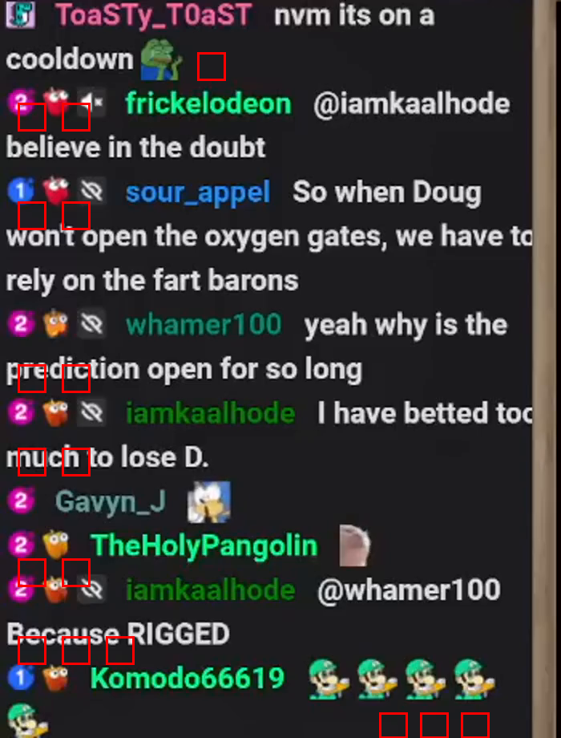
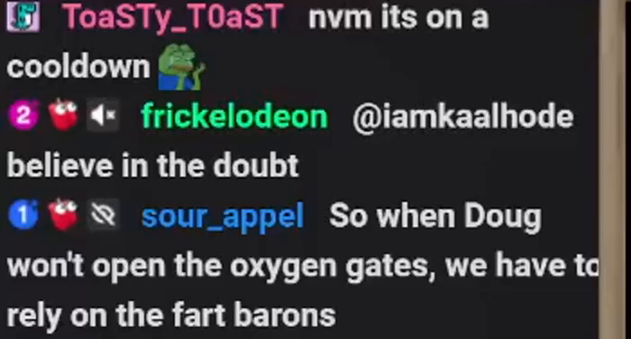
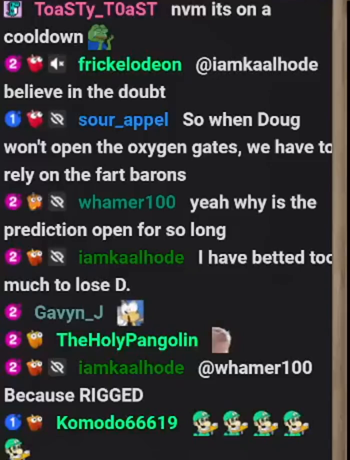

# 2026-02-09
## overall progress
- [ ] re-evaluating the emote extraction
- [ ] making a script to extract text from messages

## re-evaluating emote extraction
After getting the key frames refined, I decided to spend a bit more time to attempt to get the emote pixel positions. Unfortunately, no amount of prompt engineering could get the emote positions correct.



I decided to try emote extraction/substitution. I ran into some issues with the model kept confusing the sub icons as emotes.

So I tried using an example within the prompt
```py
content = [{
    "type": "text",
    "text": (
        "\n"
        "MESSAGE TEXT\n"
        "- Keep the visible message text.\n"
        "- Replace each INLINE message emote with a one word description, include them inline and use a structure of `:emote_described:` `:another_emote_described:` ... in the message.\n"
        "- Do not insert :oneword: tokens for left-gutter UI icons.\n"
        "\n"
        # "TOKEN↔BOX CONSISTENCY (STRICT)\n"
        "- Order emotes left-to-right.\n"
        "\n"
        "If message text is not visible, use '(No message text visible)'.\n"
    ),}, 
           {"type": "text", "text": f"for example this image:"},
           {"type": "image_url", "image_url": {"url": image_file_to_data_url(example_frame)}},
           {"type": "text", "text": """the output is {
      "user_name": "ToaSTy_T0aST",
      "message": "nvm its on a cooldown :pepehands:",
      "emotes": [
        {
          "emote_name": "peepehands",
          "description": "pepe the frong crying"
        }
      ]
    },
    {
      "user_name": "frickelodeon",
      "message": "@iamkaalhode believe in the doubt",
      "emotes": []
    },
     {
      "user_name": "sour_appel",
      "message": "So when Doug won't open the oxygen gates, we have to rely on the fart barons",
      "emotes": []
    },
    """ },
           {"type": "text", "text": f"the emojis in front of the username are decorators, so avoid adding the icons before the username as emojis:"},
           
          ]

```

I reused the same image to see if it would make it better, it seemed to fix the issue

```
{
  "chat_messages": [
    {
      "user_name": "TheHolyPangolin",
      "message": "Because RIGGED",
      "emotes": []
    },
    {
      "user_name": "iamkaalhode",
      "message": "@whamer100 Because RIGGED",
      "emotes": []
    },
    {
      "user_name": "Komodo666619",
      "message": ":luigi: :luigi: :luigi: :luigi:",
      "emotes": [
        {
          "emote_name": "luigi",
          "description": "green mario character"
        }
      ]
    },
    {
      "user_name": "comicallyidiotic",
      "message": "I have 80 cakes on the table",
      "emotes": []
    },
    {
      "user_name": "Jennie027",
      "message": "the strat was to wait until doug goes live or doesn't because the prediction goes past the time",
      "emotes": [
        {
          "emote_name": "eggplant",
          "description": "purple eggplant"
        }
      ]
    },
    {
      "user_name": "projectdolphin_",
      "message": "",
      "emotes": []
    },
    {
      "user_name": "iamkaalhode",
      "message": "Oh no",
      "emotes": []
    },
    {
      "user_name": "crismanti20",
      "message": "EUROPE :mouth:",
      "emotes": [
        {
          "emote_name": "mouth",
          "description": "open mouth"
        }
      ]
    },
    {
      "user_name": "iamkaalhode",
      "message": "He changed title",
      "emotes": []
    },
    {
      "user_name": "pegglequeen1",
      "message": "why is the prediction this long? people will just",
      "emotes": []
    }
  ]
}

```

At this point I decided it wasn't worth delaying my progress further, so I decided to scrap that idea and just focus on extracting the chat messages.

## making a script to extract text from messages
Since I wanted to not get stuck trying to extract emote positions, I decided to move forward with making a script to extract the emotes and text. 

I started by extracting a single image, then had chatgpt wrap up the code and logic into a function

This was the initial codeblocks I used
```py
from pathlib import Path
from dotenv import load_dotenv

try:
    start = Path(__file__).resolve()
except NameError:
    start = Path.cwd()

supporting_files = next(p / "00-supporting-files" for p in start.parents if (p / "00-supporting-files").exists())

project_parent = next(p for p in (start.resolve(), *start.resolve().parents) if (p / "00-supporting-files").exists()).parent

video_dir = project_parent / "large-files"

data_dir = supporting_files / "data"

example_frame = supporting_files / "data" / "example.png"
```

```py
import base64
from openai import OpenAI

def image_file_to_data_url(path: str) -> str:
    # Change mime if needed: image/jpeg, image/webp, etc.
    mime = "image/png"
    with open(path, "rb") as f:
        b64 = base64.b64encode(f.read()).decode("utf-8")
    return f"data:{mime};base64,{b64}"

client = OpenAI(
    base_url="http://localhost:1234/v0",  # or http://localhost:8000/v1
    api_key="unused",  # many local servers ignore this
)

client = OpenAI(
    base_url="http://localhost:1234/v1",
    api_key="lm-studio"
)
```

```py
import json
import requests
from typing import Optional, Tuple, Type
from pydantic import BaseModel
from pydantic import BaseModel, Field

class EmoteBox(BaseModel):
    emote_name: str = Field(..., description="a shorthand name for the emote (e.g., 'PepeHands', 'POG', 'OMEGALUL', 'D:'   'CINEMA', 'dougdougPump').")
    description: str = Field(..., description="Short human-readable description of the emote use a full description rather than a the emoji shorthand")

class ChatMessage(BaseModel):
    user_name: str = Field(..., description="Username as shown in the chat UI for this line (no inferred/extra metadata).")
    message: str = Field(..., description="Visible message text and emoji (described as 1 word) for this chat line. If emotes and emojis are in the message, include them inline and use a structure of `:emote_described:` `:another_emote_described:` ...")
    emotes: List[EmoteBox] = Field(..., description="list of unique emotes, can be empty ignore images next to the name just focus on emotes/emojis after the name")

class ChatExtraction(BaseModel):
    chat_messages: List[ChatMessage] = Field(
        default_factory=list,
        description="All visible chat lines in a single image, in top-to-bottom reading order.",
    )

labeled_example = """
The extracted output from the reference is 
{{
  "user_name": "ToaSTy_T0aST",
  "message": "nvm its on a cooldown :pepehands:",
  "emotes": [
    {
      "emote_name": "peepehands",
      "description": "pepe the frong crying"
    }
  ]
},
{
  "user_name": "frickelodeon",
  "message": "@iamkaalhode believe in the doubt",
  "emotes": []
},
  {
  "user_name": "sour_appel",
  "message": "So when Doug won't open the oxygen gates, we have to rely on the fart barons",
  "emotes": []
}}
""".strip()  

print(labeled_example)
```
```
The extracted output from the reference is 
{{
  "user_name": "ToaSTy_T0aST",
  "message": "nvm its on a cooldown :pepehands:",
  "emotes": [
    {
      "emote_name": "peepehands",
      "description": "pepe the frong crying"
    }
  ]
},
{
  "user_name": "frickelodeon",
  "message": "@iamkaalhode believe in the doubt",
  "emotes": []
},
  {
  "user_name": "sour_appel",
  "message": "So when Doug won't open the oxygen gates, we have to rely on the fart barons",
  "emotes": []
}}
```

```py
# ---------- pick first 8 files ----------
FRAMES_DIR = video_dir / "Doug_and_Twitch_Chat_TAKE_OVER_EUROPE-VpmmuHlLPM0__crop_no_audio__crop_0x14_350x460__s2" / "chat_frames"

exts = {".jpg", ".jpeg", ".png", ".webp"}
files = sorted([p for p in FRAMES_DIR.iterdir() if p.is_file() and p.suffix.lower() in exts])
# if len(files) < 8:
#     raise RuntimeError(f"Need at least 8 images in {FRAMES_DIR.resolve()}, found {len(files)}")

instructions = [{
    "type": "text",
    "text": (
        "You are a helpful assistant who is extracting twitch usernames and messages"
        "# MESSAGE TEXT EXTRACTION INSTRUCTIONS\n"
        "- Keep the visible message text.\n"
        "- Replace each INLINE message emote with a one word description, include them inline and use a structure of `:emote_described:` `:another_emote_described:` ... in the message.\n"
        "- Do not insert :oneword: tokens for left-gutter UI icons.\n"
        "\n"
        "- Order emotes left-to-right.\n"
        "\n"
        "If message text is not visible, use '(No message text visible)'.\n"),
        }, 
           {"type": "text", "text": f"# EXAMPLE IMAGE \n \nfor example this image:"},
           {"type": "image_url", "image_url": {"url": image_file_to_data_url(example_frame)}},
           {"type": "text", "text": labeled_example},
           {"type": "text", "text": f"the emojis in front of the username are decorators, so avoid adding the icons before the username as emojis:"},
          ]

instructions          
```

```py
MODEL = "lmstudio-community/Qwen3-VL-30B-A3B-Instruct-GGUF"
MODEL = "qwen3-vl-30b-a3b-thinking"

# Preferred: structured parse (if your server supports it)
single_resp = client.beta.chat.completions.parse(
    model=MODEL,
    response_format=ChatExtraction,
    messages=messages,
    # temperature=0.2,
    max_tokens=-1,
)

single_resp_parsed = single_resp.choices[0].message.parsed
single_resp_validated = ChatExtraction.model_validate(single_resp_parsed)

print(single_resp_validated.model_dump_json(indent=2))
```
```py
{
  "chat_messages": [
    {
      "user_name": "projectdolphin_",
      "message": "FUCK NOOOOOOOO",
      "emotes": []
    },
    {
      "user_name": "mrgundhamtanaka",
      "message": "DOUG MY MONEY",
      "emotes": []
    },
    {
      "user_name": "whamer100",
      "message": "DOUG MY MONEY",
      "emotes": []
    },
    {
      "user_name": "moomin_tophat",
      "message": "DOUG",
      "emotes": []
    },
    {
      "user_name": "tacoespionage",
      "message": "DOUG",
      "emotes": []
    },
    {
      "user_name": "meowsticks24",
      "message": "GEOGRAPHY",
      "emotes": []
    },
    {
      "user_name": "crismanti20",
      "message": "Yo",
      "emotes": [
        {
          "emote_name": "redface",
          "description": "red face emoji"
        }
      ]
    },
    {
      "user_name": "Jennie027",
      "message": "I AM SO GOOD AT BETTING",
      "emotes": []
    },
    {
      "user_name": "LankLTE",
      "message": "DOUG",
      "emotes": [
        {
          "emote_name": "snowflake",
          "description": "white snowflake"
        }
      ]
    },
    {
      "user_name": "mmust_m",
      "message": "SUCK IT NON",
      "emotes": []
    },
    {
      "user_name": "Komodo66619",
      "message": "Yeesssssssssssss",
      "emotes": [
        {
          "emote_name": "owl",
          "description": "owl emoji"
        }
      ]
    }
  ]
}
```
Once I got it all wrapped up into a function, I started running it across the dataset.