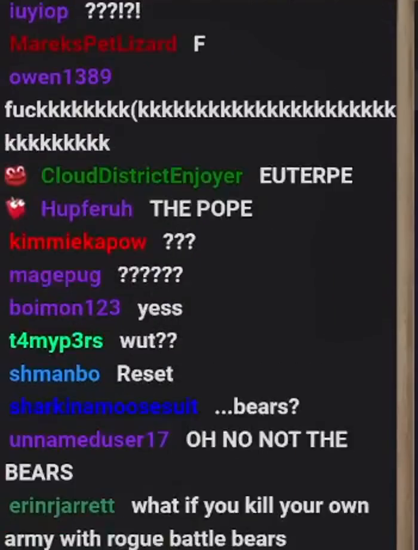

# 2026-02-09
## overall progress
- [ ] trailing characters infinite loop
- [ ] side research

## trailing characters infinite loop
while waiting for the script to process the full video for all chat messages, I observed qwen would get stuck on certain screenshots. For example if the text would wrap around qwen would use all the tokens to fill the wrap around

```py
2026-02-09 18:35:16 [DEBUG]
 LlamaV4: server assigned slot 3 to task 2338097
2026-02-09 18:35:16  [INFO]
 [qwen3-vl-30b-a3b-thinking] Model generated tool calls:  []
2026-02-09 18:35:16  [INFO]
 [qwen3-vl-30b-a3b-thinking] Generated prediction:  {
  "id": "chatcmpl-udda7kzdb3jqt6tgbtvw",
  "object": "chat.completion",
  "created": 1770683700,
  "model": "qwen3-vl-30b-a3b-thinking",
  "choices": [
    {
      "index": 0,
      "message": {
        "role": "assistant",
        "content": "{\"chat_messages\": [{\"user_name\": \"iuyiop\", \"message\": \"????!\", \"emotes\": []}, {\"user_name\": \"MareksPetLizard\", \"message\": \"F\", \"emotes\": []}, {\"user_name\": \"owen1389\", \"message\": \"fuckkkkkkkk(kkkkkkkkkkkkkkkkkkkkkkkkkkkkkkkkkkkkkkkkkkkkkkkkkkkkkkkkkkkkkkkkkkkkkkkkkkkkkkkkkkkkkkkkkkkkkkkkkkkkkkkkkkkkkkkkkkkkkkkkkkkkkkkkkkkkkkkkkkkkkkkkkkkkkkkkkkkkkkkkkkkkkkkkkkkkkkkkkkkkkkkkkkkkkkkkkkkkkkkkkkkkkkkkkkkkkkkkkkkkkkkkkkkkkkkkkkkkkkkkkkkkkkkkkkkkkkkkkkkkkkkkkkkkkkkkkkkkkkkkkkkkkkkkkkkkkkkkkkkkkkkkkkkkkkkkkkkkkkkkkkkkkkkkkkkkkkkkkkkkkkkkkkkkkkkkkkkkkkkkkkkkkkkkkkkkkkkkkkkkkkkkkkkkkkkkkkkkkkkkkkkkkkkkkkkkkkkkkkkkkkkkkkkkkkkkkkkkkkkkkkkkkkkkkkkkkkkkkkkkkkkkkkkkkkkkkkkkkkkkkkkkkkkkkkkkkkkkkkkkkkkkkkkkkkkkkkkkkkkkkkkkkkkkkkkkkkkkkkkkkkkkkkkkkkkkkkkkkkkkkkkkkkkkkkkkkkkkkkkkkkkkkkkkkkkkkkkkkkkkkkkkkkkkkkkkkkkkkkkkkkkkkkkkkkkkkkkkkkkkkkkkkkkkkkkkkkkkkkkkkkkkkkkkkkkkkkkkkkkkkkkkkkkkkkkkkkkkkkkkkkkkkkkkkkkkkkkkkkkkkkkkkkkkkkkkkkkkkkkkkkkkkkkkkkkkkkkkkkkkkkkkkkkkkkkkkkkkkkkkkkkkkkkkkkkkkkkkkkkkkkkkkkkkkkkkkkkkkkkkkkkkkkkkkkkkkkkkkkkkkkkkkkkkkkkkkkkkkkkkkkkkkkkkkkkkkkkkkkkkkkkkkkkkkkkkkkkkkkkkkkkkkkkkkkkkkkkkkkkkkkkkkkkkkkkkkkkkkkkkkkkkkkkkkkkkkkkkkkkkkkkkkkkkkkkkkkkkkkkkkkkkkkkkkkkkkkkkkkkkkkkkkkkkkkkkkkkkkkkkkkkkkkkkkkkkkkkkkkkkkkkkkkkkkkkkkkkkkkkkkkkkkkkkkkkkkkkkkkkkkkkkkkkkkkkkkkkkkkkkkkkkkkkkkkkkkkkkkkkkkkkkkkkkkkkkkkkkkkkkkkkkkkkkkkkkkkkkkkkkkkkkkkkkkkkkkkkkkkkkkkkkkkkkkkkkkkkkkkkkkkkkkkkkkkkkkkkkkkkkkkkkkkkkkkkkkkkkkkkkkkkkkkkkkkkkkkkkkkkkkkkkkkkkkkkkkkkkkkkkkkkkkkkkkkkkkkkkkkkkkkkkkkkkkkkkkkkkkkkkkkkkkkkkkkkkkkkkkkkkkkkkkkkkkkkkkkkkkkkkkkkkkkkkkkkkkkkkkkkkkkkkkkkkkkkkkkkkkkkkkkkkkkkkkkkkkkkkkkkkkkkkkkkkkkkkkkkkkkkkkkkkkkkkkkkkkkkkkkkkkkkkkkkkkkkkkkkkkkkkkkkkkkkkkkkkkkkkkkkkkkkkkkkkkkkkkkkkkkkkkkkkkkkkkkkkkkkkkkkkkkkkkkkkkkkkkkkkkkkkkkkkkkkkkkkkkkkkkkkkkkkkkkkkkkkkkkkkkkkkkkkkkkkkkkkkkkkkkkkkkkkkkkkkkkkkkkkkkkkkkkkkkkkkkkkkkkk",
        "tool_calls": []
      },
      "logprobs": null,
      "finish_reason": "length"
    }
  ],
  "usage": {
    "prompt_tokens": 1222,
    "completion_tokens": 900,
    "total_tokens": 2122
  },
  "stats": {},
  "system_fingerprint": "qwen3-vl-30b-a3b-thinking"
}
2026-02-09 18:35:16 [DEBUG]
 Received request: POST to /v1/chat/completions with body  {
  "messages": [
    {
      "role": "user",
      "content": [
        {
          "type": "text",
          "text": "You are a helpful assistant who is extracting twit... <Truncated in logs> ... is not visible, use '(No message text visible)'.\n"
        },
        {
          "type": "text",
          "text": "# EXAMPLE IMAGE \n \nfor example this image:"
        },
        {
          "type": "image_url",
          "image_url": {
            "url": "data:image/png;base64,iVBORw0KGgoAAAANSUhEUgAAArwA... <Truncated in logs> ...WBFYEVgRWBFYEVgWMh8P8BTaYz4+WVfdgAAAAASUVORK5CYII="
          }
        },
        {
          "type": "text",
          "text": "The extracted output from the reference is \n{{\n  \"... <Truncated in logs> ...ave to rely on the fart barons\",\n  \"emotes\": []\n}}"
        },
        {
          "type": "text",
          "text": "Notice that the emojis in front of the username are decorators, so avoid adding the icons before the username as emojis:"
        },
        {
          "type": "text",
          "text": "Repeat the process above for the following image:"
        },
        {
          "type": "image_url",
          "image_url": {
            "url": "data:image/png;base64,iVBORw0KGgoAAAANSUhEUgAAArwA... <Truncated in logs> ...yO6OTnjjzxozU2bttt+w/ugTMdeirQfAAAAABJRU5ErkJggg=="
          }
        }
      ]
    }
  ],
  "model": "qwen3-vl-30b-a3b-thinking",
  "max_tokens": 900,
  "response_format": {
    "type": "json_schema",
    "json_schema": {
      "schema": {
        "$defs": {
          "ChatMessage": {
            "properties": {
              "user_name": {
                "description": "Username as shown in the chat UI for this line (no inferred/extra metadata).",
                "title": "User Name",
                "type": "string"
              },
              "message": {
                "description": "Visible message text and emoji (described as 1 wor... <Truncated in logs> ...:emote_described:` `:another_emote_described:` ...",
                "title": "Message",
                "type": "string"
              },
              "emotes": {
                "description": "list of unique emotes, can be empty ignore images next to the name just focus on emotes/emojis after the name",
                "items": {
                  "$ref": "#/$defs/EmoteBox"
                },
                "title": "Emotes",
                "type": "array"
              }
            },
            "required": [
              "user_name",
              "message",
              "emotes"
            ],
            "title": "ChatMessage",
            "type": "object",
            "additionalProperties": false
          },
          "EmoteBox": {
            "properties": {
              "emote_name": {
                "description": "a shorthand name for the emote (e.g., 'PepeHands', 'POG', 'OMEGALUL', 'D:'   'CINEMA', 'dougdougPump').",
                "title": "Emote Name",
                "type": "string"
              },
              "description": {
                "description": "Short human-readable description of the emote use a full description rather than a the emoji shorthand",
                "title": "Description",
                "type": "string"
              }
            },
            "required": [
              "emote_name",
              "description"
            ],
            "title": "EmoteBox",
            "type": "object",
            "additionalProperties": false
          }
        },
        "properties": {
          "chat_messages": {
            "description": "All visible chat lines in a single image, in top-to-bottom reading order.",
            "items": {
              "$ref": "#/$defs/ChatMessage"
            },
            "title": "Chat Messages",
            "type": "array"
          }
        },
        "title": "ChatExtraction",
        "type": "object",
        "additionalProperties": false,
        "required": [
          "chat_messages"
        ]
      },
      "name": "ChatExtraction",
      "strict": true
    }
  },
  "stream": false
}
2026-02-09 18:35:16  [INFO]
 [qwen3-vl-30b-a3b-thinking] Running chat completion on conversation with 1 messages.
2026-02-09 18:35:16 [DEBUG]
 LlamaV4::predict slot selection: session_id=<empty> server-selected (LCP/LRU)
2026-02-09 18:35:16 [DEBUG]
 slot get_availabl: id  3 | task -1 | selected slot by LCP similarity, sim_best = 1.000 (> 0.100 thold), f_keep = 0.576
2026-02-09 18:35:16 [DEBUG]
 slot launch_slot_: id  3 | task -1 | sampler chain: logits -> penalties -> ?dry -> ?top-n-sigma -> top-k -> ?typical -> top-p -> min-p -> ?xtc -> temp-ext -> dist 
slot launch_slot_: id  3 | task 2338998 | processing task, is_child = 0
slot update_slots: id  3 | task 2338998 | new prompt, n_ctx_slot = 8192, n_keep = 322, task.n_tokens = 1222
slot update_slots: id  3 | task 2338998 | cache reuse is not supported - ignoring n_cache_reuse = 256
slot update_slots: id  3 | task 2338998 | need to evaluate at least 1 token for each active slot (n_past = 1222, task.n_tokens() = 1222)
slot update_slots: id  3 | task 2338998 | n_past was set to 1221
slot update_slots: id  3 | task 2338998 | n_tokens = 1221, memory_seq_rm [370, end)
slot update_slots: id  3 | task 2338998 | prompt processing progress, n_tokens = 1222, batch.n_tokens = 1, progress = 1.000000
slot update_slots: id  3 | task 2338998 | prompt done, n_tokens = 1222, batch.n_tokens = 1
slot init_sampler: id  3 | task 2338998 | init sampler, took 0.05 ms, tokens: text = 320, total = 1222
2026-02-09 18:35:16  [INFO]
 [qwen3-vl-30b-a3b-thinking] Prompt processing progress: 0.0%
2026-02-09 18:35:16  [INFO]
 [qwen3-vl-30b-a3b-thinking] Prompt processing progress: 100.0%
2026-02-09 18:35:31 [DEBUG]
 slot print_timing: id  3 | task 2338998 | 
prompt eval time =      36.66 ms /     1 tokens (   36.66 ms per token,    27.28 tokens per second)
       eval time =   14858.57 ms /   900 tokens (   16.51 ms per token,    60.57 tokens per second)
      total time =   14895.23 ms /   901 tokens
slot      release: id  3 | task 2338998 | stop processing: n_tokens = 2121, truncated = 0
srv  update_slots: all slots are idle
2026-02-09 18:35:31 [DEBUG]
 LlamaV4: server assigned slot 3 to task 2338998
2026-02-09 18:35:31  [INFO]
 [qwen3-vl-30b-a3b-thinking] Model generated tool calls:  []
2026-02-09 18:35:31  [INFO]
 [qwen3-vl-30b-a3b-thinking] Generated prediction:  {
  "id": "chatcmpl-oxqv1lnop6m0ljz5heu3uz",
  "object": "chat.completion",
  "created": 1770683716,
  "model": "qwen3-vl-30b-a3b-thinking",
  "choices": [
    {
      "index": 0,
      "message": {
        "role": "assistant",
        "content": "{\"chat_messages\": [{\"user_name\": \"iuyiop\", \"message\": \"????!\", \"emotes\": []}, {\"user_name\": \"MareksPetLizard\", \"message\": \"F\", \"emotes\": []}, {\"user_name\": \"owen1389\", \"message\": \"fuckkkkkkkk(kkkkkkkkkkkkkkkkkkkkkkkkkkkkkkkkkkkkkkkkkkkkkkkkkkkkkkkkkkkkkkkkkkkkkkkkkkkkkkkkkkkkkkkkkkkkkkkkkkkkkkkkkkkkkkkkkkkkkkkkkkkkkkkkkkkkkkkkkkkkkkkkkkkkkkkkkkkkkkkkkkkkkkkkkkkkkkkkkkkkkkkkkkkkkkkkkkkkkkkkkkkkkkkkkkkkkkkkkkkkkkkkkkkkkkkkkkkkkkkkkkkkkkkkkkkkkkkkkkkkkkkkkkkkkkkkkkkkkkkkkkkkkkkkkkkkkkkkkkkkkkkkkkkkkkkkkkkkkkkkkkkkkkkkkkkkkkkkkkkkkkkkkkkkkkkkkkkkkkkkkkkkkkkkkkkkkkkkkkkkkkkkkkkkkkkkkkkkkkkkkkkkkkkkkkkkkkkkkkkkkkkkkkkkkkkkkkkkkkkkkkkkkkkkkkkkkkkkkkkkkkkkkkkkkkkkkkkkkkkkkkkkkkkkkkkkkkkkkkkkkkkkkkkkkkkkkkkkkkkkkkkkkkkkkkkkkkkkkkkkkkkkkkkkkkkkkkkkkkkkkkkkkkkkkkkkkkkkkkkkkkkkkkkkkkkkkkkkkkkkkkkkkkkkkkkkkkkkkkkkkkkkkkkkkkkkkkkkkkkkkkkkkkkkkkkkkkkkkkkkkkkkkkkkkkkkkkkkkkkkkkkkkkkkkkkkkkkkkkkkkkkkkkkkkkkkkkkkkkkkkkkkkkkkkkkkkkkkkkkkkkkkkkkkkkkkkkkkkkkkkkkkkkkkkkkkkkkkkkkkkkkkkkkkkkkkkkkkkkkkkkkkkkkkkkkkkkkkkkkkkkkkkkkkkkkkkkkkkkkkkkkkkkkkkkkkkkkkkkkkkkkkkkkkkkkkkkkkkkkkkkkkkkkkkkkkkkkkkkkkkkkkkkkkkkkkkkkkkkkkkkkkkkkkkkkkkkkkkkkkkkkkkkkkkkkkkkkkkkkkkkkkkkkkkkkkkkkkkkkkkkkkkkkkkkkkkkkkkkkkkkkkkkkkkkkkkkkkkkkkkkkkkkkkkkkkkkkkkkkkkkkkkkkkkkkkkkkkkkkkkkkkkkkkkkkkkkkkkkkkkkkkkkkkkkkkkkkkkkkkkkkkkkkkkkkkkkkkkkkkkkkkkkkkkkkkkkkkkkkkkkkkkkkkkkkkkkkkkkkkkkkkkkkkkkkkkkkkkkkkkkkkkkkkkkkkkkkkkkkkkkkkkkkkkkkkkkkkkkkkkkkkkkkkkkkkkkkkkkkkkkkkkkkkkkkkkkkkkkkkkkkkkkkkkkkkkkkkkkkkkkkkkkkkkkkkkkkkkkkkkkkkkkkkkkkkkkkkkkkkkkkkkkkkkkkkkkkkkkkkkkkkkkkkkkkkkkkkkkkkkkkkkkkkkkkkkkkkkkkkkkkkkkkkkkkkkkkkkkkkkkkkkkkkkkkkkkkkkkkkkkkkkkkkkkkkkkkkkkkkkkkkkkkkkkkkkkkkkkkkkkkkkkkkkkkkkkkkkkkkkkkkkkkkkkkkkkkkkkkkkkkkkkkkkkkkkkkkkkkkkkkkkkkkkkkkkkkkkkkkkkkkkkkkkkkkkkkkkkkkkkkkkkkkkkkkkkkkkkkkkkkkkkkkkkkkkkkkkkkkkkkkkkkkkkkkkkkkkkkkkkkkkkkkkkkkkkkkkkkkkkkkkkkkkkkkkkk",
        "tool_calls": []
      },
      "logprobs": null,
      "finish_reason": "length"
    }
  ],
  "usage": {
    "prompt_tokens": 1222,
    "completion_tokens": 900,
    "total_tokens": 2122
  },
  "stats": {},
  "system_fingerprint": "qwen3-vl-30b-a3b-thinking"
}
2026-02-09 18:35:31 [DEBUG]
 Received request: POST to /v1/chat/completions with body  {
  "messages": [
    {
      "role": "user",
      "content": [
        {
          "type": "text",
          "text": "You are a helpful assistant who is extracting twit... <Truncated in logs> ... is not visible, use '(No message text visible)'.\n"
        },
        {
          "type": "text",
          "text": "# EXAMPLE IMAGE \n \nfor example this image:"
        },
        {
          "type": "image_url",
          "image_url": {
            "url": "data:image/png;base64,iVBORw0KGgoAAAANSUhEUgAAArwA... <Truncated in logs> ...WBFYEVgRWBFYEVgWMh8P8BTaYz4+WVfdgAAAAASUVORK5CYII="
          }
        },
        {
          "type": "text",
          "text": "The extracted output from the reference is \n{{\n  \"... <Truncated in logs> ...ave to rely on the fart barons\",\n  \"emotes\": []\n}}"
        },
        {
          "type": "text",
          "text": "Notice that the emojis in front of the username are decorators, so avoid adding the icons before the username as emojis:"
        },
        {
          "type": "text",
          "text": "Repeat the process above for the following image:"
        },
        {
          "type": "image_url",
          "image_url": {
            "url": "data:image/png;base64,iVBORw0KGgoAAAANSUhEUgAAArwA... <Truncated in logs> ...yO6OTnjjzxozU2bttt+w/ugTMdeirQfAAAAABJRU5ErkJggg=="
          }
        }
      ]
    }
  ],
  "model": "qwen3-vl-30b-a3b-thinking",
  "max_tokens": 900,
  "response_format": {
    "type": "json_schema",
    "json_schema": {
      "schema": {
        "$defs": {
          "ChatMessage": {
            "properties": {
              "user_name": {
                "description": "Username as shown in the chat UI for this line (no inferred/extra metadata).",
                "title": "User Name",
                "type": "string"
              },
              "message": {
                "description": "Visible message text and emoji (described as 1 wor... <Truncated in logs> ...:emote_described:` `:another_emote_described:` ...",
                "title": "Message",
                "type": "string"
              },
              "emotes": {
                "description": "list of unique emotes, can be empty ignore images next to the name just focus on emotes/emojis after the name",
                "items": {
                  "$ref": "#/$defs/EmoteBox"
                },
                "title": "Emotes",
                "type": "array"
              }
            },
            "required": [
              "user_name",
              "message",
              "emotes"
            ],
            "title": "ChatMessage",
            "type": "object",
            "additionalProperties": false
          },
          "EmoteBox": {
            "properties": {
              "emote_name": {
                "description": "a shorthand name for the emote (e.g., 'PepeHands', 'POG', 'OMEGALUL', 'D:'   'CINEMA', 'dougdougPump').",
                "title": "Emote Name",
                "type": "string"
              },
              "description": {
                "description": "Short human-readable description of the emote use a full description rather than a the emoji shorthand",
                "title": "Description",
                "type": "string"
              }
            },
            "required": [
              "emote_name",
              "description"
            ],
            "title": "EmoteBox",
            "type": "object",
            "additionalProperties": false
          }
        },
        "properties": {
          "chat_messages": {
            "description": "All visible chat lines in a single image, in top-to-bottom reading order.",
            "items": {
              "$ref": "#/$defs/ChatMessage"
            },
            "title": "Chat Messages",
            "type": "array"
          }
        },
        "title": "ChatExtraction",
        "type": "object",
        "additionalProperties": false,
        "required": [
          "chat_messages"
        ]
      },
      "name": "ChatExtraction",
      "strict": true
    }
  },
  "stream": false
}
...
```
To fix this I had chatgpt added the following instruction
> "- Transcribe exactly what’s visible; do not continue a pattern."

I also had chatgpt generate me some code so that if the max retries is >20, log the entry and store it in a separate file.

```py
from __future__ import annotations

from functools import wraps
from pydantic import ValidationError

# robust import across openai sdk versions
try:
    from openai import LengthFinishReasonError
except Exception:
    try:
        from openai.lib._parsing._completions import LengthFinishReasonError
    except Exception:
        LengthFinishReasonError = None


def retry_until_valid(
    max_attempts: int | None = None,
    bump_on_length: bool = True,
    bump_add: int = 256,
    bump_mul: float = 1.5,
    failed_extractions_out=None,          # Path | str | None
    failed_keys=("i", "filename"),        # what to pull from kwargs
):
    retry_exc = (ValidationError,) + ((LengthFinishReasonError,) if LengthFinishReasonError else ())

    def deco(func):
        @wraps(func)
        def wrapper(*args, **kwargs):
            attempt = 1

            def log_failed():
                if not failed_extractions_out:
                    return
                rec = {k: kwargs.get(k) for k in failed_keys}
                # only write if we actually have the fields
                if any(v is not None for v in rec.values()):
                    append_jsonl(failed_extractions_out, rec, indent=2)

            while True:
                try:
                    return func(*args, **kwargs)

                except retry_exc as e:
                    # bump on length failures
                    if LengthFinishReasonError and isinstance(e, LengthFinishReasonError) and bump_on_length:
                        if "soft_completion_tokens" in kwargs:
                            prev = int(kwargs["soft_completion_tokens"])
                            hard = int(kwargs.get("hard_completion_cap", prev))
                            bumped = min(hard, max(prev + bump_add, int(prev * bump_mul)))

                            if bumped == prev:
                                log_failed()
                                raise

                            kwargs["soft_completion_tokens"] = bumped

                    attempt += 1
                    if max_attempts is not None and attempt > max_attempts:
                        log_failed()
                        raise

        return wrapper
    return deco


@retry_until_valid(max_attempts=20, failed_extractions_out=FAILED_EXTRACTIONS_OUT)
def extract_messages(
    *,
    i: int | None = None,            # just for logging
    filename: str | None = None,     # just for logging
    MODEL,
    ChatExtraction,
    messages,
    soft_completion_tokens: int = 900,
    hard_completion_cap: int = 1600,
    ctx_margin: int = 128,
):
    # your existing max_tokens logic (example)
    prompt_est = 0  # replace with your real estimate if you have one
    cur_ctx = 4096  # replace with model ctx if you track it
    available = max(1, cur_ctx - prompt_est - ctx_margin)

    max_tokens = max(1, min(available, soft_completion_tokens, hard_completion_cap))

    extraction = client.beta.chat.completions.parse(
        model=MODEL,
        response_format=ChatExtraction,
        messages=messages,
        max_tokens=max_tokens,
    )

    parsed = extraction.choices[0].message.parsed
    validated_extraction = ChatExtraction.model_validate(parsed)  # may raise ValidationError

    return extraction, validated_extraction
```

So far there hasn't been any logs, so I'll keep an eye on it.

## side research
Since my my gpu was occupied with performing extractions, I took the time to inspect the outputs, and perform some research

### continuity breaks
While inspecting the outputs, I realized that the frame skipping code I had chatgpt generate worked alright in maintaining continuity, but I still had a couple of examples where chat moved too fast and broke continuity. 

I decided it wasn't worth halting the process as ultimately, I just needed a general idea of what chat was saying in reaction to dougdoug. I can have a model generate messages. 

### looking at other model alternatives
I also observed that some messages were getting split into separate examples. This made me want to look for some potential alternatives, or change how I chunk it out.

While researching, I came across this thread [Best AI vision model for extracting text and adding bounding boxes](https://old.reddit.com/r/computervision/comments/1kjltvc/best_ai_vision_model_for_extracting_text_and/)

A suggestion linked to [PaddleOCR](https://github.com/PaddlePaddle/PaddleOCR), which looked promising for accurate text recognition, but it required me to install the paddleocr library. I decided to look for an alternative, when I came across this article [Top 7 Open Source OCR Models](https://www.kdnuggets.com/top-7-open-source-ocr-models). The article included [MiniCPM-V 4.5](https://huggingface.co/openbmb/MiniCPM-V-4_5), which looked promising as it was a multimodal model that could take in video too. In the github repo, there's a markdown file that explains how to make video requests [MiniCPM-V4.5 vLLM Deployment Guide](https://github.com/OpenSQZ/MiniCPM-V-CookBook/blob/main/deployment/vllm/minicpm-v4_5_vllm.md](https://github.com/OpenSQZ/MiniCPM-V-CookBook/blob/main/deployment/vllm/minicpm-v4_5_vllm.md#23-video-inference)) might be interesting to learn how to use vllm too. 

### having chatgpt identify the segments
With the hope of using MiniCPM, I decided to also have chatgpt chunk out the stream so that I can reduce the amount I need to process.
[details="Youtube Transcript"]
```
0:14
what's up [Music]
0:43
i'm so excited for this [Music]
0:48
park sir what are you doing here no you guys i'm doug it's me you guys
0:54
it's me doug i thought we were taking over the whole world no i've
1:00
i'd said it wrong [Music] it's gonna be great i don't know how to describe what we're
1:06
doing though um
1:15
doug and twitch chat take turns
1:28
[Music]
1:41
[Music]
1:51
[Music] who can take over more of europe
2:02
no can doug doug and twitch chat
2:12
[Music] there we go that's it
2:17
oh there's people here yo what up um ah
2:23
i am excited for this i'm gonna be a bit late to class today i'm at work right now unacceptable
2:29
you should drop your work at uh whatever time it is for you probably like the middle of the day
2:36
i have code please send help sorry allie black this is not that fun i've said it before and i'll say it again covet is not
2:42
actually that fun of a disease yo what up there's a new video on
2:49
youtube the donkey kong stream um [Music]
2:54
can you pause the stream for five minutes no but i'll stall a little bit today i'm really excited about this this
3:01
is one of those ideas that i i have where i'm like i'm really stoked about this
3:07
but there's a strong chance this is a mess this is one of those things that could go either way all right this could be like there are some streams that i've
3:13
thought like this is going to be awesome it was not that awesome and there's other streams where i was like this is probably gonna be super stupid for
3:19
example uh skyrim if i say dragon and that turned into my most popular video
3:24
ever so it's like you never really know is this like risk i've never actually played risk maybe it is kind of like
3:30
risk what do you do in risk risk is just like you just try to take over the europe or whatever right or the world or something
3:37
i'll explain the rules and everything that's happening again this will pro my suspicion is this will more be a mess
3:43
it's more likely to be a mess and be anything funny at all but we'll see [Music] who's chump
3:51
pause champ for what hey thank you so much for all oh my god
3:56
there's a bunch of subs ally black thank you rasn thank you so much sir king artismo thank you a yellowish
4:04
dorito thank you cloud district enjoyer thank you democratic decaf thank you all boosty thank you jonathan drr8 thank you
4:11
rapid spaniel thank you smell 88 thank you murph owo thank you the flying newt
4:16
thank you random 21 people thank you adder of middle thank you the me 90 thank you yanini thank you for the 16
4:24
months nil zak thank you for the nine months test fortune thank you for the eight months basil boss thank you for the nine months
4:30
grumble thank you for the tier one sub wraiths rage thank you wow i get a lot
4:35
more subs when i thank them all to tori thank you so much for the prime canister beans thank you so much for the prime oddworm thanks so much for the prime
4:41
unicorn ruby thanks so much for the prime and fist thank you for these 16 months i'll give another minute or two for people to get here and then i'll explain
4:47
the rules again this is probably going to be a [ __ ] mess first
4:53
i guess you guys we can start with this you can start brainstorming why are we taking over europe uh you have to decide for yourself okay
5:00
you figure that out this yeah okay hold on for this okay but actually before we get into that i i can
5:06
i combined the balkans to make this a little bit easier but i didn't even combine all the balkans i'm not like good at geography or anything uh is this
5:14
offensive what i'm doing combining them it's purely for the sake of the rules and the game being a little easier to
5:19
work as long as i didn't do something like controversial uh here by combine i just picked randomly i just picked
5:25
it's just there are too many in this area i just need to make it a little bit simpler
5:33
that is offensive immensely i feel okay these don't seem real who
5:39
cares to be honest i mean it probably doesn't matter but you know there are some intense uh relations between
5:44
certain countries but i'm a hot-blooded god-fearing football watching beer drinking american i don't know any of that [ __ ] right
5:51
it's not offensive well whatever i'll reiterate when we get started that i didn't combine these for any political
5:56
purpose this is just to make the the game a little easier to do [Music] what is with the netherlands over here
6:04
does another netherlands have a tumor or is that did i do that did i draw this whatever
6:10
um i guess we can start um with something that doesn't actually matter
6:16
what we are both going to be an empire i will be one empire and you guys will be another empire and you're trying to take
6:22
we're both trying to take over europe does anybody what do you guys want your empire to be called
6:29
twitchlandia like we need a nate cause not not
6:35
country specific nuke fart fart cravey
6:41
chatenstein i twitch landia i think is good ideally it's something that involves chat or twitch in some ways so
6:47
we know who's who time someone tried to take over europe asking for a friend
6:52
no this is fine look we're gonna set this in the year 1000 man i'm so stoked for this this is gonna be a [ __ ] mess
6:57
this isn't gonna work well at all it's one of my this is like my greatest idea ever but definitely has the highest
7:02
chance of not working at all uh barn finders boners chatuan chatland
7:08
chatopia chast chatis chatustan i like chattistan oh i hope we're not
7:15
having an internal server error today because i really need the poll
7:21
please be working today uh-oh
7:29
[Music] alphabetia okay that's pretty good twitch topia i like a lot
7:36
chatswana crap i hope this polling website is
7:41
working oh there we go okay uh what is the name of twitch chat's empire
7:50
okay hold on i'm gonna explain the rules of this in a
7:56
sec first we're gonna decide your guys's empire name think about it like civilization okay chatlandia
8:03
a chatter slot wait ch what was it chat slavia no chatistan
8:10
javastand um i wanted to involve chat or twitch in
8:15
some way so that's easy to remember what is wrong with me all hail the [ __ ] unacceptable
8:21
tarot thank you the chat's republic of twitch topia twitch topia is pretty good i don't want
8:27
it to be super long because we're gonna be using the ai a whole bunch chat slovakia
8:32
no that just has a different country in the name that's confusing florida no we're not naming you ohio
8:40
yeah we have to be able to like distinguish between the two of us in the ai and on the map chattenstein
8:46
chattenstein chatopia oh chatopia is pretty good
8:53
would it be one tea chatopia is pretty great
9:03
chatswana no i'm not putting ohio all right between these what do you guys want
9:10
you have chatlandia chatustan twitch topia chatenstein
9:15
i think twitch topia and chat topi are both pretty great thank you whammer
9:20
um once you guys have picked your empire name i guess i'll pick my empire name too and then i'll explain the rules of this [Music]
9:33
chat stan doesn't feel chat to stan
9:41
should it be chat is stan jesus take the wheel okay between
9:46
chat topi and twitch choppy are kind of okay we're going to do chattistan and chatopia as the two finalists
9:53
what empire name [Music] hey doug yeah chad is coming from a
9:59
major chest surgery at home right now and you helped keep my mind off of the horrific pain also oh no the balkans oh
10:07
[ __ ] yeah no we're fine balkans are gonna be fine
10:14
all right we're doing a new vote right now these are this is to decide your empire name chatta stand or chat topia
10:27
we want chat swana will chat a stan beat chatswana chatopia i was putting here because
10:33
these votes might have been split between twitch topia and chat topia okay you guys are chattistan
10:40
the empire of chattistan um congratulations what should my empire be what is doug's empire name oh it needs
10:47
to be like one word that's easy to remember and clearly distinguished one of the things you do with skyrim and i
10:52
was wondering if you had thought about playing fallout 4 i tried fallout 3 and i really didn't
10:58
like it um i just don't like the setting at all so that was my
11:04
it i don't think it's for me i'll probably try it at some point but i didn't love it when i tried number three and i was like i don't want to be in
11:10
this setting at all i hate post-apocalyptic settings so maybe okay douglas that's not very creative
11:17
dougtopia i like dogtopia i'm not going to do dumb memes like ohio
11:24
or whatever else it has to include the word doug look this whole thing the stream is going to be very confusing we have to have names that are clear not
11:29
ohio divorcia that would be more your guys's name
11:35
like i'm not doing state farm dugotar doug mark
11:42
dugite no that's uh that sounds weird doug neeland
11:48
that's confusing and dumb dug dug dumb the empire of dug dumb
11:55
doug troit no it doesn't sound enough doesn't sound enough like me this is ultimately my
12:00
call i don't know why i'm doing a poll douga slavia
12:06
detroit so this looks like
12:13
make turn trying to turn it into ohio just looks like dougie like doe io
12:18
douga fournia okay
12:25
what do you guys think between these i i think i'm i get to pick and i'm gonna pick doug topia
12:30
doug kneeland is also pretty funny okay people will really like do ohio
12:39
wow none of you were voting for doug topia
12:49
dugne land okay
13:12
dogtopia and chatustan those are our resources
13:18
all right is everybody ready you guys are here yeah sorry it's right right right right right frj cakes also we're taking over europe
13:26
because of the plan oh guys this is gonna be a mess of a stream i'm so excited this has the chance to be
13:32
really entertaining but most likely it's gonna be really really stupid oh by the way hold on um we occasionally need to
13:38
do this does anybody how do you change your color in twitch chat because most you guys are purple right now actually it's kind of mixed up anyways if you
13:45
want to change your how do you change your color again you like go into your settings right below the chat or something like that
13:51
uh [Music] that describes most of my streams no no
13:57
no this stream is way less coherent i think the star icon next to chat
14:02
chat identity okay well at the bottom of your screen there's chat at the bottom of chat chat identity if you want to be
14:08
something other than purple you want to stand out i like when there's like a mix of colors you know it's it's a little weird when like everybody's just purple
14:14
so feel free to swap up colors okay with that being said uh we're gonna pause alerts and i am going to explain
14:20
the rules um is this on youtube no this is twitch
14:26
if you're actually wondering if this is going to be a youtube video i don't know dude i never know we'll we'll see like i said this is a this is a bad idea and
14:33
we'll see what happens um today twitch chat and me are going to try to
14:40
take over europe okay we are both going to pick a starting country you can pick whichever one you want okay and you
14:47
will form the brand new initial government of that country okay so that is where your empire will start you guys
14:54
will be controlling one empire i will be controlling another empire we are going once we have our starting countries we
14:59
are going to alternate taking turns on your turn you are allowed to invade a
15:04
nearby country you are also allowed to try to to create a peace treaty with that country okay
15:11
alternatively you can research new technology let's say uh you only have swords because we're gonna start in the
15:17
year one thousand okay we're starting near 1000 so we're all going to start with a sword army okay
15:23
uh but you could research bows you could research uh mounted combat for example so what this would actually look like
15:31
let me get the colors
15:37
let's say for example um i start with france
15:45
what hello why is the selection not working oh if
15:51
photoshop just doesn't work that's not good oh because i have to do map i'm done
15:57
[Music] okay let's say i start on france okay we
16:03
would color the country as france and let's say you guys choose to start on poland we'll we'll vote on where you
16:08
want to start in a sec [Music]
16:17
so we'll each start with our own country we'll be able to pick whichever one you want we'll start with a country
16:22
and then on your turn you can try to invade one of the surrounding countries you can also try to do a peace treaty if either
16:29
one of those succeed then that country joins your empire and they become your color
16:35
each country you have control of is one point for you okay [Music]
16:41
you will also get a point for every special resource that you have right now we have we have zero we're gonna start
16:46
with one resource each but if you manage to gain a resource from another country if
16:51
you manage to research a new resource of some kind that also gets added to the score
16:58
[Music] okay we're slowing this what about
17:05
luxembourg where is luxembourg you guys are gonna be any europeans who are watching are gonna be infuriated by
17:11
this stream because i don't know any of the countries [Music]
17:16
okay um now you're probably wondering how do you actu it's below belgium oh that
17:23
here do we need liechtenstein or luxembourg i mean um hold on let me explain the rules
17:30
first and then we'll decide how messed up my map is okay you're probably wondering how do you actually invade a country or do a peace street
17:37
we're gonna alternate taking turns okay on your turn you get to decide what you want to do
17:44
and then we put it into novel ai and the ai is going to tell us what actually
17:49
happens so you're gonna be like my army invades poland
17:56
and then whatever so we'll give more details right whatever this says that's the result of
18:02
what's gonna happen okay so i didn't give enough details but basically in this in this case on the
18:08
first day of september the police force has surrendered so in this case if that was my turn i just successfully took over poland
18:14
but i tested this earlier and your invasions do not always work sometimes they'll kill your army sometimes they'll
18:19
give you random [ __ ] you can also try to do peace treaties basically every single time it's your turn i'm gonna allow you
18:25
guys to do a poll and vote on what you want to do
18:32
what you want to do on that turn and the ai will determine what actually happens on the map make sense
18:40
[Music] how do i undo no no
18:49
undo [Music] undo there we go [Music]
18:54
this sounds so fun this is the thing i don't know if this will work [Music] to start off
19:00
you guys need to pick your beginning country the empire of chitistan
19:05
can begin in a single country on europe where do you want
19:12
wait actually hold on first i need to see are there any pr sorry i i'm getting ahead of myself i tried to simplify the
19:19
map right the reason i condensed a bunch of balkan countries is because like if we have every single city state and
19:25
country in europe like it's gonna get too hard to visualize what's going on am i missing or did i do anything offensive
19:31
um in this map before we get started yes it is a little bit simplified i don't i know turkey is not necessarily count
19:39
but this is the map oh and iceland's up here you can start with iceland if you want which would be a terrible idea i also combined britain um i just did
19:45
britain and ireland like that to make it a little bit simpler luxembourg i don't even know where god
19:51
this is i'm gonna be so embarrassed today luxembo where the hell is luxembourg do we really need luxembourg on the map i feel like it's fine
20:04
where is it oh it's right below belgium
20:11
oh this okay do we really need luxembourg
20:16
i finally had luxembourg i'm gonna make their text really small though okay
20:30
where's germany
20:42
okay where's malta look there again there's there's a bunch of countries that are missing for the sake of simplicity on this map are there any
20:48
others that we feel like really have to be here and i'm sorry if you are from that country or tied to that country the
20:53
point of this is not to be an accurate map of europe the point is it for it to be simple enough that we can actually
20:59
play this this game and see if it works vatican we don't need vatican city
21:04
actually that's kind of funny yeah
21:10
it's not even on the map man i'd have to like draw lines onto the map i guess we do need vatican city look i
21:17
like these we're not doing okay any other besides macedonia is not the correct name is not north macedonia here
21:24
is it just macedonia did i get that wrong
21:30
okay we're gonna do a quick vote what countries do we need to add
21:37
uh vatican city vatican city is right there what's in it's in italy i would have to add it
21:44
ohio is not a country uh lichtenstein
21:50
all right where's some music we need music no you can see it on the map the smaller
21:55
dot in italy is the vatican and the bigger one is san marino oh okay i didn't realize the dot was there
22:02
that the dot was representing um vatican city we have sweden is on there i'm saying are there any countries i have to
22:08
add to the map north macedonia is correct andorra where's antora
22:16
sweden is spelled wrong the alphabet's kingdom cyprus that's the thing cyprus is like
22:22
does it need to be its own thing in in this map finland is on there
22:29
no we're not doing north africa we're gonna stick it we're gonna stick with in europe again the point is not to be 100 percent accurate
22:35
we're trying to make a thing that works within the rules of this game new south wales what the hell is new south is that
22:41
a real place new south wales
22:47
no that's not australia uh wales whales sorry you're being put into
22:53
britain for the sake of simplicity north south wales monaco i guess we can
22:59
have a creative autocracy of chatzner
23:05
for the sake of the ai being readable that's why i need i need um i need the names to be simple not the
23:12
democratic whatever of whatever remove poland please no we're not moving poland all right of these do we need to
23:17
add any of these
23:23
and again i deeply apologize if you are from the country i am about to wipe off of this
23:28
map but i want to be clear here this is not meant to be an accurate historical retelling of europe okay this is a dumb
23:35
ai stupid thing made by an american who barely knows any
23:41
geography okay we're gonna have vatican city
23:47
is this vatican city is it this dot here i don't know where vatican or is it this dot is it the north dot or the south dot
23:55
[Music] it's the south dot okay
24:02
[Music] vatican city
24:07
all right cool so this is its own country within italy that you can invade all right now let's
24:13
go over the rules of this uh of exactly how this is gonna work okay nope oh there we go
24:19
okay now this is a work in progress we might have to adjust this as we go again this is a
24:25
this is a weird idea i don't know if this will actually work out so on your turn
24:30
you can choose to invade a country to try to form an alliance with a country and let's be clear if you form an
24:35
alliance with a country they're part of your empire right so these are basically synonymous you just get to choose what kind of approach you want to take
24:41
diplomatically um you can research new technology again we're going to start in the year 1000. we're both going to start
24:47
with an army of 10 000 swordsmen okay so if you want to get archers you're going
24:53
to have to research that um or get it from a country that you invaded or took over you can also do whatever else you
24:58
want right um ultimately it's like you have the flexibility if you want to do a trade route with somebody you can do
25:04
whatever you like i'm basically gonna just read chat take up to 10 suggestions and you guys can vote on what you want
25:09
to do on your turn on my turn i'm just gonna pick whatever i want right so our our empires we'll start on a country
25:15
we're each going to start with 10 000 swordsmen and one resource so you can pick your custom resource you get a point per country owned and per resource
25:22
owned all right um again you must research a new technology to use it if your army's defeated you have to wait two turns to
25:28
rebuild your army so you can you can try to do invasions but then if you're while you're rebuilding your army you can form
25:34
alliances or researchers stuff um you can only interact with contiguous countries okay so we can we can try to
25:39
take over each other's territory but we have to be contiguous right you can't just like go invade uh like finland if
25:45
you're starting in spain if weird [ __ ] happens you gotta build off of it okay so if you try to invade
25:51
spain and they come up with like battle elephants okay and they they run your
25:57
[ __ ] over with battle elephants your next turn if you want to take over spain you have to actually address the
26:03
battle elephants all right so if you develop a story with another country you have to resolve that story before you
26:09
get official ownership of that country at the end the score is going to be one point per country owned or alliance
26:16
right or allied country and then one point per rare resource the
26:21
rare resources are going to be like if the ai sh throws random stuff at us then we'll see what happens right
26:27
now we need dragons it's supposed to be realistic in the year 1000 okay
26:34
um i guess the last thing we have to do is decide who's starting where i will let
26:39
you guys pick what country twitch chat would you like to start your empire on
26:45
remember you're gonna have to you can only attack contiguous countries a lot of people say in germany i don't
26:51
have a lot of german viewers if you do germany i'm gonna i think i'll start with with france
26:57
it's just so we're like we're right next to each other we're gonna start [ __ ] although with france wait if i go france i might go switzerland because that way
27:03
i could move east or west if you go to germany you want to start as the vatican city all right hold on we're doing a
27:09
poll what country does twitch chats empire begin
27:16
on just kidd thank you so much for the 10 gifted subs appreciate it hey also it is
27:21
unlike the alerts are probably going to be really really far behind today because i don't want the alerts going off while i'm explaining things so just
27:28
a heads up probably don't give me money today you won't be able to hear it uh vatican city germany
27:35
um ukraine
27:42
luxembourg iceland is a terrible strategic play
27:50
it's terrible idea turkey uh
27:57
denmark seeing i'm seeing some denmark seeing some russia's
28:02
okay those are the ones i'm seeing the most uh no i saw some finlands multiple
28:09
finlands and i saw multiple polands all right you've got these ten chat what country do you want to start your empire
28:14
on vote now
28:24
sheer one she won she won she won she won she won she won she won she went hey
28:29
i can see my home from here and how about the good old ottoman empire
28:36
the ottomans will have to wait sorry ottomans i guess you can if you can rename them [Music]
28:43
parker's the best he is my favorite person on earth okay so twitch chat has voted they're gonna
28:49
start as vatican city and you know what
28:55
if you guys are vatican i'm starting as germany
29:00
let's go dude using my german roots all the people who wanted germany i got you man
29:07
[Music] my country wait no maybe i should start in switzerland to be on the even footing
29:12
with you no i'm starting with germany dude all right hold on
29:20
okay um you guys just merge group you freeze okay i can't move the names
29:27
anymore all right map doug my wife recently divorced me for an
29:33
emperor this is my chance to get her back thank you
29:39
you're welcome i do what i can [Music]
29:49
and you guys are
30:07
all right also you can probably marry and divorce park sir in final fantasy 14. ooh true that is too big a dot
30:17
i'm making it that big so that you can see where you are on the map okay
30:23
um all right this is where the battle begins the wait what is my name dougtopia right
30:30
the empire of dougtopia begins in modern day germany the empire of chitistan begins in
30:37
vatican city you can attack any contiguous country or
30:43
make a peace treaty you can also research new technology to begin we are in the year 1000
30:49
we've both got an army of ten thousand soldiers i will let you guys take the first turn
30:56
your only option is italy so let me know what you wanna do
31:04
now at this point you guys suggest ideas uh okay
31:10
what to do i will pick the ones that seem reasonable and that offer a spread of ideas
31:17
invade italy um offer peace treaty
31:24
to italy research ballistics
31:29
all we have is hold on all we have is swordsman right now i think you have to start you can't just research gunpowder
31:34
if you're a bunch of swordsmen you got to start with archery and work your way up to gunpowder so you can do research but a lot of people want to research
31:40
archery or like weapons so i think that makes sense or if you want to do if you want to research like artillery i don't
31:45
know how that would work like how would artillery work dude i think we i think you have to start with archery right
31:52
create really okay fine create a religion i assume catholicism right or do you want a different religion
31:58
what religion would you want
32:07
scientology chattism no that sounds weird uh research boats i'm gonna assume we have
32:15
boats i'm gonna i'm gonna give everybody boats um religion of divorce
32:23
divorcism [Music]
32:28
okay research trebuchet sure so like you're researching siege
32:34
technology versus archery um any any other things you might want
32:40
to do marry your daughter
32:46
to italy to form a union
32:55
sell wait do you say sell out the pope [Music] kill the pope
33:00
why what would that do no hold on i assume i assume you would want to yeah they might divorce you
33:07
wait no i don't think you want to kill the pope do you want to try to marry the pope off to italy i guess marry the pope off to italy
33:15
okay the pope is a heretic um okay these are your first options
33:23
per your suggestions you can now decide you want to invade italy with an army offer a peace treaty
33:29
to italy research archery form the religion of divorcism research trebuchets marry your daughter to italy
33:35
to form a union or marry the pope off to italy all right looks like you guys want to
33:41
marry the pope off wait uh hold on are you doing this is
33:46
the idea that this is like to form an alliance i would assume that or do you just
33:51
literally want to get rid of the pope
33:57
okay i'm gonna assume you wanna i'm gonna both okay i'm gonna we're gonna say
34:03
all right you guys are choosing to marry the pope off to italy to try to form an alliance
34:10
all right actually hold on i gotta i gotta set the the beginning because we gotta give some like um some
34:15
some prompt for for the ai to work with right um so help me out how do we start this
34:22
the year is one thousand the great empire
34:28
of dugtopia has been formed in germany
34:37
the leader douglas douglas is hell bent
34:45
on invading and taking over the continent of europe
34:54
he has 10 000 armed swordsmen and what's my resource you guys got the
35:00
pope as a special resource what's my resource what do i get as as germany
35:06
because we gotta update we're gonna we're on top of the countries that you have we're also gonna have resources you guys have the pope
35:13
what do i get germans here oh a beer i mean yeah i got beer because like i got offered to trade my
35:19
beer to other people industrial perfection or quick sparse do i just take beer
35:25
think about that i'm taking beer maybe i can research industrial perfection later
35:32
okay the year's 1000 the great empire doug topia has been four of germany the leader douglas douglas hellbent on invading t he's one thousand armed swordsman and the best beer in the in
35:40
the world and the best most delicious german beer in the world
35:47
but over in the in vatican city the a new empire
35:55
of chattistan has formed you're missing a the
36:02
huh [Music]
36:07
what are you talking about in oh oh in the world but over in vatican city a new empire of chitistan
36:14
has formed this small but chaotic country
36:21
chatting city
36:27
no we're calling it vatican city you guys can rename it that later the the ai we need to give it enough clues at the
36:33
beginning they can write a coherent story otherwise none of this is going to be like possible to read or follow this small
36:40
but chaotic country plans on taking over the entirety of europe
36:46
starting with italy because they have to because you're entirely within italy
36:51
chattistan is equipped with the finest ten thousand swordsmen
36:58
swordsmen would it be swordsmen no swords yeah swordsman right hey whatever
37:05
uh and the pope
37:11
as this new era of violence and expansion begins
37:18
okay okay uh chattistan
37:24
offers the pope to italy
37:30
to italy's king to italy to italy
37:36
who are you offering it to it's men okay i'll re-read this in a second
37:42
to the to italy's emperor prince italy's prince of venice
37:50
italy's king chatter stan offers the pope to italy's king in marriage in the hopes of securing a peace treaty
37:57
with the country okay ladies and gentlemen this is the
38:02
beginning of the battle um the year is one thousand the great
38:08
empire of doug topia has been formed in germany the leader douglas douglas is hell bent on invading and taking over the continent of europe he has ten
38:14
thousand armed swordsmen and the best most delicious german beer in the world but over in vatican city a new empire of
38:20
chitistan is formed this small but chaotic country plans on taking over the entirety of europe starting with italy
38:25
china stand is equipped with the finest ten thousand swordsmen and the pope as this new era of violence and
38:31
expansion begins chattistan offers the pope to italy's king and marriage in the hopes of securing a peace treaty with the country
38:39
king william the first na will fight them he sends his army to attack the enemy doug those stupid italians don't
38:45
wait hold on king william who's king william
38:51
is this from italy [Music]
38:59
is it italy's king is there a king of italy named william
39:05
i'm not supposed to be in this i think we retry
39:10
all right let's say that we retry it if it's like not clear what happened okay
39:17
chattistan offers the pope to the okay chadistan offers the pope to italy's king and marriage in the hope of
39:22
securing a peace treaty with the country meanwhile pope francis leader of the church is not interested in marriage at
39:28
all he does not like the idea of being taken away from his beloved people but he must accept the offer under the threat that if he refuses the chatusani
39:34
army will invade rome and kill everyone there
39:39
i guess we continue until we learn whether it worked
39:45
so the pope is down okay i guess we just go on
39:51
so chattistan sends the pope
39:56
to italy to marry the king
40:03
so chatustan sends the pope to italy to marry the king however in an attempt to get out of marrying the king pope francis decides to run away into the
40:10
forest instead aha you're so cute little pope are you the pope all right no he ran away that doesn't count you did not
40:16
get a peace treaty yes all right no progress for you guys [Music]
40:21
wait maybe i should hold on maybe we should have two windows one for my story and one for your guys's story because i
40:28
don't know how we then pivot away from the pope to what germany's doing um
40:37
god isn't this such a great idea you guys what a great stream france ii the better france
40:46
what why is this a security risk novel ai
40:52
sorry i'll keep playing loud music
41:02
[Music]
41:11
okay this side is mine okay on this window i will have all of my uh
41:18
turns you guys will have all of your turns do you lose our special resource yeah do
41:23
you guys lose the pope you guys might have lost the pope there no he decided he runs into the forest so
41:28
he's still in the forest of vatican city we'll say you guys still have the pope that would be unfair if you guys lost your precious resource already until the
41:35
pope is like dead is rolling in his grave bestie
41:40
okay all you guys did was lose the pope i will do what i've always dreamed of
41:46
doing invading switzerland
41:53
first the empire of dugtopia
41:58
sends their army of ten thousand swordsmen into the mountains of switzerland
42:06
and attempts to take over the government
42:13
okay the empire of doug topia sends their army of ten thousand swordsmen into the mountains of switzerland attempts to
42:19
take over the government after much bloodshed and battle they're
42:24
finally forced back to germany by a combined force of swiss troops god damn it in rome the people have had enough of
42:29
these aggressive invaders and decide to make a stand okay i got rebuffed
42:35
you guys are up nobody's made any progress
42:42
okay give me your suggestions thanks for the great content hey thank you to eat god
42:47
what do you want to do currently you're in vatican city recapture the pope
42:58
communicate the king of italy make a new pope
43:07
[Music] kill the pope and blame italy tittle of
43:13
the isle of man is called ticklish i didn't know that all right okay invade
43:18
invade italy with ten thousand soldiers [Music]
43:25
invade rome specifically i guess no no we can do rome when i pick it
43:32
marry the pope you guys are like a government you're not a person
43:38
please do do mark the danish get so little recognition don't worry i'll go take
43:45
oh doug mark don't worry i'll go take over denmark marry the pope that doesn't make sense
43:50
research cavalry oh that's a good idea then you could have the pope ride around on a horse
43:58
okay assassinate the king of italy [Music]
44:06
eat the pope [Music]
44:13
train more troops all right we'll say you can train another uh 5 000 troops per turn
44:22
all right let's start this okay you've got nine options recapture the pope excommunicate the king of italy
44:28
make a new pope kill the pope and blame italy invade italy with soldiers research cavalry assassinate the king of
44:34
italy eat the pope again you're trying to either get a
44:40
peace treaty with italy or invade them successfully i don't know how any of these options really get you italy
44:50
you know what though you know if you do this so if you kill the pope and blame italy maybe you'll then be able to have a better chance of
44:56
getting a [ __ ] joint true maybe i'll have a better chance of taking over another country or doing a
45:02
peace treaty because they'll know uh they'll think that italy sucks because they kill the pope you know what i mean
45:07
like maybe killing the pope and blaming italy this is a pr move to make it easier to make peace treaties in the future
45:14
okay however in an attempt to get out of marrying the king francis decides to run away into the forest instead
45:31
the empire of china stand recaptures the pope i lay claim two minutes and proceeds
45:36
brutally kill him in the public square wait wait hold on is it a public killing or no it's probably not a public killing
45:42
right because otherwise they'll know it wasn't italy or you could burn the forest down assassinate him okay so that's it and
45:49
assassinate him in the forest
45:54
they then blame the pope's death on italy
46:03
okay your next play the empire of chattistan
46:08
recaptures the pope and assassinates him in the forest they then blame the pope's death on
46:14
italy let's see what happens the church loses faith in the empire due
46:20
to their actions but they do find one interesting thing about it the chattasani army is made up of a bunch of women so what are these women
46:27
i guess let's keep going and learn are they good for anything besides war and why did they capture the pope in the
46:32
first place these are questions for the future okay so you guys get a special resource card i think
46:39
you have some sort of incredibly powerful uh all-female army
46:49
okay remember every special resource you have is also a point you did kill the pope but you replaced it with a special
46:56
all-women army the girl boss army
47:09
okay cool so you guys are still stuck in vatican city but you do have a badass army and maybe other people are upset at
47:16
italy now
47:21
okay switzerland didn't work switzerland's always been impossible to invade right
47:28
what i'm wondering dude should i go for a peace treaty with switzerland or invade austria
47:34
oh but i do want luxembourg i have to come back for luxembourg at some point um i'm gonna i'm new uh i could invade
47:41
luxembourg okay switzerland switzerland sent me back i probably have to research archery first so i'm gonna invade luxembourg and
47:47
just get a win under my belt okay
47:55
back in doug topia the government rallies the soldiers
48:04
they are beaten and bloodied from their loss to switzerland
48:11
are you saying two turns wait was my only defeated oh [ __ ] after much bloodshed and battle
48:18
they're finally forced back to germany by combining force does that mean my oh that does mean my army was defeated [ __ ]
48:24
okay yeah you're right okay so in the last battle my army was beaten that means i have two turns where i can't use my army
48:30
okay i'll try to i'll try to i'll try to do a peace treaty with
48:35
luxembourg [Music] back in dougtopia the government
48:41
attempts to sign a alliance treaty
48:46
with luxembourg they explain how with germany's
48:53
vast population and delicious beer
49:00
luxembourg would be an asset to the doug
49:06
topian empire [Music]
49:13
okay back in dougtopia the government attempts to sign an alliance treaty with luxembourg
49:20
they explain how with germany's vast population and delicious beer luxembourg would be an asset to the dogtopian
49:25
empire luxembourg refuses to join unless the
49:31
emperor personally comes to visit them and endorses it the emperor agrees under the condition that no one ever mentions
49:37
his name again when the emperor arrives at their doorsteps he finds the entire nation armed and ready for war let's go
49:42
i got luxembourg i think okay but i'm i'm never allowed
49:47
to mention my emperor again which i apparently had okay
49:53
let's go [ __ ] i got lol b i got big lb what do you mean no i didn't no they're
49:58
not wait hold on hold on are they fighting me when the emperor rides their doorsteps he finds the entire nation
50:03
armed and ready for war are they hold on is luxembourg attacking me or is this like a hey our army is
50:10
like is this like a north korea situation where when the dictator shows up all the armies there is like a showcase of their military might
50:17
it's a double cross hold on i'm gonna continue this i'm gonna continue this and see are they
50:23
double crossing me or are they joining my army in the last ditch effort to avoid war
50:28
the emperor tries to negotiate peace through diplomacy oh [ __ ]
50:35
they do want to fight me okay i gotta continue this until we get a resolution right that's not a loss right we keep going
50:41
until we learn whether this works that's the thing i think we keep we keep the ai going until there's a resolution
50:47
of the thing at hand right right now uh okay okay let me let me
50:54
rephrase this um so the emperor is at the doorstep they have the army they're trying to go to
51:01
war with me and the emperor says please let us join your glorious empire we will work hard to ensure that dogtopia is the
51:07
greatest country in the world that doesn't make sense [Music]
51:17
but the people of luxembourg refuse to listen as they continue to prepare for war their government explains how the only way to stop their country from
51:23
falling apart is to kill everyone who disagrees with them the emperor manages to escape and return to his capital city
51:29
god damn it dude luxembourg is impossible to work with
51:34
[ __ ] okay we've made no progress i can't invade switzerland or luxembourg
51:40
meanwhile you guys just killed the pope and i've done nothing else all right your turn
51:48
all right what do you want to do next as a reminder your pope is dead but you
51:54
have a super big girl boss army what next invade italy with the girl boss army
52:05
[Music] burn rome i'll i'll add burn rome to the details if that's what you guys pick
52:11
[Music] um
52:17
train the girl boss army [Music]
52:22
uh you do research trebuchets chat swam that was wrong
52:30
create a new pope you don't need a pope
52:37
seduce italy doesn't make sense you have to seduce like you don't have a person to sue oh like have the army
52:44
seduce the italian army
52:51
everyone change your color to purple he can't stop us i mean i can't
52:56
create a new religion [Music]
53:06
you say this has the potential to be really entertaining or really stupid like those are mutually exclusive
53:12
everyone here knows content is at its best when it's both brilliant and stupid simultaneously
53:18
okay somebody said somebody said trade the girl boss army to italy for a pizza that's a terrible idea but you could do trade the girl boss army as part of
53:26
uh uh an alliance so you could do like offer offer the girl boss army
53:32
to italy as part of an alliance and then you would get italy what is the girl boss army the girl boss
53:39
army last time is that so you killed the pope let me just for anybody who showed up so
53:45
let me recap the rules of what's going on because probably there's more people who weren't here at the beginning we have the map of europe it's starting
53:51
off with right here in germany the empire of dugastan slavia no dougtopia the empire of
53:57
dogtopia i'm currently just in the country of germany twitch chat decided to start in vatican city okay so uh the way this works is we
54:05
are alternating turns on your turn you get to tell the ai novel ai to do something
54:11
you can invade another country here the rules are you can invade another country you can form an alliance with them which
54:16
also brings them into your empire you can research a new technology or you can do whatever the [ __ ] you want
54:22
we both started with 10 000 swordsmen and one special resource i started with beer you guys started with the pope you
54:28
can research new technology you have to research before you can use it if your army is defeated you have to wait two turns to rebuild your army before you
54:34
can invade again you can only interact with contiguous countries like the ones next to you and if weird [ __ ] weird [ __ ]
54:40
happens you have to build off of it in the last round let's reunite the caliber union you guys kill you assassinated the
54:46
pope you blamed the death on italy the church lost faith in the empire but the chatustani army is made up of women who
54:54
are incredible fighters i guess um so that's your guys the situation your options for your next turn are
55:00
these seven okay pick between the following invading italy with your girl boss army training
55:05
the girl boss army to be better fighters researching trebuchets creating a new pope have the army seduce the italian
55:11
army create a new religion of divorcism offer the girl boss army to italy as part of an alliance
55:18
no i have short-term memory okay it looks like you guys are
55:23
you guys are torn between invading italy with the girl boss army [Music]
55:32
and having the army seduce them i will here's what i'll do i'll combine those two things so you'll invade them but as
55:38
part of the invasion part of the girl boss army's like a war tactic is that they're able to seduce uh or they
55:44
attempt to seduce the italian navy okay
55:50
chat chattistan decides to send their army
55:56
of powerful [Music] girl boss warriors girl ball girl boss
56:02
warriors [Music] do you want to invade italy or rome
56:07
specifically do you want to go for the capital or just the whole country
56:13
to invade rome not only [Music]
56:19
are these mysterious women incredible god i can't type today credible at the
56:25
art of war they also have a secret technique
56:31
they can seduce the italian soldiers doug you don't understand our dependency on luxembourg
56:38
to sway the fight in their favor suddenly the invasion begins
56:44
so i will try to give you guys as many italy as a whole oh you said italy all right let some burgers rise up the world
56:50
is ours not only are these mysterious women incredible the art of war they also have a secret technique okay chad's stand decides to wait we need
56:58
music chattistan decides to send their army of powerful girl boss warriors to invade
57:04
italy cannot believe you would exclude all the islands of greece like that not cool dude
57:10
not only are these mysterious women incredible at the art of war they also have a secret technique they can seduce the italian soldiers to sway the fight
57:16
in their favor suddenly the invasion begins now the question remains who will win
57:22
will the chattani army conquer italy through sex or will the italian army went through traditional military force
57:28
which side are you rooting for um let's uh we'll start here
57:37
oh how do i get rid of this [Music] the battle begins
57:44
[Music] seduction battle the empire of
57:50
chattistan the storytape whoa what is happening no no what is going on here
57:56
okay we're we're going back to the beginning of the invasion [Music]
58:01
suddenly the invasion begins [Music] will the empire of doug topia be able to
58:07
protect italy from being taken over by the girls or will the kingdom of china stand completely take over italy and force them to become their slaves only
58:13
time will tell and that time
58:19
is now
58:25
i am the son of the great king douglas douglas lord of the dugtopia empire ha you sure don't look like much
58:36
okay let's try again we need a resolution
58:41
suddenly the invasion begins it turns out that the enemy has captured
58:47
the pope and he's now locked up in a dungeon somewhere deep inside the castle francis the pope is head of the church
58:57
francis is dead [Music] it is said that he knows how to make the right decisions no matter what situation
59:03
he's in the empire of chattan captures him as a prisoner and holds him captive in the deepest part of the dungeon then
59:08
the girl boss army army invades italy okay you guys got the
59:14
pope again the battle takes place in an underground city underneath the castle
59:21
and so the war begins between italy and china both sides want to take control of europe by defeating the other and at the
59:26
end of it all the empire of china stands victorious okay huge win for you guys chat takes over
59:31
all of italy and the pope [Music]
59:37
hold on is the pope dead oh wait is this a new pope wait popes
59:43
take the name of previous popes so they definitely made a new pope that you guys took captive in the dungeon so you also
59:50
have the pope as a new resource again wow big turn from chattistan
1:00:07
all right and with that chat takes over italy
1:00:14
and you've now got a second resource [Music] poke two
1:00:22
give us sicily too fine
1:00:31
there are you happy i don't even know if this is sicily i assume it is because it's the biggest island next to italy
1:00:37
okay you guys have two countries technically
1:00:42
i've got one uh i still have one okay i still have one more turn before my army is ready to go so i'm going to
1:00:49
i think do an alliance with czech republic
1:00:54
yeah
1:00:59
what about sardinia you'll live
1:01:12
we need to take denmark for the potatoes doug doesn't want them anyway
1:01:20
you know what
1:01:29
no i want a peace treaty with switzerland because that way you guys can't invade them first i'm going for switzerland
1:01:35
after the feat of switzerland the rejection of the peace treaty of the treaty by luxembourg
1:01:42
the empire of dugtopia [Music]
1:01:47
decides to switch strategies of war
1:01:53
they will use the promise of peace
1:01:59
the emperor of dugtopia who i have by the way
1:02:05
and luxembourg both broke their promise of saying my name so i don't care that i can keep using it
1:02:11
[Music] the empire of dogtopia personally visits the country of switzerland
1:02:20
and offers a treaty of alliance to the swiss people
1:02:25
[Music]
1:02:31
if you join us we can fight back
1:02:46
these are my favorite streams you do hoping you'll eventually cave in and make a tournament for the insurance
1:02:52
mascots so we have more content you guys you guys aren't heathens it's
1:02:57
just what it's it's a negotiation tactic all right don't freak out you're gonna be fine okay
1:03:03
after the after the defeat in switzerland and the rejection of the treaty by luxembourg the empire of dogtopia decides to switch
1:03:09
strategies instead of war they will use the promise of peace the emperor of dougtopia personally visits the country of switzerland and offers a treaty of
1:03:15
alliance to the swiss people the emperor says if you join us we can fight back the heathens of vatican city
1:03:21
switzerland replies no thanks [ __ ] dude the emperor then goes to germany asks them to sign a treaty of
1:03:27
alliance germany responds we already have our own alliance with luxembourg why should we waste our time no that's incorrect god damn it switzerland
1:03:33
switzerland's a dick i swear dude if you guys sign a treaty with them right off the bat i'm gonna [ __ ] piss jesus take the wheel you're probably gonna
1:03:39
offer the pope or something and they'll just say yes just kidd thank you again for the 10 gifted subs i know that was a while ago
1:03:44
thank you what the [ __ ] man we i should have offered beer that's the problem all i'm doing is i'm saying hey join my country
1:03:50
or i'm trying to invade and then i'm not offering anything i'm gonna i'm gonna offer beer next these countries existed
1:03:55
that's fine okay no progress for germany again
1:04:04
what do you guys want to do next luxembourg
1:04:10
invade austria i'm seeing invade switzerland
1:04:19
they were polite they were pretty polite can you explain what is happening please
1:04:26
uh i just did recently which i assume that message came before offer switzerland the pope as part of an
1:04:33
alliance treaty i hate that you guys got a new pope i'll
1:04:38
do what i want i mean you can do it seduce the french
1:04:44
with the girl boss army [Music]
1:04:52
somebody said sell the pope to france do you want anything else for it
1:05:01
oh that could be a special resource doug here is a very specific suggestion for a thing you decided
1:05:07
minutes ago to use you free fifa tracks height toward casper there you go
1:05:13
kill the pope and blame switzerland in the future we should have a crew and
1:05:19
crew as secretary teams yeah we could we could do that
1:05:25
[Music] um just try do a peace treaty do alliance
1:05:32
treaty with switzerland anything you said about not giving money
1:05:37
you can't research nukes currently all we know is swords you have to research that first
1:05:43
okay create italian olive oil okay that could be a special resource
1:05:51
all right well those are nine [Music] okay your next options
1:05:58
invade austria invade switzerland offer switzerland the pope as part of a peace treaty seduce the french with the girl
1:06:04
boss army sell the pope to france for the mona lisa research trebuchets kill the pope and blame switzerland do an alliance treaty
1:06:10
of switzerland create italian olive oil you guys didn't accomplish anything when you killed the pope the first time and
1:06:15
blamed italy i'm not sure why that's such a hot option for you [Music]
1:06:20
maybe you just want pope number three maybe you're bored of pope too [Music]
1:06:30
okay looks like chattistan is going to offer switzerland the pope
1:06:38
okay take my money doug flush with victory thank you just
1:06:44
kidding the empire of chattistan now includes the country of italy
1:06:53
in their next step to take over europe an admission into heaven if they join us
1:07:00
oh that's a good play you can continue to do that because you have pope too
1:07:06
in their next step to take over europe chattistan decides doug can i ask you a question offers
1:07:13
the pope yes chest and offers the wait who did you
1:07:18
offer to switzerland right [Music]
1:07:25
we need to get to switzerland and found lichtenstein as soon as possible [Music]
1:07:37
do you want me to say anything to them so you're offering the pope to switzerland in chatustan
1:07:42
walks takes the pope up to switzerland
1:07:48
and shouts you don't want to say anything okay nobody you guys don't want to say anything okay fine most people seeming you just
1:07:55
you're just doing you're just silently walking up to switzerland and offering the pope
1:08:01
okay flush with victory the empire of china stand now includes the country of italy
1:08:08
in their next wait no no no we need
1:08:14
flush with victory the empire of china stand now includes the country of italy in their next step to take over europe
1:08:21
chattahoon offers the pope to switzerland in exchange for an alliance treaty
1:08:27
what happens on the surface everything seems peaceful but in reality the pope is stuck in a dungeon and chattistan's army is still
1:08:34
invading italy by the way the pope is actually a girl okay
1:08:39
we've got a girl boss pope we're gonna keep going until we get a resolution on the treaty she was sent to italy as a
1:08:44
hostage and forced to marry the king when she realizes that it's all a sham the pope escapes her captivity and runs
1:08:50
away into the forest okay you lost the pope again now the empire of china stan is poised to conquer europe they offer
1:08:56
the pope to switzerland again in exchange for a peace treaty
1:09:07
but this time the pope doesn't agree to the marriage instead she runs away with the army of girl boss worse and tries to
1:09:12
warn the rest of europe the empire of china state is so confident that they'll believe they'll be victorious again no didn't work
1:09:18
didn't work pope ran away let's go huge win for me
1:09:24
man man switzerland is the one that got away dude none of us can get switzerland switzerland won't be invaded they won't
1:09:30
take a peace treaty they won't take the pope well actually they might have taken the pope except the pope ran away
1:09:36
[Music]
1:09:42
you guys do have two resource points and you have two country points i'm still just in germany
1:09:48
okay dude uh i guess wait you did lose the pope [Music]
1:09:55
she runs away does running away count as losing i guess it does right you probably have to go get the pope back
1:10:02
the pope took the army no no oh she runs away with the army of girl boss warriors that feels like it might be too much
1:10:07
maybe you just lose the pope losing both is intense if you guys want
1:10:12
to play like that and like your resources can just be stolen very easily we can play with those rules
1:10:18
she's still in italy though yeah that's the thing she's still in italy so i think you guys have them but in the next
1:10:23
so here's what we're gonna do if something like if something changes with your resource you just have to acknowledge the change for future things
1:10:31
so you guys cannot just immediately go off for the pope to another country for an alliance you have to go
1:10:37
get the pope and get her to agree to do this right so that that's why one of the rules is like if weird [ __ ] happens you
1:10:44
must build off of it so you guys still technically have those resources but with the caveat they've run away
1:10:49
okay
1:10:55
all right so you guys couldn't take switzerland i think switzerland is the key to unlocking the rest of europe
1:11:00
that's often what they say about the swiss i'm gonna invade switz no no i have my army back
1:11:07
i'm gonna offer beer i'm gonna offer swiss people beer in exchange for an
1:11:12
alliance because like the invasion didn't even get close to working and historically switzerland is never invadable
1:11:21
well the pope runs away into the forest and then you offer again and that's what makes us lose the army too
1:11:26
oh i get what you mean i mean i think it's fine as is i mean all i did was continue
1:11:36
it's not been two turns yeah no this is turned four for me my first turn i tried to invade luxembourg no first turn i invaded
1:11:43
switzerland and they they beat my army second turn i tried to do an alliance with luxembourg and they tried to kill
1:11:49
my emperor last turn i did peace treaty with switzerland right this is fourth this is turn four
1:12:01
um humiliated the emperor
1:12:06
of germany returns home and begins
1:12:12
a new plan
1:12:19
instead of trying to invade switzerland
1:12:27
doug topia will use their precious resource beer
1:12:33
what are the best what are the best german beers give me some of the best brand names right now
1:12:39
germans in the chat they are they collect 100 barrels of their finest
1:12:47
heineken heineken is not one of germany's nicest beers pisswasser is from gta 5.
1:12:54
i don't know if these are real logovin uh guden carolud
1:13:05
uh okay i'll pick one more heineken is dutch oh yeah oops
1:13:11
samuel adams no that's not fusional all right hopefully these are appropriate words
1:13:24
are these good
1:13:29
not even one german brand i'm german i've never heard of these whatever dude it's fine they're probably german
1:13:38
the vatican city has a popular tone of 825 people as of 2019 with a landmass of
1:13:45
109 acres this means our ten thousand swordsmen make up over one thousand
1:13:50
percent of our total population that's vatican city babylon genghis khan
1:13:55
on the world pope too i wonder how many popes you guys should uh get your guests in right
1:14:01
now how many popes are we gonna go through how many popes will you have owned by the end of this game
1:14:07
okay the emperor yells out to the swiss people
1:14:13
please accept this generous gift of german beer
1:14:18
and in return you must join
1:14:23
the emperor which is going on this stream of dogtopia
1:14:33
please okay this is my turn humiliated the emperor
1:14:40
of germany returns home and begins a new plan a dying pyro sign wait hold on
1:14:48
a dying persyrenid i always mispronounce that thank you so much for 12 months um
1:14:56
this song humiliated the emperor of germany returns home and begins a new plan instead of trying to invade switzerland
1:15:02
dougtopia will use their precious resource beer they collect a hundred barrels of their finest log event gouden
1:15:07
karl lude candidian fiji and fusion of beers and
1:15:12
bring them to the king of switzerland [Music] the emperor yells out to the swiss people please accept this generous gift
1:15:19
of german beer and in return you must join the empire of dogtopia in an alliance treaty please
1:15:26
[Music] the king of switzerland asks why should
1:15:32
i trust you you tried to conquer my land already [ __ ] they remember why do you think i should even consider trusting
1:15:37
you dougtopia's ambassador pleads with the king look just drink some beer and see if you don't feel like joining
1:15:44
our great empire if not then we'll send more beer next time that is all the king of switzerland except the beer drinks
1:15:49
that he feels so good after drinking the beer that he immediately calls for an official treaty let's go dude i got to
1:15:55
switzerland with the beer [ __ ] yeah that's literally after i invaded them like a year ago
1:16:01
i got switzerland baby oh huge pickup for germany
1:16:13
all right country score is two to two
1:16:19
and we're right on each other's borders oh [ __ ] you know what i realized you guys could still try to take switzerland
1:16:24
from me even if you do that i'm gonna go maybe i go for scandinavia oh i don't know i
1:16:30
don't and i do want to grab britain and ireland at some point because then i can get iceland and everybody wants iceland although i do something luxembourg
1:16:36
okay is europe's heating up you guys are up what do you want to do
1:16:47
[Music] okay a lot of people want to invade france
1:16:52
a lot of people want to invade switzerland you're not taking over oh you know why you might actually be able to invade switzerland because they're
1:16:58
all drunk now uh elect a new pope
1:17:05
[Music] you don't need a third pope yet your first two popes accomplished
1:17:11
nothing dude create the religion of divorcism
1:17:19
go find the girl boss pope [Music]
1:17:25
go steal the beer go steal the german beer from
1:17:31
switzerland research mountain climbing
1:17:37
oh so you can invade switzerland [Music]
1:17:45
um [Music] offer an alliance no you can't offer
1:17:50
switzerland alliance at this point i think you have to va you have to invade them right
1:17:56
okay offer france and alliance against germany
1:18:02
build boats [Music]
1:18:08
all right what do you want to do between these options you've got invade france invade switzerland elect a new pope create the
1:18:14
religion of divorcism go find the girl boss pope go steal the german beer from switzerland research mountain climbing off of france and alliance against
1:18:20
germany or build boats as a reminder resources do count as a point so if you
1:18:26
steal the beer from switzerland you'd actually take a point away from me
1:18:40
okay it looks like you're tied between stealing the german beer from switzerland or offering france alliance i did the
1:18:46
math from the pakista stream yesterday he streamed for a total of 113 minutes and made about 246 comma five bits per
1:18:54
minute for a grand total of 27 856 bits he also made an additional 23
1:19:00
freedom bucks in donate okay cool i wasn't i mean i had no intention of charging him rent but i
1:19:06
guess he's made a bunch of rent money for me [Music] all right
1:19:11
wait which which one won offer france and alliance okay so you're going with offering france and
1:19:18
alliance just barely beating out stealing the beer from switzerland
1:19:25
okay okay okay how do we set this up um [Music] the empire chatter sand is so confident
1:19:31
i believe they'll be a victorious again next chatustan
1:19:36
decides to woo i don't want to say woo i'm worried like it'll get sexual again
1:19:44
do a finalist vote we just we have so much to go through
1:19:50
all right real quick unless this is like vastly different what next steal steel beer from switzerland
1:19:56
[Music] or peace
1:20:02
alliance treaty with france
1:20:08
you can't do both gotta pick one [Music]
1:20:16
yeah it's still alliance with french okay next chatustan decides
1:20:21
to bring to bring france into their growing empire
1:20:30
[Music] um the leader of chattistan
1:20:38
for the sake of the it might make the ai might make more sense if we give him like a character i have the emperor who's been talking for me who do you
1:20:44
guys want to talk for you do you want a president you can't use the pope right now do you want a president do you want just the leader but i feel like if um
1:20:51
oh yeah chad is stan i feel like if you uh it's not jake from state farm i mean like it's not a specific person it's
1:20:58
just like the title for them what is the title if it's if you want a specific person you have to create them like the pope
1:21:04
president pope okay we're saying the president the mods
1:21:11
the moderator of chatham-stan
1:21:16
um travels to paris and
1:21:22
i guess enters a meeting do you want to do a meeting and joins a meeting meeting wow i cannot
1:21:29
spell today meeting with the french leadership
1:21:34
the supreme moderator joins meeting with french leadership uh
1:21:40
do you guys just want to say join us or do you want to say anything specific do you want the supreme moderator to say anything in particular
1:21:50
join us or die you're going to threaten them in an alliance treaty meeting
1:21:58
offer to safeguard the mona lisa with the pope okay uh the supreme moderator of
1:22:04
chattan travels to paris i'll even say okay because a lot of you guys want to use the girl boss army with the um okay the supreme moderator of chatteston
1:22:11
peacefully travels to paris with their girl boss army
1:22:18
and we'll say you guys stole the girl boss army just don't have the pope and joins a meeting with the french leadership
1:22:23
chatistan offers the french people
1:22:29
an alliance
1:22:34
do you want any reasoning
1:22:40
okay a lot of you're saying to protect against germany um the chatter state offers the french people alliance i'll say the supreme
1:22:46
moderator says join our great alliance
1:22:57
and our girl boss army will protect your nation from the germans
1:23:05
really it's from the dogtopia but whatever if you guys are specifically worried about the germans that's fine um
1:23:11
[Music] next chatustan decides to bring france into their growing empire the supreme
1:23:16
moderator of shadowstand peacefully travels to paris with their girl boss army and joins a meeting with the french leadership chattistan offers the french
1:23:23
people alliance the supreme moderator says join our great alliance and our girl boss army will protect your nation
1:23:28
from the germans let's see what happens [Music] but the french don't trust chattistan so
1:23:35
they refuse to join them the empire of china stand decides to use their girlboss army to attack france anyways their army marches towards paris and
1:23:40
once they arrive the fighting is fierce we roll with it the girl boss army is even able to take
1:23:46
control of the palace and assassinate the king of france but the final blow comes when the emperor of china state
1:23:51
shows up in purple person and the french people realize what china stand truly is okay
1:23:57
look if the ai pivots what you guys are doing so be it i guess you took over france
1:24:03
[Music] what is wrong with you guys [Music]
1:24:13
uh no no no this is okay so we just stick here we just take here
1:24:20
you took control of the palace and assassinated the king that counts
1:24:25
all right in a red wedding style meeting [Music]
1:24:35
twitch chat takes over france but you know what because most of the
1:24:41
people because you've deceived them right you literally showed up there for a peaceful treaty and they were like no thank you and then you killed their
1:24:47
emperor oh wait who'd you kill you you killed their king because you showed up there under the
1:24:52
premise of a peaceful meeting and you and then you killed their king i could probably use that i bet i could
1:24:59
no but i can't invade them because they're already oh wait no i can't do a peace treaty because you control the government now [ __ ] okay i gotta get
1:25:04
luxembourg luxembourg is the key to unlocking france okay
1:25:11
what do i do now dude i don't know i think i go for luxembourg
1:25:19
i want luxembourg i know how badly you guys want luxembourg the shadistan committee of science would like to
1:25:24
propose research on pokemon okay i'll put that in a future one no
1:25:30
pokemon it's got to be realistic to the year 1000 we will take luxembourg the way this the way let's do this if a
1:25:36
country joins as an alliance you can't you can't like you or sorry you can't
1:25:41
steal a country via a treaty if a country is part of a different empire you have to invade it that's the
1:25:47
only way you get it back as a german myself i have to welcome you in germany spritch deutsch do so nine across the
1:25:54
two item nine that's the only word i know in german [Music]
1:26:00
ladies and gentlemen doug topia is going for [Music]
1:26:06
luxembourg okay king of switzerland next dougtopia decides to finally crush the
1:26:14
resistance our armies into the sea and invade atlantis [Music]
1:26:20
done there's no atlantis we already have enough countries this is taking too long as is next door topia decides to finally
1:26:26
crush the resistance of pitiful luxembourg is our negotiator
1:26:33
[Music]
1:26:41
emperor laughs luxembourg
1:26:47
cannot resist the might of my new army of ten
1:26:53
thousand swordsmen your motives are meaningless in this fight doug we have got in the now
1:26:59
estranged group on our side it is all in providence submit to our will be smoked
1:27:05
okay you might have divine providence i don't give a [ __ ] you know why because i still have german beer here's my wild card play the entire army
1:27:13
gets drunk
1:27:22
then with extreme levels of confidence
1:27:28
the emperor marches to luxembourg
1:27:35
and invades and i'll just say i'll try to be easier for the marches [Music]
1:27:40
which is the army [Music] i want to make the a i have the highest
1:27:46
likelihood of actually continuing this okay next dougtopia decides to finally
1:27:51
crush the resistance of pitiful luxembourg ha-ha-ha the dogtopian emperor laughs luxembourg cannot resist
1:27:57
cannot resist the might of my new army of ten thousand swordsmen who are alive now after my initial fight
1:28:04
with switzerland the entire army gets drunk off incredible german beer then with extreme levels of
1:28:12
confidence and intoxication the emperor marches the army and invades luxembourg
1:28:20
[Music] luxembourg however is in no mood to give up without a fight they've gathered a
1:28:26
new army of ten thousand swordsmen some of whom are quite skilled the battle between the two armies takes place near the border of luxembourg okay whoever
1:28:32
wins this that's it it ends up being a very close and exciting battle after many hours of
1:28:37
non-stop fighting the armies eventually get tired and call for a truce the dogtopian emperor wants to show his gratitude towards luxopian uh luxembourg
1:28:44
king for saving his life wait maybe he'll offer beer and i'll get a peace treaty
1:28:49
he invites him over to his palace to discuss the terms of an alliance treaty king luxembourg looks around and notices
1:28:54
that there are a lot of women present i've never seen so many beautiful women in my entire life we're going until this
1:28:59
concludes he exclaims what's going on here the emperor smiles this is just one of
1:29:05
our many female soldiers before you go inside why don't you try this new german beer i made
1:29:10
i'm giving it two more continues the king of luxembourg takes a sip and is instantly addicted this beer is amazing
1:29:16
how did you guys make such a delicious brew the emperor tells him we use the finest ingredients to combine them with
1:29:21
the magical power of german beer okay this is my last attempt to sign the peace treaty [Music]
1:29:28
luxembourg suddenly remembers what happens in the previous battle he recalls how the dogtopian empire was destroyed by a single knight his name
1:29:34
was the king of luxembourg rushes out of the palace and starts yelling at his army i'm sorry
1:29:41
okay i get one more one more continue we have to know what happens he yells outside at his army i'm sorry i'm really
1:29:47
sorry i can't believe i let myself get tricked like that we need to go and finish them off right now i can't believe i fell for your stupid trick the
1:29:53
defeated dogtopians slowly go back to germany [ __ ] so i lost my whole army i was that close to a peace treaty dude
1:30:00
i literally got the king of luxembourg in my palace that i have apparently he literally came to my palace and drank
1:30:07
my beer and then left and oh [ __ ] man
1:30:13
okay luxembourg is still not taken by anybody [Music]
1:30:18
you guys are up [Music] i love that the ai somehow
1:30:27
somehow got the battle to turn into a peace treaty meeting with beer and then
1:30:32
back into a battle what an amazing moment okay okay okay uh what do you want to do next
1:30:40
invade luxembourg i'm seeing a lot of invade luxembourg
1:30:46
to fill up baguettes of war france 2 to france too furious
1:30:55
invent archery we're still all a swordsman you can't invade russia it has to be
1:31:01
contiguous you guys can only invade the countries you're next to [Music] chat i hope you're happy our resource
1:31:08
just ran into the bloody woods [Laughter]
1:31:13
uh peace alliance treaty with luxembourg
1:31:19
[Music] um okay offer a girl boss cardinal
1:31:27
we'll say the alliance treaty you guys can pick what you offer invade belgium and luxembourg you only
1:31:32
get to pick one you can go for belgium though naval invasion of britain
1:31:38
let's say you have boats let's say you don't have to uh research boats so you guys could go invade britain right now
1:31:44
[Music] holla with me thanks so much for the 12 months [Music]
1:31:50
sail to britain and invade you can also invade ireland i guess
1:31:58
don't attack britain you saw what happened to the germans this is this is set in the year 1 000. so they might not be able to defend themselves three times
1:32:04
as powerful maybe roman oh develop a roman legionary
1:32:12
how do you spell legionnaires like that clearly we must create chastiality the
1:32:19
chat religion which has the holy principles of divorce i wife and praise magic hat
1:32:26
[Music] okay if you guys do steal the german beer from switzerland i don't think you steal all my beer i still have beer in
1:32:33
germany i just gave some of the beer to switzerland so you guys would also get beer we both have german beer
1:32:39
um research gun power is invented in oh [ __ ]
1:32:44
swiss in the main language spoken there is german possible infiltration route interesting um i guess you could
1:32:51
research gunpowder apparently gunpowder was invented in the 9th century so you could invest you could invent gunpowder
1:33:02
all right these year 9 your options are invade luxembourg develop bad guts of war invent archery alliance treaty with
1:33:08
luxembourg you can offer them whatever you want that you own invade belgium sell uh sail to britain and invade
1:33:14
develop a road develop a roman legionary army steal the german beer from switzerland research gunpowder
1:33:23
by the way you're going to try to research gunpowder all with all these things i will tell the ai this is what you try to do i'm
1:33:29
not going to say they research gunpowder and it happens you don't know what's going to happen all right you might fail and accidentally research baguettes or
1:33:35
some [ __ ] i will find out um
1:33:40
okay looks like you guys want to research gunpowder really badly last turn you really wanted to steal the
1:33:45
beer from switzerland but once you realize guns were in this timeline
1:33:53
[Music]
1:34:28
okay it would be bombs not guns well it's gunpowder right
1:34:34
i feel like it kind of just covers multiple things this work you need anything else
1:34:39
if you guys get nukes that's stupid okay this better not turn into nukes [Music]
1:34:47
okay whatever you end up researching that's what you get
1:34:52
now that chadistan has successfully taken over france the empire's decided it needs new weaponry the china state
1:34:58
government collects its best scientists and tasks them with researching a new technology called gunpowder let's see if
1:35:03
you actually get it [Music] it takes a while but eventually they devise a plan to create a small cannon
1:35:10
that can be mounted on horseback these cannons are then used to destroy the cities of the french people you already
1:35:15
own france the empire of china has managed to conquer all of europe except for britain no no no this does not count
1:35:21
okay you get gun horses [Music]
1:35:29
that is a new special resource [Music]
1:35:35
cannons on horses
1:35:40
and as a reminder the girl boss army is currently killing the cities of france and the pope is somewhere in the woods i
1:35:46
still got beer [Music]
1:35:53
i also like that you specifically didn't invade britain
1:35:59
[Music] you can call them the gun accord it's just really stupid
1:36:05
i'm having a great time though this is turning out to be as entertaining as i hoped okay um
1:36:13
i think i've had so much issue with luxembourg and switzerland
1:36:21
no i don't want to recreate world war ii um i mean already we're way off any
1:36:26
historical basis here because italy took over like killed the king of france jesus take the wheel where do i go i you
1:36:32
know what i could do mr cuddle shirt thank you so much for the gifted so i could
1:36:39
i could go for britain
1:36:45
i could put the gunner corn on the map
1:36:51
sure dm at me the fk did i walk into
1:36:58
invasion of europe i'll i'll recap the rules unless i have gunacorn ready to go
1:37:10
what would the emperor dies during this oh wait i have unicorn hold on
1:37:20
the emperor is just uh it's just a pawn
1:37:25
luxembourg treated the utopian empire like doug treated jake from state farm
1:37:30
hashtag all right i got it thank you though um
1:37:40
oh yeah i need the one without miyamoto i'm not good yeah okay actually good call good call
1:37:55
put chatter stain and duketopia into law book entries and use memory to tell the ai what this story is about
1:38:03
at this point it seems like it's okay and it kind of understands both of them i should have done at the beginning though yeah i meant to but i forgot
1:38:10
make an alliance with austria okay uh for people who are um not
1:38:17
following what's going on let me quickly explain what is happening
1:38:23
this is a battle to see which of our two empires can take over europe the fastest okay
1:38:29
you have no army oh [ __ ] god damn luxembourg how the [ __ ] did my
1:38:36
army lose to switzerland and luxembourg [ __ ] god you guys have a sweet ass girl boss army and my army [ __ ] sucks
1:38:43
okay uh this is a battle to take over europe the fastest we might just have to play to a certain
1:38:49
number of points i don't know yet because i only have three more hours i can stream well i
1:38:55
could probably push it a little bit but anyways um we both started with one country oh
1:39:00
they were drunk yeah getting my getting my army really wasted was a bad idea but i dude i almost got the luxembourg king
1:39:06
i keep getting distracted um we both started with one country you get one point per country in your empire
1:39:13
twitch chat started with vatican city they managed to what how did you guys get italy again
1:39:19
how did you get italy did you invade them or did oh yeah oh yeah twitchchat invaded rome i think and
1:39:25
killed them and then you went to france under the premise of a peace treaty and
1:39:30
when they said no you killed the king of france and took over the palace so twitch chat has killed uh or
1:39:36
assassinated the leaders of two countries and currently owns three uh i started as germany and i have a peace treaty with
1:39:42
switzerland there's also resources that you get from the ai right now i still have my german beer which i had at the
1:39:48
beginning the chattahoo empire has a girl boss army the i don't we still don't quite know what that means but
1:39:53
apparently the whole army is made out of women who are like badass fighters uh you also have uh girl boss pope number
1:39:59
two because they killed the first one and you have cannons on horses you get one point per special resource
1:40:06
and you get one point per country owned and each of us take turns telling the ai
1:40:12
what to do makes sense yeah that probably makes sense you get it
1:40:17
okay here's the pro here's what i'm thinking my army has failed to invade switzerland it has failed to invade [ __ ]
1:40:23
luxembourg but we were drunk so here's what i'm thinking i need to develop some new resources your guys's
1:40:28
girl boss army has actually been super badass it literally murdered the king of france i think i need something big
1:40:36
what resource do i research here somebody give me an idea
1:40:42
hi digitalis thank you so much for the five gifted subs i'm not getting a pope you guys get to have poke get cavalry
1:40:53
high mobility gamer chairs deuce luxembourg do they just rejected
1:40:59
my peace treaty and my army aircraft we're starting with swords i can't go right from swords to aircraft
1:41:08
i could do mounted archery it has to make some sort of logical
1:41:14
sense wait wait hold on are there el does anybody know are there elephants in switzerland can i can i get battle
1:41:20
elephants is that cool can i have battle elephants you guys come on does anybody know if there are elephants in germany like like a thousand years
1:41:26
ago what about battle tigers does germany have tigers do you guys have any is there any cool animals in germany that i could do
1:41:32
battle versions of get the vikings to join you oh this isn't year 1000 yeah
1:41:38
oh i could go for a peace treaty with the vikings wolves we have wolves okay
1:41:44
and bears i i could do battle bears right the ai is less likely to give me battle
1:41:52
bears as a research so that should be the trade-off right okay
1:41:59
okay we're researching battle bears
1:42:05
the defeated dougtope and solution back to germany after two straight defeats in battle
1:42:22
[Music]
1:42:40
how did i weird word you guys think okay an attempt to research
1:42:52
what do i even call this uh mounted
1:42:59
bit mounted bears battle bears
1:43:06
a new form okay uh teddy
1:43:17
yeah uh after two strategies i need a new wow my brain is so bad at
1:43:25
typing today
1:43:33
okay this is also worded stupidly whatever oh that's just fine we'll keep we'll get going i need dramatic music for this
1:43:44
after two straight defeats in battle the dogtopians clearly need a new form of military might and so they decide to
1:43:50
train germany's fiercest wild animal the bear the top german scientists convene and attempt to research a brand new kind
1:43:57
of troop the battle bears give me this man they designed special armor suits for each of the bears and
1:44:03
put them into rigorous training one day the utopian army is patrolling the countryside when they notice a large
1:44:09
group of men running away from something i guess we continue this did it work i think it worked they quickly surround
1:44:14
the area and discover a small village upon entering the town they find that is occupied by a band of bandits
1:44:22
how do we find out whether we got bears [Music]
1:44:35
just retry i think we try from here right
1:44:41
okay [Music] they designed special armor suits for each of the bears and put them into rigorous training
1:44:48
all we're doing right now is training the bears after months of intense training the team finally creates a perfect fighting machine the battle bear
1:44:54
they equip all of them with weapons and send them out to attack the enemy the doctopian army marches into switzerland once again all right we get to continue
1:45:01
this you guys got to take over france since they have superior numbers and better equipment they easily win the battle when the dogtopians approach the
1:45:07
king of switzerland he thinks this must be a trap he orders his guards to surround the dogtopian army while he prepares a counter-attack wait hold on
1:45:13
the battle's still going dougtope topia's emperor does not want to fight so he yells to the king hey friend there's no need to attack we're here to
1:45:19
offer a treaty of peace you can drink some excellent german beer tonight and you can stay here and rest if you like we need a conclusion on this the king of
1:45:26
switzerland immediately recognizes the voice of the man who betrayed him before [ __ ] he quickly orders his guards to open fire but the philippine army is
1:45:33
completely annihilated all of the bears are killed [ __ ]
1:45:39
i should have stopped it man i had it i had everything i had the bears i had switzerland i had it all
1:45:46
[ __ ] why does every peace treaty get me assassinated it sucks what the [ __ ] is wrong with
1:45:52
switzerland i don't even have bears anymore [ __ ] okay
1:45:59
i got nothing wait switzerland is my ally
1:46:05
why'd they kill my bears
1:46:12
the [ __ ] switzerland all right fine you guys are up [Music]
1:46:20
man that was a [ __ ] roller coaster i had the oh man i had the bears
1:46:26
and and and i won a battle in switzerland for some reason
1:46:31
we're not fighting god damn i think we're still drunk is the problem okay uh what do you guys
1:46:37
what do you guys want to do your turn i shouldn't lose switzerland they killed
1:46:42
my army but didn't no no no no just because we're fighting that's a civil war they're still in my empire
1:46:51
that is too much they killed my entire army again at all my bears
1:46:56
besides switzerland was drunk everybody was drunk they wake up the next morning they're like oh man
1:47:02
wow what a crazy night i'm sorry about that germany i killed all your bears and jeremy's like oh oh my god what a
1:47:08
headache you know it's cool it's cool man it's cool we're good we're good okay what next for chat
1:47:15
invade germany jesus christ dude we're drunk and we have no bears left don't do that to me all i would have left is
1:47:22
switzerland you're not even gonna go for luxembourg you cowards
1:47:28
[Music] uh capture the pope again you will never take us alive
1:47:36
apparently not my army sucks steel germany's bears they're all dead
1:47:42
all the bears are dead it literally said that i equipped all of them with weapons every bear
1:47:48
from germany was killed in switzerland uh okay alliance treaty with luxembourg
1:47:56
i swear to god dude if you guys get luxembourg i live there too [Music]
1:48:02
i don't think they burned it down complete the gunner corn you already have gunacorn
1:48:09
you you have cannons on horses uh research bombs
1:48:14
at this point you have cannons and horses as a research [Music]
1:48:20
uh alliance with doug topia no we reject poison germany's beer change our name to
1:48:26
chatting city we can then start the ninth chat save [Music]
1:48:33
i didn't think about us sabotaging each other's resources [Music]
1:48:38
offer one girl boss no you have to offer everybody [Music]
1:48:51
you can't offer like a piece of your resource you got to offer the full resource if we are german i am fine since we did
1:48:57
the whole invade europe in the last century already and we all know it was glorious to some degree chat we need
1:49:03
some good old blitzkrieg strike fast and hard i mean what we're learning is i would be a terrible
1:49:10
terrible military person i offered part of the beer i guess that's fair
1:49:17
fine let's say okay yeah okay we actually got to figure out the rules so bad you forgot about
1:49:23
the bouncy castle stream true um how do we deal with resources so
1:49:30
i started with german beer and then i offered the german beer to the swiss and that's how they joined the peace treaty so i was gonna say i still have the
1:49:36
german beer here i guess it's in switzerland i guess the beer is in switzerland okay fine so
1:49:42
we'll say your resort whatever resource you have you have to like fully commit it to something because it's just gonna become a mess if it's like split up a
1:49:48
whole bunch you know um so like if you got if you guys send your girl boss army to one place and it dies the army is
1:49:53
dead you can't offer half the army because that just gets too it gets too messy so we'll say my german beer is in
1:49:59
switzerland right now you would have to steal it out of switzerland and then it's all gone but we've still been drinking it over here whatever if the ai
1:50:04
does [ __ ] the ai does [ __ ] whatever it says that's what happens okay uh let me get one more
1:50:10
one more one more idea ally you can't ally with somebody who's already in my empire you can invade though
1:50:19
okay your options invade germany capture pope 2 again alliance treaty with
1:50:24
luxembourg research muskets research bombs sneak into germany and poison their beer i guess would be switzerland
1:50:30
offer the girl boss army to austria kill the pope invade switzerland
1:50:38
[Music]
1:50:50
all right twitch chat is going to invade germany
1:50:57
i've been fighting so many battles with luxembourg and switzerland that on paper i should lose but on paper
1:51:04
i should have won against luxembourg twice and so i'm actually i think we can
1:51:09
defend this i think we'll be fine okay
1:51:15
[Music] after developing their cannon horse cannon technology
1:51:23
that the chatopian empire's military is stronger
1:51:29
[Music] i know i don't have an army the way i think about it is you can't use your
1:51:35
army if if it's lost i mean they didn't say they literally murdered every person in
1:51:40
my army oh they literally said they murdered every person in my army [ __ ]
1:51:49
[ __ ] all right fine aft [ __ ] okay yeah you're right after
1:51:56
developing their horse cannon technology the chatopian empire's military is stronger than ever they decide to send
1:52:03
their horse cannons are you sending the girl boss army too
1:52:09
[Music] oh yeah chattistani
1:52:20
army to invade germany whose army
1:52:26
who's who i don't is it who's whose army was recently annihilated
1:52:32
[Music] by
1:52:37
who by the swiss [Music]
1:52:44
uh nah how do you spell i caught my brain is not working uh no oh two ends
1:52:49
by the swiss
1:52:59
all right this is a potentially big moment here after developing their horse cannon technology the chattistani
1:53:06
the chathani empire's military is stronger than ever they decide to send their horse cannons and girl boss army
1:53:11
to invade germany whose army was recently annihilated by the swiss suddenly the invasion of germany begins
1:53:21
this is my starting country i can't lose this come on [Music]
1:53:27
the emperor of china stan and the supreme moderator lead the invasion of germany with their armies however the german military is very strong and
1:53:32
they're able to defeat the genestani forces easily get the [ __ ] out of here get out get out of germany it's my
1:53:38
country we might be drunk and annihilated and have no bears left and we can't even beat luxembourg but your
1:53:43
[ __ ] horse cannons have nothing on us let's go i don't even know what military we have we're all dead
1:53:51
you know what what i think this means my army is in shatter like my army is in tatters right we have nothing left and
1:53:57
we still beat you guys which means france's army was like really really bad and that's the only way you beat them
1:54:03
and the real final boss of this is luxembourg luxembourg beat the [ __ ] out of my army who defended against you
1:54:10
man whoever gets luxembourg that's a huge win
1:54:20
you have no army i said the army was gone and apparently i still won i said my
1:54:26
army was annihilated by the swiss
1:54:33
it doesn't count you have no army we've said very explicitly the ai is going to
1:54:39
say what happens
1:54:44
how is this a reroll what are you talking about you act like everything else the ai has
1:54:51
done makes sense then we've already conquered all of
1:54:56
europe i mean that just breaks the entire game
1:55:03
you gotta re-roll we should too this very explicitly states what happens it states i won you're you're trying to
1:55:10
say that we need we need this to continue the invasion goes until the ai confirms that my army doesn't exist it's
1:55:16
not you're not going to get that much specific detail you're not going to get the thing to to create a completely
1:55:22
realistic story that's the whole point is that it doesn't do that we have to go off of what the ai says as long as it
1:55:27
makes some sense within the context of the game and if you don't like it you can yell rig
1:55:34
if it was like look the ai is going to undo things that
1:55:40
happened we just have to trust that somewhere in between this sentence and this one i
1:55:45
recovered some military i guess [Music] all right i'm up
1:55:54
okay my question now do i go for luxembourg again
1:56:00
maybe the problem with luxembourg
1:56:07
is belgium belgium must be funneling resources into luxembourg there's no other explanation
1:56:13
around they're so goddamn powerful my army is still dead but i'm doing a peace treaty with belgium i'm offering them
1:56:19
beer
1:56:32
almost no military left
1:56:47
so [Music]
1:57:03
now [Music]
1:57:12
oh yeah [Music]
1:57:28
[Music] um
1:57:34
i know the beers in switzerland look you the resource in your empire you can use
1:57:39
anywhere in your empire we don't need to get too specific about the that's like the logistics of
1:57:46
transporting beer from switzerland we can just say my empire has the resource your empire has your resources you don't
1:57:52
have switzerland i have switzerland i have an alliance training with them just because they killed my military it
1:57:59
didn't break the alliance treaty the dogtopian emperor yells out to the
1:58:05
belgian president i know you guys hey what's a shitty uh belgian beer what's a belgian beer
1:58:16
they literally killed you that doesn't mean the alliance is over
1:58:25
that violates the treaty we don't have the terms of the treaty look i'll keep the same thing with you if france suddenly attacks you guys they won't
1:58:31
secede from the empire part of the reason i'm doing this is we have to keep progress moving to some degree
1:58:36
um wait is my emperor dead
1:58:42
did they kill my emperor
1:58:47
i don't think so heineken isn't stella a belgian beer
1:58:57
i think he's alive
1:59:02
your emperor was with the army that was annihilated doug tobia's emperor does not want to fight so yells to the king okay he got
1:59:09
drunk with the king of switzerland it's so hard to follow uh
1:59:14
dougtopian army i think i think let's say i still have the emperor
1:59:21
the army was annihilated didn't it didn't mention the emperor all right uh the utopian empire goes out to the belgian president i know you uh
1:59:27
belgian people have uh heineken
1:59:33
can i don't know how to spell but if you join a an alliance treaty
1:59:40
with us we will give you even more delicious german beer
1:59:46
imported fresh from switzerland there we go i'm saying i have to import
1:59:52
it heineken is dutch okay what's a belgian beer
2:00:02
god you guys are acting as though you're like you personally invented heineken and you were just
2:00:09
shocked that i would attribute it to the wrong country it's fine
2:00:14
sprich deutsch is a belgian beer stella style okay i love stella
2:00:26
artois smells great okay
2:00:42
the dogtopian emperor yells out to the belgian president i know you belgian people have stella
2:00:49
do you say our toy how do you say stella i don't know how you pronounce it art is it artois
2:00:55
how do you pronounce we don't have a president all right what do you have captain
2:01:03
artois okay what do the belgian people have prime minister
2:01:10
king all right cool good correction the dogtopian emperor yells out to the
2:01:17
belgian king i know you belgium people have stella artois but if you join an alliance treaty with us we will give you
2:01:23
even more delicious german beer imported fresh from switzerland which is where we left it
2:01:29
the king of belgium is impressed by the offer he requests a meeting with the dougtopian emperor and goes to the castle however when he arrives the
2:01:35
emperor's daughter is waiting for him okay i this is maybe a negotiation tactic she introduces himse herself as
2:01:41
his wife the princess of dogtopia she explains to the king of belgium that she is the emperor's lover and plans to
2:01:47
marry him the king of belgium is shocked [Music] he explains how he was promised to
2:01:54
another woman and how this marriage proposal is nothing more than a trap the doctopian princess asked him are you sure wouldn't you rather sleep with me
2:02:01
instead is this going to turn into a peace treaty is what i'm hoping the king of belgium says of course i've always
2:02:06
wanted to marry a nice girl from belgium but i've already made a promise to someone else that octopian princess says
2:02:13
you can bake your promise tomorrow if you want no one will ever find out the king of
2:02:18
belgium is confused who are you talking about he wonders the utopian princess says my father the emperor himself said
2:02:24
that he would marry me to anyone i choose
2:02:30
the king of belgium continues to question her hoping to learn the truth where is your father right now he asks he's sleeping the princess replies a
2:02:37
sudden realization hits the king of belgium he wants to join a peace treaty with germany he realizes that the
2:02:43
emperor has set a terrible trap i have no choice but to marry you the ductopian princess my family will never forgive me
2:02:49
otherwise the doctopian princess kisses him passionately wait so i'm married to belgium right
2:02:54
is that a treaty i did it my terrible trap works
2:03:01
[Music] hold on can we can we um can we say that if our leaders marry each other that
2:03:08
counts as an alliance okay let's go we'll go two more and see if anything changes
2:03:13
[Music] then she whispers in his ear don't worry tonight after the wedding we can have a little practice session together
2:03:22
do you want to hear a joke before we start okay here it is one more
2:03:29
the doctopian princess says what do you call a german princess with three eyes a
2:03:34
triple and that's how the octopian empire ends up conquering the continent of europe i
2:03:41
win oh [ __ ] yeah all right you guys still want to go by that old rule where you get everything
2:03:48
except britain you still want to go by that oh
2:03:55
holy [ __ ] this is the greatest peace treaty of all
2:04:01
time the emperor married his daughter to belgians king
2:04:07
okay we can agree so obviously this line does not count we can agree that if
2:04:12
royalty marries each other that counts as an alliance that should count as alliance and again i will give the same
2:04:18
thing to you guys if you want to do you tried to do that earlier you literally are trying to marry the king of italy and we would have agreed that was an
2:04:23
alliance obviously there's uh some information that's missing but you guys can do the exact same thing if you want
2:04:29
you can even get these two people to divorce and then it will um i guess i'll lose
2:04:35
belgium if they divorce okay so because uh my royalty is now
2:04:41
married to belgium [Music]
2:04:53
okay through passionate marriage belgium has joined the empire of dogtopia i'm liking that map
2:05:00
the only country to resist in this whole region is [ __ ] luxembourg dude
2:05:08
i was about to offer like 10 gifted subs if you guys take luxembourg before me but i don't even have an army right now
2:05:13
oh but your army lost you don't have an army either ooh interesting interesting interesting interesting okay yeah
2:05:19
luxembourg is final boss i don't have any other resources right no i didn't earn anything there
2:05:30
the army isn't dead though so the i guess we should clarify this
2:05:36
what i thought would be the simplest rule is that if your army loses a battle you you can't use it for two turns and
2:05:42
we just leave it at that i mean because otherwise we have to like decide whether the wording says that
2:05:48
they were destroyed or not like because even if even if it's like annihilated we just say it takes two turns to recoup
2:05:53
your army and then you get to use it again but you can do whatever you want in the other two turns at some point we have to simplify things a little bit for
2:05:59
this to make any modicum of sense
2:06:08
oh you can have an orgy with the king of belgium right now both our empires have three
2:06:14
countries but you guys are way ahead in the resource game [Music]
2:06:21
all right what do you want to do [Music]
2:06:28
research witchcraft [Music]
2:06:33
unleash unleash a plague on luxembourg
2:06:38
[Music] i guess you gotta weaken them first tire
2:06:43
while they boil now check late uh
2:06:49
make a third pope [Music] you can't invade right now your army is
2:06:55
defeated you have two turns if that's what you want to call it
2:07:02
poison the german beer in switzerland
2:07:09
no let's just say i feel like we should look i could go either direction on this but if there's a resource i think we say
2:07:15
the resource is just present in the in the the empire right like trying to keep track of where the beer the girl boss
2:07:20
army the cannons of the horse the pope wait keep track of where everybody is feels a bit much or i guess if it says
2:07:26
specifically where something is maybe we do kind of try to incorporate that because we know the beer is in switzerland because that's how i got
2:07:31
that peace treaty we know we don't know where you guys invaded germany we know the pope is somewhere in the woods in
2:07:37
italy i don't know what do you think
2:07:42
okay most people are still just suggesting ideas um i will roughly roughly try to
2:07:48
incorporate where the resource is but i don't think we need to be too strict about it um okay but we'll say poison the german
2:07:54
beer that is currently in switzerland um okay what else
2:08:02
mary the queen of france you already own france but if you want do you want to marry the queen of
2:08:08
luxembourg i assume you would rather do that rather
2:08:13
than the country you already uh possess assassinate luxembourg president no
2:08:18
that's a military move you gotta wait unless you have a resource which is like an assassin you have to wait until your
2:08:25
army's back you could res you could train assassins if you wanted if you want to like do that specifically
2:08:30
because then you could use those that specific resource to go uh you know kill luxembourg people
2:08:40
send divorce papers to belgium no you would have to like try to ruin the
2:08:45
marriage between how would you do this though
2:08:50
how would you ruin the marriage they're in my empire i feel like you need a resource
2:08:56
to ruin the marriage you have to like train a lawyer or something or an assassin
2:09:05
[Music] by stealing the wedding cake that doesn't nullify a marriage
2:09:10
uh research sure research hospital [Music]
2:09:16
techniques to get your army back faster wow i cannot spell it all today jesus
2:09:23
uh stage an affair the thing is like you need like a person to do that i feel like you don't have an army
2:09:33
unleash the pope on luxembourg you don't you don't have the pope the pope is lost in the woods you can go find the pope
2:09:39
find the pope in the italian woods she ran away
2:09:46
uh alliance with spain uh i'll do one more
2:09:52
train a spy yeah i'm gonna do tr yeah train a spy you need you need like a spy or some sort of espionage to be able to
2:09:58
to sabotage a marriage i feel like okay your options research wishcraft
2:10:04
unleash a plague on luxembourg make a third pope poison the german beer marry the queen of luxembourg train assassins
2:10:09
research hospital techniques find the pope that somewhere in the italian woods alliance with spain train a spy
2:10:15
[Music] okay i might veto witchcraft witchcraft is like
2:10:21
i don't want fantasy [ __ ] happening in the game [Music]
2:10:28
the thing with witchcraft is like you guys have to keep it within reality you have to you your prompts has to be
2:10:33
within reality you can't research witchcraft and then like curse the king of whatever um
2:10:40
i don't think witchcraft doesn't make any sense how do we [ __ ] how how do we actually keep that within the rules of what's going on at all
2:10:46
you'd research poisons what i'm saying is like
2:10:52
what are the rules about what you can do with witchcraft it would have to be witchcraft that's like was actually used
2:11:01
i guess that would be okay battle bears are like a phys what i'm saying is with witchcraft witchcraft is
2:11:07
just a concept that'd be like saying research magic and then what you get to do anything you want with magic
2:11:12
witchcraft is not like a concretely defined thing that's my issue with it right we don't want to just say you guys
2:11:18
get infinite possibilities to do whatever you want unless witchcraft is like very specifically defined as
2:11:24
certain things that's fine i don't want to have this this like broad you can do anything you want kind of thing
2:11:32
this is what i mean it's like magic or superpowers to harm others um
2:11:39
let me see practices
2:11:48
the problem is like witchcraft doesn't work like and if you tell the ai to cast a
2:11:55
spell it's i don't know man um
2:12:01
what if we give witchcraft i mean it's not even winning anyways
2:12:08
how about necromancy specifically and you could bring somebody back to life although this is this is like just not
2:12:14
realistic at all um i guess it doesn't matter witchcraft is also like medicine that's
2:12:20
the problem it's just like two it's too vague of what it is and i don't want to give you guys a pass to just literally
2:12:26
you know do anything you want magically in ai dungeon because it'll go crazy with novel ai because it'll go crazy
2:12:32
with it right at any rate you've decided to unleash a plague
2:12:38
we'll figure i guess we'll figure this out if you actually vote witchcraft at some point um
2:12:43
i think why don't we do if you want to do something like this in the future pick something more specific we could do necromancy i'm okay with that we could
2:12:48
also do like potions or whatever but i want it to be more specific instead of just all of witchcraft pick a more
2:12:54
specific thing like a specific practice not spells but like you know
2:13:00
you know runes that like do whatever to a person something like that
2:13:08
okay you have decided to unleash a plague on luxembourg
2:13:14
just have it be general attack defend heal yeah we could probably do that i'm just worried it'll be like really overpowered um because it's so
2:13:21
open-ended after heading back to their empire
2:13:29
chattistan realizes that they need to weaken
2:13:34
the kingdom of luxembourg before
2:13:41
they can bring it into their empire and so
2:13:47
chattistan's top chemical engineers
2:13:53
[Music] oh my god
2:14:00
[Music]
2:14:07
what's like what's an animal in uh in france what do you want the plague based off of
2:14:18
a lot of people are saying rat you sure you don't want it to be based off sheeps
2:14:25
all right fine everybody wants rats so boring the most boring plague i've ever heard of jesus guys
2:14:32
how do you want how do you want to send the plague to luxembourg do you want to send them a shipment of rats
2:14:38
how do you how do you guys want to spread it i know rats had bubonic plague it's the most realistic one it's just uh you know
2:14:44
you could have picked any animal frogs in your baguettes okay
2:14:51
and then spreads the plague into
2:14:59
a basket of french baguettes and shares the baguettes
2:15:06
with the unsuspecting
2:15:11
people of luxembourg that work you good with that
2:15:17
[Music]
2:15:23
okay after heading back to their empire chatham realizes that they need to
2:15:30
weaken the kingdom of luxembourg before they can bring it into their empire and so china stands top chemical engineers
2:15:35
designed a new deadly plague that spreads from rats and then shatterstand spreads the deadly plague into a basket
2:15:41
of french baguettes and shares the baguettes with the unsuspecting people of luxembourg
2:15:50
virus quickly spread throughout the entire country and the population of the land of france is decimated oops
2:15:56
now the empire of china stan is poised to take over europe and they decide to send their horse cannons and girl boss army to invade luxembourg [ __ ] okay we
2:16:03
keep going until this resolves the horse cannons are used to bombard the city of luxembourg causing many
2:16:09
deaths among its people then the girl boss army invades the city and slaughters everyone
2:16:14
now that the empire of china stands conquered luxembourg they decide to invade the holy land of the church
2:16:19
okay chad stan gets luxembourg you just had to weaken them with the
2:16:25
plague [ __ ] dude i wanted it so bad
2:16:34
uh congratulations i'll at least admit you had to use all of your resources on it you had to at
2:16:40
least like you built up resources that all came into play for this
2:16:48
all right you guys have four cities or four countries
2:16:55
let us continue we need jerusalem i assumed they were talking about vatican city is that all right
2:17:04
yeah look no no no no you're trying to invade your own country
2:17:15
i'm going to end it here um
2:17:21
what i want to do dude what do i do now we've been fighting over this general area you guys
2:17:26
have four countries i have three you still have three resources i only
2:17:32
have one um i guess i'll go for you know what
2:17:41
i'm doing a wild card play wait is my army back do i have an army right now when did i when did i die
2:17:47
it was one turn ago right i still have another turn
2:17:54
okay i have one more time i have one more turn cause i got what the [ __ ] happened i invaded
2:18:00
luxembourg and then i lost right or no i i peace treated lux no i invaded
2:18:05
luxembourg and then i brought the king came to germany for a peace treaty and then uh and then the no but then the
2:18:11
king of switzerland came in and got drunk and then he switzerland killed my army right
2:18:17
at any rate my army's dead um i don't know whether should i research
2:18:24
okay i've got it i'm gonna do a wild card play i'm gonna
2:18:30
go for britain i want britain but right now i don't have anything to offer them
2:18:35
so i'm gonna research fish and chips i'm gonna research fish and chips and i'll be able to take the whole british isles
2:18:41
[Music]
2:18:50
now that the dougtopian princess you need boats no we said boats are are well i'm not invading them
2:18:57
he's a zombie piped up no you have pope too um i said earlier everybody has boats i
2:19:04
literally said that i don't think you should have to research boats i feel like boats are i
2:19:10
mean we can do that it's just like a boring tournament to deploy the pulpless utopians of their precious
2:19:16
olive oil make way for the olive oil producing secret cheese
2:19:22
are happily married uh [Music]
2:19:28
get the irish on your side first oh that's a good idea okay well first i
2:19:33
gotta get fish and chips look let's say we both have boats all right let's just save a turn we both have boat technology i think that's fine
2:19:41
uh now that dougtopian princess and belgian king are happily married the dychtopian empire um sets its sights
2:19:47
on the british isles zombie pipe zombie pipe
2:19:54
german beer
2:20:04
british people you know what you know i'm gonna have you know wait who did i just get
2:20:09
i'm gonna have belgium and so belgium belgium's top chefs decide to an
2:20:18
uh attempt to invent a new culinary
2:20:24
delicacy fish and chips cool if i get fish and chips then next
2:20:29
turn i go for britain maybe ireland though because i start with ireland and then work from ireland into the mainland
2:20:36
do britain's call it the mainland can we convert to islam and commit jihad
2:20:43
i mean technically you can do whatever you want but ideally keep it respectful um now that the empire of chattiston
2:20:50
i guess we don't know for certain what religion you guys are operating under you do have the pope but the pope left
2:20:56
so also i have to use the bathroom before this so uh discuss uh strategy amongst
2:21:01
yourself whatever
2:21:07
you've got to understand shaktistan is an introverted empire we don't talk we are shy
2:21:16
[Music]
2:21:22
camille mario has a special resource
2:21:37
[Music]
2:21:46
[Music]
2:21:53
research pokemobile will need it for poke number three
2:21:59
[Music]
2:22:08
switzerland stays neutral as well [Music]
2:22:25
roasted
2:22:31
[Music]
2:22:49
we have to research divorce attorneys
2:22:55
all right wait what music do i want for this um
2:23:10
it's been a whole lot of fighting and bloodshed but now i'm up with fish and chips
2:23:16
[Music] now that the dogtopian princess and belgian king are happily married the dogtopian empire sets its sights on the
2:23:23
british isles but they know that german beer alone won't sway the british people and so belgium's top chefs attempt to
2:23:29
invent a new culinary delicacy fish and chips come on give me this
2:23:36
the dougtopian emperor meets with the british queen who's known for her love of food okay we're getting right into it would you like some delicious german
2:23:42
beer he asked the queen nods yes please
2:23:48
i'm sorry for trying to kill you before i guess you were right about the beer when did that happen the dogtopian emperor hands her a glass of beer and
2:23:54
says here you go but remember this is not just any ordinary german beer
2:24:00
this is the finest german beer in the entire world the queen takes a sip and immediately falls in love with it she
2:24:05
asks him can i take this beer with me to england i'd like to share this exquisite flavor with my subjects wait so she's in
2:24:11
germany right now we can send you more if you like wait
2:24:18
she the dogtopian emperor gives her permission to keep the beer he explains that he plans on invading britain soon
2:24:24
so he needs all the allies i can get maybe she'll do a peace treaty with me
2:24:30
the queen understands the strategy after the invasion the utopian empire will invade luxembourg and demand a trade
2:24:36
deal in exchange for the beer meanwhile dogtopia's army marches into england
2:24:44
wait do i get to keep going i think we keep going you guys got to
2:24:50
take luxembourg i'll get two more two more continues and that's it
2:24:56
you guys just got to invade luxembourg starting by what did you do by giving
2:25:01
them a plague two more
2:25:07
they meet with queen elizabeth the dogtopian emperor extends his hand and says didn't you just meet hi i'm doug
2:25:13
toby's emperor let me introduce myself properly i am the emperor of duttopia
2:25:18
all right last one i hope you enjoy your stay here we're in britain oh and by the way have you tried
2:25:24
my german beer because it's so delicious you might be able to taste it through your skin the queen politely shakes his hand and
2:25:31
says thank you for visiting okay i got one more
2:25:38
it's nice to meet you and yes i've tried your german beer already yeah it's surprisingly good i think you should
2:25:44
invade luxembourg instead of luxembourg here let me give you some advice all right that didn't work
2:25:51
wait did i even get fish and chips
2:25:58
it literally says nothing about fish and chips i got nothing from that all i did was meet the queen like four times
2:26:06
that one sucked okay [Music]
2:26:12
all i did was meet the queen of england you guys are up
2:26:20
that wasn't too confusing what do you mean reroll i think we learned what happened
2:26:26
why would i reroll that
2:26:36
that was pretty bad i mean it was bad for me look rerolling should should be like if it like goes completely off
2:26:41
track or conflicts with something but this was fine i i mean i i didn't wait
2:26:46
queen understands strategy after the invasion i didn't invade my army is in england apparently but i didn't like
2:26:52
beat them i this doesn't need to reroll this is fine i met the ger i met the queen we
2:26:59
talked like three times my army is in england but i didn't actually invade or i didn't like take it over or
2:27:05
anything at least get advice from the queen okay so are we saying i get advice
2:27:15
our conversation's been going in circles though i don't think i need advice look man i i'm gonna i'm gonna cut myself off
2:27:25
next turn i am still planning on invading britain but for now it's your guys's turn [Music]
2:27:33
queen advice as a resource the thing is like all we did was meet three times she didn't tell me anything
2:27:41
i like i'm trying to be i'm trying to be like neutral here as far as i can tell
2:27:46
this went on for a while i met the queen and nothing else happened oh she did take my beer
2:27:53
is my beer gone i don't think she took all of it did she she took a sip and then she said can i take this beer i
2:27:59
don't think she took all the beer [Music]
2:28:06
yeah and we talked about a potential no no i don't think she took the beer she took a beer all right you guys are up
2:28:13
uh 1x [Music]
2:28:19
research minecraft no okay send a plague to england my army is
2:28:25
literally there right now don't [ __ ] plague them [Music]
2:28:30
research necromancy fine
2:28:37
send a plague to germany why don't you pick one country to send a plague to per turn
2:28:43
invade spain do you guys have an army don't you have you have one more turn without an army right i think yeah i don't think you have an
2:28:50
army this turn
2:28:55
play gets to england blackheads
2:29:01
offers switzerland free food that's secretly poisoned uh it's still pretty much a plague
2:29:08
i'll put it here but wait a lot of people are saying ireland like if you guys go for ireland
2:29:15
you can't invade right now your army was defeated so you have one more turn without being able to use your army
2:29:20
um i guess try to instill a revolution in switzerland
2:29:27
ally with ireland that could be good because then you take half the british isles before i can i don't know if i'm
2:29:32
gonna invade i'll probably try to treaty with britain
2:29:37
uh train girl boss assassins [Music]
2:29:45
form a new religion divorce city [Music]
2:29:51
divorcism you somebody you said mary the queen oh
2:29:57
you don't have who would you send to mary the queen you don't have the pope what i will allow you to do is in one
2:30:04
turn you can find the pope and try to have the pope marry the queen of england
2:30:09
find the pope [Music] send her to get married
2:30:15
to the queen and you have to hope you attempt to do
2:30:20
that so you have to assume like the the program has to be like yeah i'm going to give you both of those things so it'd be hard to do but i'll give it to you in
2:30:27
one sort of thing research trench warfare i guess
2:30:39
create a trojan horse how about yeah research trojan horses that's funny all right
2:30:44
these are your options what do you want to do next send a plague over to england research necromancy offer switzerland
2:30:50
poison food try to instill a revolution in switzerland ally with ireland train girl boss assassins form a new religion
2:30:56
find the pope and send her to get married to the queen or research trojan horses
2:31:04
could you guys research steam power when did steam power happen i don't know when that was invented
2:31:10
this is supposed to be taking place in the year 1000 approximately [Music]
2:31:18
isoparametrical thank you so much for the one year thank you thank you if you're still here i know the alerts are really far behind
2:31:26
okay i'll just i'll just say you guys find the pope i think that's fine i feel like that's that's one turn reasonably
2:31:33
okay so you guys are gonna go find the pope in the forest and then send her to get married to the queen of england [Music]
2:31:39
steam power was invented in ancient greece oh if you were ever into sweden the next person said in 1800 it just
2:31:45
means like a cute fox it's amazing beer oh okay i gotta i gotta visit germany i gotta
2:31:50
visit europe a whole bunch um i have not done a lot of traveling oh my god oh croissants i love
2:31:56
croissants and the baked goods in germany when i was there oh um
2:32:02
okay i literally walked when i was in cologne wait how do you say it whatever when i was in cologne for a week i went with my
2:32:09
friend we just walked to every single bakery and just bought a croissant from every single bakery we could find in all of downtown cologne it was the greatest
2:32:15
okay uh i'm gonna move sardinia is part of italy so either
2:32:21
give us sardinia or give us san moreno and an extra country point no
2:32:31
you don't get two country points for having italy uh what are you doing okay
2:32:37
chattistan is concerned about
2:32:42
doug topia's interest in britain please sign sardinian and suffer and give it to us no
2:32:48
this is there's enough going on i i look you guys in spirit you have sardinia
2:32:54
okay you have it i believe in you you will emotionally get through this
2:32:59
moment where you're not being properly represented you have too much beer and not enough girl boss
2:33:04
try to say is concerned about doug tobia's interest in britain and so they decide
2:33:09
to go find the missing girl boss pope who escaped
2:33:14
into the woods pokemon after recovering free or i guess girl boss pope if we get
2:33:20
her back plans to send
2:33:26
the pope to england to get married
2:33:33
should i word that differently [Music] straighten the leaning tower piece is
2:33:38
very funny um should i word like
2:33:43
and so the empire's [Music]
2:33:48
leadership i'm just trying to give it i'm trying to make sure the ai has enough like guidance decide to go find
2:33:54
the missing girl boss pope escaped in the woods after covering our chat standpoint we'll send
2:34:00
send the pope to england to get yeah we don't we don't know if it's
2:34:05
we don't know with the pope we think the pope is trans at this point we're not sure though i just want to say
2:34:12
i love the whole idea of this take a step back and really think about it it's
2:34:17
like risk but a million times better um i've never played risk i don't know how similar this is to risk
2:34:24
all right isn't it let's see how this works the anglican church
2:34:33
all righty um this is a a sneaky
2:34:39
sneaky move here you know i've been thinking about taking some law classes which got me thinking
2:34:45
about taking some law classes because that's what i've been thinking about gotta love ai conversations
2:34:52
it's so similar surprisingly similar to risk okay interesting i had no idea um
2:34:57
in a bold play shadistan is switching their strategy and they're going to try to send the pope who's currently hiding
2:35:03
in the woods over to england to try to seduce the queen to get the queen to
2:35:08
ally britain with chattistan before dogtopia can ally with them
2:35:13
chattistan is concerned about doug topia's interest in britain and so the empire's leadership decides to go find the missing girl boss pope who escaped
2:35:19
into the woods after recovering her chattistan plans to send the pope to england to get married to the queen
2:35:24
let's see what happens however the pope refuses to leave the forest instead she leads a resistance
2:35:30
movement against the empire now the empire of china state is poised to conquer britain wait what they send their horse cannons to attack london and
2:35:36
slaughter the civilians when the pope returns to the castle after escaping into the forest the empire of
2:35:42
chattanooga has already taken control of the city of london
2:35:47
the emperor and the supreme moderator decide to put an end to the rebellion when you've killed everybody in london
2:35:54
oh wait what but the pope tells her guards to save her and flee into the forest the empire of china stand goes
2:36:00
looking for the pope and finds her in the middle of the forest i think you took over britain and you're also looking for the pope the emperor and the
2:36:06
supreme moderator are confused as to why the pope would be in the forest so they decide to give chase soon enough the pope and her army of girl boss warriors
2:36:12
ambush the empire and take control of the castle
2:36:18
okay i think you guys just got england but you lost the pope and the girl boss warriors
2:36:25
i think that's what happened i'll give you england if you agree that
2:36:30
you don't have the pope anymore they literally ambushed the empire
2:36:37
or does she have her own army of girl boss warriors we're not sure
2:36:42
so the pope has beat us you currently chatter stand as it were with the pope i think
2:36:48
we don't need england really you don't want england are you crazy you want the pope that badly you
2:36:55
can get a new pope this is already pope number two [Music]
2:37:00
okay i will i will say it's her own army because i think that's what we decided earlier
2:37:06
what what i will give this to you guys what do you want do you want england
2:37:12
but no pope like the pope is officially gone and is rebelling against you or pope
2:37:19
but no england i guess either way you kind of got
2:37:24
england wait who who got england did you get england
2:37:29
[Music] you sent your horse cannons to attack london you you killed everybody in london
2:37:35
the empire chatter stand took control of the city i think you have london for sure you you have england you guys
2:37:41
definitely got england the question i don't think you should get the pope the pope is literally rebelling against you you should not get
2:37:46
the pope right that's fair you have england but you don't have the pope the pope is ran away from you
2:37:52
and is literally fighting the empire
2:37:58
everybody's typing one i don't know what that means i i didn't give a a vote oh okay pope but no
2:38:04
england wait what you want pulpit no england that doesn't make sense you have england you definitely have england i don't i don't think you have the pope
2:38:11
i think we lose it that's like that's i think the most reasonable interpretation of this is that you guys
2:38:16
uh that you guys got england but you lost the pope in the process oh that was the text box oh sorry okay so you so
2:38:21
we're in the same page it sounds like okay so
2:38:28
you guys did successfully take control of london and slaughter everybody there with your horse cannons
2:38:35
the horse cannons are really paying off for you by the way you all didn't you kill france with the horse cannons
2:38:41
but you did lose control of the pope who has her own army of girl boss warriors who are now rebelling against the empire
2:38:49
that's another point for you guys [ __ ] dude i was literally in britain
2:38:55
i had britain if you gave me one more turn i had britain
2:39:18
i don't even i don't even have fish and chips to try to woo ireland i've got nothing dude
2:39:24
i'll give you northern ireland i guess i guess really you got the whatever i know the countries here
2:39:29
aren't exactly correct or do we just say ireland its own is his own thing
2:39:35
that's not england yeah why don't we say ir this will be all of ireland ireland will be the whole island here britain is this whole island
2:39:41
i know that's not really correct but you'll be fine [Music]
2:39:47
okay so you guys now have vatican city italy france luxembourg and britain jesus
2:39:53
but you lost one of your resources girl boss pope 2 is hiding in the woods she's gone
2:39:58
[Music]
2:40:05
so the score right now is you have five countries it's seven to four [Music]
2:40:18
we do we need pope three you want to make pope three go for it
2:40:24
um [Music]
2:40:29
i think i have to go for ireland i can't let you guys control the whole british isles plus if i get ireland
2:40:35
okay wait wait let's agree iceland should only be accessible from ireland or britain
2:40:40
even though that makes no sense because denmark is the one that originally went to it okay let's say it has to be
2:40:47
ireland britain denmark and norway you have to own one of these countries to be able to go to iceland for it to be like next to
2:40:53
that thing i mean really i'm just handicapping myself here but okay um i'm i'm
2:40:58
giving more reason for me to try to do a treaty with ireland dude you know why i'm definitely gonna have a
2:41:04
successful treaty with ireland they also love being drunk and the only resource i have still is beer because my bears all
2:41:11
got killed this is an easy peace treaty right here
2:41:21
okay um sorry queen
2:41:26
but we've decided we want to get ireland that's not far away from what we were
2:41:33
actually doing and so the emperor of doug topia
2:41:41
um [Music]
2:41:48
oh god i can't read soul vanisher thank you so much for the one year i appreciate it she's already
2:41:54
dead wait was she in london did you guys kill the queen
2:42:01
you slaughtered all the citizens in london do we don't know if she was in london though right she could have been anywhere
2:42:07
are we gonna say you killed the queen fine okay fine so chat killed the queen
2:42:14
with her horse
2:42:21
um suddenly the queen it was murdered
2:42:27
by the horse cannon warriors our third special recourse is french toast now
2:42:34
from chattistan and so the emperor of topia
2:42:40
instead set his sights on ireland after taking an emergency boat and my
2:42:46
country no you can't surrender spain to
2:42:52
chitistan on behalf of spain after taking an emergency boat and escaping the carnage
2:42:58
the emperor shows up to
2:43:03
the irish government ireland is too far
2:43:10
what do you mean i'm too far from ireland my emperor is on britain of italy and corsica part of italy and france
2:43:16
respectively we own those too fine you own those too it's not too far
2:43:22
we said you can you just need a coastal country the farmers of shaktistan would like to research how to train our dragons
2:43:30
we have britain you can't go through us really i so okay let's let's be clear the my previous turn i had beer with the
2:43:37
queen of england in germany and then we went over to britain and we had like beer back and forth
2:43:43
so i'm here and then you guys invaded while i was there and killed everybody in london
2:43:48
i feel like i should be able to get off a boat but only my emperor should be able to get off the boat and go to ireland and try to make a peace treaty
2:43:55
we'll say if i don't do that no you didn't kill my emperor no no you have to explicitly kill my emperor he was somewhere in
2:44:01
england but we can't say he was specifically in london just because you didn't kill my army do you know what
2:44:07
you killed it literally said you killed the citizens which is not my army we'll bring you some
2:44:13
um the emperor is trapped on ireland yeah we'll say the emperor fled to ireland so he's in exile in ireland i
2:44:19
guess so hopefully this works because otherwise my emperor will be trapped in there he must have the option to research spaghetti
2:44:25
if you want after taking an emergency boat and escaping the carnage the emperor shows up we'll say shows up by
2:44:31
himself and i don't even have my beer because i was a refugee by by himself to the irish government logic right there
2:44:39
he starts pleading with the irish uh president
2:44:46
please mr president of ireland join our great
2:44:52
empire of doug topia i don't have much now
2:44:58
but if you join us i have delicious german beer for you
2:45:06
back in sweden to invade germany i heard rumors that he held sexy mommy squid captive
2:45:31
okay we need to get scandinavia for the vikings
2:45:36
yeah that's true there's major military power over there that sounds like a threat i'm allowed to
2:45:41
threaten him right i mean it's not really i'm just saying the queen of england like
2:45:47
okay i'll make it less aggressive it could happen to we can protect you from such a fate how
2:45:54
about that that's less of a threat and it's more of a here's why you should join us
2:46:01
um so to recap where i was my emperor was in england talking to the queen before
2:46:08
you guys showed up with horse cannons and murdered her and so um
2:46:13
suddenly the queen was murdered by the horse cannon warriors from chattistam so the emperor of dogtopia instead set his sights on ireland after taking an
2:46:20
emergency boat and escaping the carnage the emperor shows up by himself to the irish government he starts pleading with
2:46:26
the irish president please mr president of ireland join our great empire of dogtopia i don't have much now but if
2:46:31
you join us in alliance i have delicious german beer for you back in switzerland the queen of england used to love that beer before she was murdered by a gun
2:46:37
acorn we can protect you from such a fate
2:46:43
the irish president laughed at him ahaha you're funny your army is our oh [ __ ] he knows your army is already defeated in
2:46:49
both of our countries how can you possibly offer us anything dougtopia's emperor tries to reason with him
2:46:54
how does he know that my army is whatever it's simple we have more troops than you do if you join forces with us we'll
2:47:00
defeat the chinese empire the china state empire will bow down to us and ask for a trade deal in return for sending
2:47:06
his army to invade luxembourg then once we have conquered luxembourg
2:47:12
we can invade ireland and force you to join our alliance as well man go hell of
2:47:17
an offer there the irish president laughs at him that's hilarious you have more troops than us but you still lost
2:47:22
against chattistan and luxembourg true [Music]
2:47:29
what makes you think you could defeat the entire european union doug topia's emperor becomes enraged
2:47:36
fine just give me a list of the other leaders in europe and i will kill them one by one until you agree to join our
2:47:41
alliance i'll do it the irish president stands up and
2:47:47
screams you're insane you can't possibly kill them all the emperor smiles and laughs at him oh you're right i forgot
2:47:54
[Music] i need to kill these two first he points
2:47:59
his sword to the irish president and says you first i shall make you the new emperor of ireland the irish president
2:48:06
agrees and calls for his guards [Music] he puts on a bulletproof vest
2:48:13
okay i guess i have to die now but just before he's about to get shot he hears a familiar voice you can't kill me
2:48:19
[Music] i'm the president of ireland i'm sorry sir i didn't realize you were
2:48:26
the president of ireland i thought you were some random guy who agreed to help me kill them all uh who is he talking to right now
2:48:33
the irish president smiles well i guess i'll have to join your alliance the irish president walks over and hands the
2:48:38
emperor lists the other leaders and you're up here you go i win i win somehow that turned into an alliance right i think
2:48:46
[ __ ] yeah dude i don't know how that ends up at that spot i thought i was about to murder iron
2:48:53
i guess i just had to threaten him with my sword that totally counts
2:49:00
that totally counts dude i don't i don't understand how but somehow i threatened the leader of
2:49:06
ireland and got him to join doug topia [Music]
2:49:14
whoa huge play there the british isles are split and i now have a list of all of the
2:49:20
european [Music] oh union
2:49:28
re-roll bulletproof vest add list of leaders as a resource
2:49:34
wait hold on is this really a a special resource though having a list of the other
2:49:40
leaders in europe that doesn't feel that special to me if you if you guys want me to get a
2:49:46
point off that sure okay um so i get ireland and
2:49:52
the irish president gave me a list of every other leader i think in the european union
2:50:04
okay so there is a european union somewhere in here
2:50:18
damn huge turn for me all right so the score now i have four
2:50:23
countries you guys have five and then you've got two resource points i have two resource points okay let me
2:50:30
make one
2:50:36
[Music]
2:50:42
okay we might only have time to play first to ten because i have to go in like two hours but we'll see
2:50:47
this might there's no way we're to take over all of europe today in one stream but so this may just become who has the
2:50:53
who hits 10 points first with that being said you guys are up
2:51:02
year and bulletproof vest what happens we'll just ignore that we'll just say the bulletproof vest doesn't exist
2:51:07
[Music] all right uh you guys have your army you
2:51:13
have your army back um
2:51:19
okay research necromancy hold on again for invasion you can you
2:51:24
can invade any contiguous country you could also go for iceland if you want um
2:51:29
britain i guess you could hit these i would say because you have britain you can do netherlands denmark norway
2:51:35
uh you've also got spain you've got the balkans are kind of grouped into two
2:51:41
austria and greece [Music]
2:51:50
invade switzerland who uh uh alliance with spain
2:51:59
make a third pope third pope would get you a new resource
2:52:05
free scotland go and invade scotland uh invade netherlands
2:52:12
alliance with iceland [Music]
2:52:18
research electricity i feel like that's too much of a jump right now you have gun you have cannons you have gunpowder
2:52:24
create sure train samurai you want [Music]
2:52:29
uh i mean there's a lot of invasions that people want to do i mean you could invade
2:52:34
well no you you already you own scotland i mean for simplicity's sake we're just going to say you you have all of the
2:52:41
right british island i don't want to invent pornography
2:52:46
because that could get me banned [Music] warn the european
2:52:52
[Music] allies um
2:52:58
yeah researching the microscope feels like a bit of a jump invade you want to invade germany again really i beat the [ __ ] out of you guys
2:53:04
last time i like that electricity is a stretch but necromancy is chill at least necromancy fits the time period electricity i'm
2:53:11
fine with if you work your way there right now you're a gunpowder i feel like you need one more thing before electricity
2:53:20
[Music] uh
2:53:26
create french wine [Music] all right what are these options
2:53:32
research necromancy invade switzerland alliance with spain make a third pope invade the netherlands alliance with
2:53:37
iceland train samurai warn the european allies invade germany create french wine
2:53:42
[Music]
2:53:51
i don't know what you're gonna do with necromancy we have the mona lisa as a resource who i guess the first pope is dead i
2:53:59
guess you could revive the first pope [Music]
2:54:07
you guys have the mona lisa you just haven't explicitly like had it drawn or created yet or anything
2:54:18
okay necromancy is allowed but it's got to be within reason you can't just like revive an entire army
2:54:24
whenever you want right it's gotta be like you revive a person like you can revive the leader of a country or something it's gotta be somewhat
2:54:30
reasonable [Music]
2:54:39
[Music] here i'm gonna redo the vote with that in mind oh it's invade germany
2:54:44
[Music] wait what oh [ __ ] germany one okay should have swiss cheese as a
2:54:51
resource [Music]
2:54:59
okay you've decided to invade germany again i think my army is back [Music]
2:55:06
for the future let's decide how necromancy would work because i'm not wild about just this getting like super derailed into like
2:55:12
you know magic uh if you do necromancy for future votes i think it should be like you can revive a person who's
2:55:19
killed right not like an entire army because even then that's obviously like not realistic at all but at least then
2:55:24
it's not it's not just like oh i bring back everybody to life like that's kind of stupid right versus everything else
2:55:30
we were doing which is not stupid yeah like zombie army like that just derails this so far from any semblance
2:55:37
of reality that like it's kind of dumb i think okay so if you guys want to research
2:55:42
necromancy it's also like a two-turn thing because you'd have to research necromancy and then spend a turn reviving pope one although that would
2:55:48
get you a resource you could just create i don't understand your guy's strategy you could just create a third pope that
2:55:54
would immediately get you another research point a resource point necromancy only applies to a person
2:56:00
who's been killed so we can bring back the og pope and eat them again and blame them on germany that's fine if you guys research necromancy specific individuals
2:56:07
who who die you can revive we'll put it that way right but you can't just go revive every dead person ever or
2:56:13
whatever uh but you did vote for invading germany
2:56:22
germany is i guess now that i have ireland germany is where like most of my land mass is
2:56:27
this could be interesting like if you guys take germany for me i guess i still have access to the
2:56:33
coastline because of belgium and ireland and then maybe i go for scandinavia at that point but i don't want to lose
2:56:38
germany last time you guys invaded germany and you were destroyed even though my army was just annihilated it
2:56:44
was a massive upset can you do it again
2:56:50
and let's be clear this time this time my army is actually healthy so i should beat you
2:57:02
now that chattistan has taken has uh slaughtered the people of london
2:57:10
and captured england
2:57:16
they set their their sights back on their arch nemesis
2:57:25
germany i assume you want to use your horse cannons and your girl boss army
2:57:34
they gather their because the horse cannons have done a lot of work i think they've killed like
2:57:40
many many french and english people
2:58:04
[Music] what do you want is a war cry
2:58:10
[Music] today we will divorce i'll give it my best
2:58:16
shot then let me know if this worked today we will divorce the nation of germany
2:58:39
[Music]
2:58:48
all right now that chatustan has slaughtered the
2:58:55
people of london and captured england they set their sights back on their arch nemesis germany they gather their horse
2:59:00
cannons a girl boss army at the border of germany and france right then the supreme moderator of china stand gives
2:59:06
out a war cry today we divorce the nation of germany from dogtopia and if our army falls it is rigged for the pope
2:59:14
then chattistan army attacks into germany [Music]
2:59:22
the horse cannons fire and rain down destruction on the german army the emperor and the supreme modulator right
2:59:28
into battle alongside their armies the battle rages on until the emperor of china stand gets shot in the neck
2:59:36
the emperor of china stan is seriously injured and unable to continue fighting the supreme modulator rides his horse over to him and whispers something into
2:59:42
his ear the emperor sees what the supreme modulator said and realizes that he's been betrayed
2:59:49
you guys didn't even have an emperor before now and he's already been betrayed so the emperor of chattistan decides to surrender now that doug topia
2:59:56
has taken over germany chattesan is finally done conquering europe ladies and gentlemen that's a victory for me
3:00:02
boom your emperor surrendered
3:00:07
even says i took over germany again i guess
3:00:12
[Music] i think i speak for everyone when i say
3:00:18
what i don't get it i i mean
3:00:25
your emperor got shot and then surrendered that's that's as far as i have
3:00:31
why is this a re-roll why would you re-roll this you need a reason why this like doesn't fit at all with like the roles we've
3:00:38
established so far reroll doesn't mean i don't like the outcome
3:00:44
who's the supreme moderator the supreme moderator i guess the emperor you didn't have an emperor did you you only had a
3:00:50
supreme modulator moderator mod durator the supreme moderator is just the leader of
3:01:04
chattahoon the last phrase makes absolutely no sense yeah you know i mean this this isn't like canon
3:01:12
we could we could continue from here
3:01:18
we'll continue from here we'll do we'll do up to five more five more runs
3:01:26
and i'll agree to this because i think the emperor of chatistan is an imposter
3:01:33
but oh wait wait wait hold on i didn't have an emperor until until the the a i said that i had an emperor and then i
3:01:39
just rolled with it
3:01:45
i'm trying to be fair here his horse over is too far away to reach him
3:01:53
i think we continue from here we have the mod the modulator
3:01:59
we'll continue from here this is being very generous to you guys i think but we're going to re-roll from here and i'm
3:02:04
going to say if your emperor this emperor is cannon now right if the ai says you guys have an emperor you
3:02:11
guys have an emperor that's how we've established everything so far so you guys have an emperor if at this point your emperor surrenders it's over but we
3:02:17
will reset it to this point now that we've established what's going on so you have two leaders i guess the supreme
3:02:22
modulator and an emperor okay so we begin
3:02:31
where are the guns i don't know it could be it's not
3:02:37
it could be an arrow it doesn't say shot with a gun
3:02:43
[Music] people are saying i don't have guns look
3:02:49
the way this works is unless it directly contradicts something or breaks the rules of the game we're saying that if
3:02:55
the ai says something happens that's the new canon right that's how you get a new resource that's how you do whatever
3:03:01
right you have to just trust that the ai is doing a thing so saying i don't have archery you guys didn't have an emperor before this you
3:03:07
didn't have a girl boss army until the ai said you had a girl boss army like we at some point we have to say the ai said
3:03:13
this happened it happened and shot could mean uh arrows anyways
3:03:19
i won't say that i like have archery that i can use in the future but if the ai says i have archery in the ai
3:03:25
responses then we go with it um okay
3:03:30
the emperor sees what the supreme modulator said and realizes that he has been betrayed his horse however is too
3:03:35
far away to reach him before he dies the emperor of chattishan
3:03:41
pit spits out a curse at the empire from here on out you shall be known as chattistan
3:03:46
okay then he collapses and dies leaving the supreme modulator of chat to stand in charge well that solves that problem where we didn't know who the emperor was
3:03:53
okay you've got one leader the supreme modulator i think the battle's still going
3:03:58
the supreme modulator takes advantage of the empire's weakened state and captures the pope from her prison cell okay you've got the pope back he then offers
3:04:05
the pulp to a sworn enemy the country of dougtopia in order to secure an alliance the supreme modulator demands that the
3:04:11
pope marry the king of dogtopia i have a king hold on does he accept
3:04:17
if she refuses chatusan will invade dougtopia but the pope can't be persuaded and so chattissan continues to
3:04:22
pursue the pope with their armies at last the pope agrees to marry the king in return for safe passage out of the
3:04:27
country so who's the poemaring
3:04:34
as a result the empire of china stand now includes the country of doug topia no no no no chadistan goes on to conquer
3:04:41
all of europe okay no no no no for a second that was making sense that
3:04:47
you got the pope this briefly made sense
3:04:56
i think we have to redo everything like where do we end this
3:05:01
we can't have our two nations no our two no no there's no alliances between our two nations if we went with this first
3:05:08
off the game would be over which we don't want it's gotta be first to ten i'm not a country i'm an empire so this
3:05:15
doesn't make sense either uh the pope agreed to marry my king but that doesn't make sense because that
3:05:20
would be an alliance between the two of us you offered the pope to me but then that's an alliance that doesn't make
3:05:26
sense i think we redo all of this it can't just end the game we gotta
3:05:33
go to ten points that's still a country no i'm an empire we're both empires my country is germany
3:05:39
there is no country of dogtopia sore loser i should have won this twice
3:05:56
re-rolls when he loses defends bs when he wins uh i won the first one
3:06:01
clearly and then i agreed to re-roll it this one literally just ends the game and doesn't make any sense because it would cause an alliance if you guys just
3:06:07
want the street you just want the stream to be over i can just turn off the screen and be done but otherwise we have to reroll this i don't understand why
3:06:14
this is a [Music]
3:06:20
yay we win [Music]
3:06:36
there you go new role we can't form an alliance that's all invalidated this is attempt number three i think what we can
3:06:41
uh we can uh summarize this by saying in the first iteration of this battle i
3:06:47
won because your emperor surrendered and the second one you guys broke the game completely and ruined everything
3:06:54
but at least they got to marry your popes that was kind of cool um we're gonna re-do this
3:07:00
whole section fair now it's rigged all of this is rick this doesn't make any sense you guys act like there's been
3:07:06
these really clearly defined rules and then only when i make a change is it unfair now
3:07:12
we're doing a pretty good job i think
3:07:24
once again you guys are where the [ __ ] dude i'm so confused oh right you just okay you just
3:07:30
killed london it's like a nine-year-old playing pretend with his friends that's the
3:07:36
thing we're all sitting around playing pretend and trying to figure out what the rules of pretend are i think we're
3:07:41
doing good all right but but to be clear from this point forward no alliances between us two right that doesn't make any sense that
3:07:48
just ends the game so you and i cannot have our two empires cannot have an alliance um
3:07:54
hopefully this actually ends this fight to recap you guys are invading uh you're
3:08:00
invading [ __ ] what is it germany you're invading germany and you're trying to take germany for me um
3:08:09
now that chadistan has slaughtered the people of london and captured england they set their sights back on their arch nemesis germany they gather their horse
3:08:16
cannons and curl boss army at the board of germany and france right then the supreme moderator of chattan gives a war
3:08:21
cry today we will divorce the nation of germany from dugtopia and if our army falls it is rigged for the pope
3:08:31
and fat albert then the chinese chattistan army attacks into germany come on defend this as the war continues
3:08:37
the emperor of china stand is injured in battle the supreme moderator takes command of the army and takes the throne of chattiston this new emperor is the
3:08:44
same age as the pope and they spare ferrous share a special bond the pope is not here they decide to
3:08:51
become lovers and rule his husband and wife all right you guys got the pope back the war between the empire of china
3:08:57
and the nation of doug topia continues we'll say this is still within germany at some point the emperor of chinese
3:09:02
realizes that he has feelings for his wife [Music] we're in a war the emperor of china
3:09:09
decides to give up on conquering europe and returns home his wife the pope becomes upset because she wants to continue their conquest she tries to
3:09:16
convince the emperor to stay but he refuses i guess we see where this goes and this maybe determines the the
3:09:21
emperor decides to flee the empire with his horse cannons and girl boss army who's the emperor
3:09:29
the supreme moderator takes command of the chatusan army and decides to invade italy once there
3:09:35
she discovers that the pope is gone okay i we re-roll right
3:09:41
we re-roll this i'm there's this is totally incoherent [Music]
3:09:52
one of these days the battle of germany is going to make sense
3:09:59
the good news for you guys is that the program really wants you to get the pope back and to marry the pope
3:10:05
um okay then the chatustani army attacks into germany
3:10:14
the battle is fierce and the horse cannons caused lots of damage meanwhile the supreme moderator and her army are
3:10:19
mercilessly massacring the german people in the end the empire of china stands victorious really after all that [ __ ]
3:10:27
[Music] after all that [ __ ] it just gives it to you
3:10:34
okay germany goes to chatham [Music]
3:10:48
[ __ ] now my empire's split dude i'm not even connected [Music]
3:10:56
oh my god all right you guys have vatican city
3:11:01
italy france germany and britain i've only got ireland belgium and switzerland
3:11:06
left and they have to go for austria
3:11:12
you've lost the beer no because remember the beer is in switzerland we agreed upon that oh and luxembourg sorry
3:11:20
because of that rule that we agreed upon i still got my beer in switzerland
3:11:26
[Music]
3:11:32
can i invade spain from ireland
3:11:44
it's not really contiguous it's sort of contiguous to ireland
3:11:51
you can invade portugal we got some portugal haters in the chat
3:11:58
you lost your military did i i thought you killed all my citizens you no you massacred my people you
3:12:05
didn't kill my army like it seems to have specific all you guys do is murder citizens you never actually kill armies
3:12:10
you've slaughtered all the citizens in france and a bunch of random like innocent cities killed every citizen in
3:12:16
london and i've massacred all my people my army is still alive
3:12:21
only war crimes japanese is the most war crime ridden country i've ever seen
3:12:27
you know i'm going for netherlands if i take netherlands then i can go to denmark and stop you from scandinavia
3:12:34
[Music] tell the brits you found working teeth
3:12:42
[Music] now that doug topia
3:12:50
wait how many points do you guys have one two three four five six seven eight [ __ ] you're on eight points
3:12:57
okay wait a minute if you guys are at eight points right now jesus take the wheel
3:13:05
if we're playing first to
3:13:11
[Music] what do you ten you're at nine one two look out three four five six
3:13:18
seven eight against us and become their own nation you don't have the pope we rerolled that
3:13:27
[Music]
3:13:36
a reroll means it didn't happen here at 8.
3:13:47
you have it in your hearts
3:13:52
here's what i was thinking
3:13:58
i was gonna go for the netherlands because they haven't been involved yet and i feel like i could take them easily from belgium but you guys are at eight
3:14:04
points already and if we're playing to ten that means you only need one or two more good turns
3:14:11
but what i could do is take back luxembourg they're weakened from your plague and i've got an army in
3:14:16
belgium [Music] you guys have been fighting in germany
3:14:22
this whole time you've been so distracted you didn't even think about luxembourg now that doug topia has a list of all
3:14:29
the other
3:14:57
i don't have beer i don't have beer over here my beer is in switzerland
3:15:03
we need more plague
3:15:10
[Music]
3:15:19
i can say you guys are weakened by plague right plus luxembourg didn't you kill like
3:15:24
everybody in luxembourg you guys just murder everybody in the countries that you invade doug will you conquer asia
3:15:30
next and become the true emperor of thw eastern world no i'm becoming the emperor of europe plague went to france
3:15:38
i thought you guys sent a plague to luxembourg my reason what did you do to luxembourg i thought you [ __ ] up luxembourg somehow oh yeah
3:15:44
the plague was in france plus strategy plus w plus not maidenless
3:15:49
wait what did you do to how did you get luxembourg i don't remember we tried but it went to oh yeah you
3:15:54
tried to send a plague to luxembourg and then you poisoned all your own french people oh yeah and then you murdered
3:15:59
them with the cannons and then you went and invaded luxembourg i remember it now we hashtag slay
3:16:06
yeah hold on where was where was
3:16:12
oh yeah yeah jesus take the wheel you created a new plague digitalis thank you again for the
3:16:18
five-year subs you created a new plague from rats you put them in french baguettes you tried to give them luxembourg but it spread throughout the
3:16:25
country and the population of france was decimated science committee and then you invaded luxembourg for no reason magic
3:16:31
okay so luxembourg is not weakened by a plague
3:16:38
is there any country that you guys own that you haven't like slaughtered the civilians
3:16:45
you lost the battle for germany i'm saying i still have my army because it specifically says you massacred the
3:16:50
german people i think that i should be able to still have my army i don't think you've slaughtered the
3:16:56
people of the vatican city although you literally killed your own pope to try to besmirch italy so even even within the
3:17:02
vatican city you've murdered a bunch of civilians
3:17:16
now that doug topia has a list of all the other leaders of europe they finally know who leads luxembourg this could be
3:17:22
the secret weapon needed to finally take control of the country and so the remaining doug tobian army in belgium starts the invasion of luxembourg
3:17:31
they storm into the capital of luxembourg the army is vastly outnumbered but the dougtopian soldiers are well trained and have been prepared
3:17:37
for this battle they defeat every single warrior of the enemy army without losing a single soldier themselves
3:17:42
that counts right that's it the dogtopian army marches through the streets of the capital they stop in
3:17:48
front of the palace and look down down upon the king of luxembourg they're confident they can easily defeat him and conquer this last country in europe i
3:17:55
guess i should kill the king however there's one problem there's a giant statue of a horse in front of the
3:18:02
castle and atop that horse is the chattasani emperor he's looking down to the dogtopian army and laughing oh [ __ ]
3:18:08
if i kill him i get luxembourg look at those idiots fighting over a stupid horse the dogtopian emperor is furious
3:18:15
he yells at his troops that's not the right horse that's a different horse the dogtopian army is confused
3:18:24
how can you tell one of the masks because that horse is wearing armor and this is a naked horse
3:18:29
[Applause] all the dogtopian arm all the dogtopian soldiers look at each other and begin to
3:18:35
laugh [Music] oh wow i totally forgot about that
3:18:40
that's a chattistani trick to fool their enemies they paint the wrong horse with armor so that it looks like a dogtopian
3:18:47
horse the chattistan emperor laughs as well that's such a classic chat move
3:18:53
he turns around and sees the dogtopian emperor pointing at him ah now you've painted yourself into a corner the
3:18:59
dogtope nipper is angry now you little jerk [Music]
3:19:06
you tricked us into thinking that the chess chad's stand horse was wearing armor and we painted our own horse but
3:19:12
it really wasn't arbor we were painting it with the same color as wait hold on so we both apparently both of our
3:19:19
emperors are on horses arguing about who's painted what color right that's what's going on
3:19:25
okay we were painting with the same color as the chattistan horse
3:19:32
the china stand emperor laughs again surprise surprise i knew you would fall for it now how will you defeat me the
3:19:39
doug tobian emperor realizes what he has to do this could be it if i kill your emperor i get luxembourg we'll just
3:19:45
attack the china stand horse with everything we have we have more cannons than they do so we will win this war go
3:19:50
get ready his army cheers and prepares to charge
3:19:56
suddenly the chatuchan emperor shouts not so fast first i need to teach you another lesson you can't beat me unless
3:20:02
you know how to use your weapons the chat of sand emperor runs over to one of his horses and takes off its armor
3:20:11
then he holds up his palm to show the dogtopian emperor that the chattasan horse is carrying no weapons
3:20:17
see no swords no spears nothing i'm invincible so you can't beat me unless
3:20:22
you learn how to fight without weapons
3:20:27
otherwise you'll be dead meat in a few seconds the dogtopian emperor is enraged you little jerk you tricked us again
3:20:34
this time you made us paint our own horses and armor [Music] [Applause]
3:20:41
you tricked us into believing that the chattishan horse is wearing armor and now we painted the wrong horse
3:20:48
didn't we already say that the chattestan emperor left i see so you're saying that your army
3:20:53
painted the wrong horse no wonder you couldn't defeat it
3:20:59
the doctopian emperor realizes he's been tricked he yells you made us paint the wrong okay we're going way back
3:21:09
[Music]
3:21:14
okay okay okay we're going all the way back to here
3:21:20
there's a giant statue of a horse right in front of the castle top the horse is the emperor it's looking down at my army and laughing look at those idiots
3:21:25
fighting over stupid horse i've already beat the luxembourg army if i kill the emperor
3:21:31
this counts [Music]
3:21:36
the dogtopian emperor is furious how dare he interfere with my conquest i command you to kill him now one of the
3:21:42
general's response but sir the chattistan emperor is a giant
3:21:48
how can we defeat him he looks like he could crush us with one arm the dogtopian emperor is about to give an order when suddenly a voice echoes
3:21:55
through the sky it's the chattasani emperor again why did you come here to invade my country
3:22:00
[Music] you should know that i have the power to control all your armies with my mind
3:22:08
even if you defeat me your army will fall apart and you will lose all of the dogtopian soldiers look up at
3:22:14
the sky they see the chattasani emperor floating
3:22:19
above their heads [Music] the dogtopian emperor yells at his men kill him kill him kill him the
3:22:26
dogtopians rush forward and attack the chattistani emperor but the chadistani upper doesn't even
3:22:32
feel the pain of being stabbed or chopped instead he laughs and waves his hand around suddenly his fingers begin
3:22:38
to glow with magical powers the chattestan emperor begins to shout dragon breath
3:22:44
the dragon breath dragon bath he opens his mouth and releases a torrent of fire all the dogtopian soldiers are instantly
3:22:51
incinerated in an instant the chattasani emperor lasts as he floats away
3:22:56
[Music]
3:23:01
so is it a draw that's my emperor bog
3:23:08
[Music]
3:23:14
i think what happened is that i invaded luxembourg my army killed your army but
3:23:20
then you guys have a giant emperor who killed my army with a dragon breath it's a draw i don't get luxembourg
3:23:28
[Music] you don't have the magic emperor now
3:23:34
because he floated away
3:23:47
wait somebody's saying i took luxembourg because the emperor floated away wait a
3:23:52
minute do i get luxembourg you don't get luxembourg you don't lose
3:23:58
your army i definitely lose my army my emperor is still there my soldiers
3:24:04
were all killed i think both of our armies are dead i guess your army is also dead then right
3:24:12
i say lose army but get luxembourg yeah if i don't have the army no that doesn't really make sense right if i
3:24:18
don't ever be there i couldn't really take luxembourg okay so the great battle for luxembourg
3:24:23
between belgium and luxembourg that's a draw the great battle about oh my god i can't speak the great battle of
3:24:28
luxembourg is a draw both armies were incinerated though so we're both out of armies for two
3:24:34
turns [Music]
3:24:45
i mean both armies were killed i killed your army you incinerated mine [Music] and i guess you do have
3:24:53
is the giant emperor who can fly insert is the giant emperor who can fly and use
3:24:58
dragon breath a resource
3:25:10
i was gonna say like my emperor doesn't count but my emperor also isn't a giant
3:25:18
he also flew away we don't know where he is no no luxembourg is still you guys
3:25:25
[Music]
3:25:32
i know he flew away okay what we're gonna say is that your empire does technically
3:25:39
have a gigantic emperor who can shoot dragon breath and fly but he flew away
3:25:45
so you don't know where he is right now you can't use him until you find him again with that being said you guys are up
3:25:54
you are still at eight points you've got six countries and two resources
3:26:01
if you if you re-summon the giant emperor that's a resource [Music]
3:26:07
you still don't have the pope [Music]
3:26:15
no i don't wanna i don't want to make this any more sexual than it's already gotten
3:26:22
invade luxembourg no you already have it you guys didn't research necromancy
3:26:27
um thank you so much for the one year i appreciate it
3:26:34
oh wait wait wait hold on is your army dead or is it just luxembourg citizens oh god
3:26:40
this took so long uh i defeated every warrior of the enemy army i i killed your guys i killed
3:26:47
yourselves the divorced men of chat uh chattistan does for sure okay you guys
3:26:52
don't have an army so we're both we both have no army for two turns okay find the god emperor
3:26:58
because right now all you have is the supreme uh modulator
3:27:03
um bam you can't ally with a country that i own
3:27:08
you'd have to invade i mean you could do something else like send them a plague around virtual base
3:27:14
and again if um this has happened before if you like because literally you sent you sent a
3:27:20
plague to france and somehow the ai turned that into you invading luxembourg so if the
3:27:26
a.i continues you guys having an army then yes you must be stopped we will rise from the vatican you can't start
3:27:33
your turn with an army protect peace in europe rise shatterstands and fight
3:27:38
um oh yeah yeah you could peace treaty with um alliance with iceland
3:27:46
people were talking about iceland being good send a painted horse a wooden horse to spain
3:27:54
toxic gas i don't know if you were able to learn that quite yet oh yeah make a third pope
3:28:00
you guys have been missing a pope for a while [Music]
3:28:06
you can't revive the first pope because you haven't researched necromancy yet
3:28:12
you'd have to do that first doug i'm getting emotional whiplash from
3:28:18
this switzerland plotline wow these alerts are really far behind as a reminder the alerts i need to pause
3:28:24
for a lot of this so don't give me money today
3:28:29
find the flying emperor yeah that's already here maybe trillions uh make a third pope i'm mostly seeing
3:28:35
these kind of things there's like fart a lot of fart jokes
3:28:41
but we don't need that research steam power sure we'll do that wtf youtube channel
3:28:47
because switzerland switzerland killed all my bears dude
3:28:54
uh you can't train another army we just say you get your army back in two turns
3:29:02
germany he won't be able to make any more moves and we will win you could also go for scandinavia you go
3:29:08
for uh norway okay most of the things seem to be about
3:29:13
the pope or the god emperor okay what do you guys want to do find your god emperor who flew off somewhere
3:29:20
alliance with iceland send a painted wooden horse to spain make a third pope research now okay we don't even okay
3:29:26
you're definitely going for the goddamn witchcraft for the girl boss army
3:29:33
okay that would be a badass witch army
3:29:38
okay if you can successfully recover your god emperor that is another resource point
3:29:52
okay how about this i'm going to try to set you guys up with like the the most reasonable uh
3:29:59
how do we segue into this okay now that chatter stand has taken over germany the empire research witchcraft for the girl
3:30:05
boss army
3:30:10
in fact it needs the greatest leader
3:30:19
start a revolution in switzerland
3:30:28
uh now that uh uh and defended luxembourg
3:30:34
can we research poison that's cheese and use it to take over switzerland yes
3:30:39
uh the empire society needs a new leader in fact it needs the greatest leader chadistan must find its
3:30:44
long-lost god emperor the giant man who can fly and
3:30:51
shoot dragon breath he was lost at the battle of luxembourg
3:30:59
but the chattistani people cry out for his leadership
3:31:06
and so the people of chattistan go looking
3:31:11
well so if the ai says [ __ ] the ai says [ __ ] the ai shatterstand took over all
3:31:17
europe doug that doesn't count feign pika it's rigged our casey one mad
3:31:23
so the people of shadowstand are looking throughout the empire for their god emperor
3:31:29
that fair no we're not calling him fat albert it's gonna get too confused we need to keep it focused
3:31:36
it was good all right
3:31:41
this is the quest to find your gigantic emperor now that chadistan has taken over germany and defended luxembourg from the
3:31:47
dogtopians the empire has decided it needs a new leader in fact it needs the greatest leader chadistan must find its
3:31:54
long-lost god emperor the giant man who can fly and shoot dragon breath he was lost at the battle of luxembourg but the
3:32:00
chattistani people cry out for his leadership and so the people of chattan go looking
3:32:05
throughout the entire empire for their god emperor
3:32:14
but no one has seen him since the battle of luxembourg the emperor wants to search for him we'll say you
3:32:19
have two emperors the emperor wants to search for him in the mountains but the supreme moderator suggests another place instead the depths of hell the emperor
3:32:26
of greece and so the supreme moderator leads the empire's army deeps in wait leads the empire's army deep into the
3:32:32
bowels of hell finally the emperor and the supreme moderator reach the deepest parts of the underworld there they see a massive door
3:32:39
carved into the rock wall and above it written in an ancient script the gate of hell [Music]
3:32:46
suddenly the door opens and a figure appears it's the god emperor the mighty warrior the master of magic and
3:32:52
fireballs i have returned the god emperor walks past the emperor and supreme moderator and flies off to
3:32:58
his throne room holy [ __ ] you got him how did that work that was shockingly
3:33:04
coherent for you guys going to hell all right you found him the emperor's back in the throw room chatter stand has the emperor and that's point number nine
3:33:11
[Music]
3:33:19
if you already have girl boss army you have horse cannons and now you have [Music]
3:33:25
giant god emperor meanwhile meanwhile i've got beer and a
3:33:31
list of the european leaders thanks ireland
3:33:38
okay this potentially match point i'm going for netherlands
3:33:44
[Music]
3:33:51
i need another point on the board i don't have an army right now what i'm hoping here's my hope i try to make an
3:33:57
alliance with netherlands they say yes because they love me i can even offer my beer but then
3:34:03
hopefully the ai continues it and they'll give me like a god bear emperor or something who will invade germany and
3:34:08
i take germany back i need like a two for here i need a big turn here
3:34:14
you don't have your beer there god damn it you're right the beers in switzerland
3:34:20
okay fine i'll offer them my list of european leaders netherlands
3:34:25
loves lists dutch people love lists of european
3:34:30
leaders dude okay
3:34:36
uh how do i approach this
3:34:42
what do i do how do i make this work what is the what is like i need to give myself the highest likelihood that belgium is down
3:34:50
sorry not belgium netherlands [Music]
3:34:55
your list is in ireland no i've moved it back to belgium
3:35:01
norway and russia so whoever gets one of those countries can westernize the unicorn whales
3:35:07
that is a good point okay
3:35:15
with the doug topian army defeated
3:35:22
dogtopian emperor returns to his temporary
3:35:27
okay with the dougton army defeated and germany lost the dotopian emperor returns to his
3:35:34
temporary headquarters [Music]
3:35:39
but you know what would make it better if we researched pokemon who say pokemon weren't there in the ten thousands
3:35:47
you can research random animals can research narwhals i can't invade my army was killed last
3:35:54
turn i have two turns of that on army so again if your army is defeated in a battle you can't you you can't invade
3:36:00
for two turns [Music] maybe get germany back with the swiss german beer
3:36:05
[Music] oh well he didn't want to include luxembourg
3:36:12
luxembourg has been the the key to unlock europe um
3:36:18
the other role we've said is that if if somebody is in if a country is in the other empire you can't peace treaty
3:36:24
you have to invade still have some military forces left their army was annihilated but they wouldn't send
3:36:29
everything at once and leave themselves entirely defenseless yeah we have to assume they do for the
3:36:34
sake of making this easier to follow so right now both of our armies are gone once i have my once i have my army back i might go for germany
3:36:43
okay um what we're saying right you can't peace treaty uh a country that is
3:36:50
already in the other empire with the dougtopean army defeated in germany lost
3:36:56
in germany uh in belgium it is time for the great nation of
3:37:02
netherlands to join doug topia
3:37:07
and so the emperor it said doug's army was destroyed not his entire military
3:37:13
also we should make gunboats go for naval superiority
3:37:19
um gets his precious list
3:37:25
of nothing usefully so doug toby nebber gets this precious list of all european leaders
3:37:32
and brings it to the belgian uh kind of keep mixing this up to the dutch president
3:37:41
with this list of leaders you could assassinate
3:37:47
all of europe in exchange i ask that you join
3:37:54
doug topia yeah alliance
3:38:03
the dutch don't have a president whatever
3:38:08
the dutch chieftain this is so not realistic being an
3:38:13
emperor's right hand my army was just burned to death by a giant fire-breathing flying emperor
3:38:20
and you're concerned that the dutch don't actually have a president
3:38:30
how delayed are these my god
3:38:36
i spent oh my god i spent so much effort on luxembourg i can't believe i don't have luxembourg i've literally invaded
3:38:42
or tried to ally with luxembourg like four times i think okay um
3:38:51
this is the big plan the big bet use the list and i get the dutch
3:38:57
with the dougtopian army defeated and germany lost the dogtopian emperor returns to his temporary headquarters in
3:39:03
belgium it's time for the great nation of netherlands to join dogtopia and so the dogtopian emperor gets his precious
3:39:09
list of all european leaders and brings it to the dutch chieftain
3:39:14
with this list of leaders you could assassinate all of europe in exchange i ask that you join dogtopia in alliance
3:39:22
the dutch chieftain smiles dugtopia that's a new name but i'm not interested in joining any alliances and besides i'm
3:39:28
too old for this kind of thing okay i have a chance maybe i'll offer him beer or something
3:39:34
why do they never want to join my alliances the doctopian emperor is shocked what why are you refusing the
3:39:39
dutch chieftain answers because i'm gay i don't want to marry anyone
3:39:47
at this point the dogtopian emperor realizes that his plan has failed
3:39:54
why won't anybody join my peace treaties i didn't even bring up marrying people
3:40:00
this has nothing to do with the list of european leaders man
3:40:05
all right fine that's my turn you guys are up i'm still i'm still locked into belgium
3:40:12
switzerland and ireland [Music]
3:40:20
chat you guys are potentially on game point you've got six countries and nine
3:40:25
resources you don't have an army though you can't invade right now you have one more turn
3:40:31
without invasion
3:40:41
ally no i hell isn't on the map you can't
3:40:47
ally with hell
3:40:58
i guess [Music] i guess we could put hell on the map
3:41:07
[Music]
3:41:18
offer the giant emperor to marry who [Music]
3:41:25
who do you want the giant emperor to marry
3:41:32
to mary saying
3:41:39
[Music]
3:41:53
i mean it feels like this is what most people want
3:41:58
steal the beer from switzerland
3:42:07
uh offer giant emperor to marry netherlands
3:42:12
dutch king chieftain
3:42:26
send a plague to hell
3:42:40
you can't invade a lot of people want to invade spain you can't invade spain right now um
3:42:47
oh wrong button
3:42:55
okay here are your options potentially game point here your options are make an alliance with hell offer the giant
3:43:01
emperor to marry satan create a third pope steal the german
3:43:06
beer from the swiss offer the giant emperor amir the dutch chieftain send a plague to hell research olive oil
3:43:12
research necromancy if you get a marriage with satan that
3:43:19
counts as an alliance that's how i got who did what country did i get i got an alliance from some marriage
3:43:25
i can't remember who i got from marriage i think i got belgium for marriage right oh yeah the belgian king married my princess
3:43:32
it's like by threat [Music]
3:43:41
okay it looks like you're definitely interested in making alliance with hell the question is do you just want to offer them a peace treaty or do you want
3:43:46
to offer the the giant emperor to marry their leader all right get your final votes in
3:43:52
between one and two you can vote for up to three
3:44:00
[Music]
3:44:08
okay on your potentially game-winning point chad is going to offer their giant emperor to marry satan and thus form an
3:44:15
alliance with hell [Music] i need hell represented on the map
3:44:25
[Music]
3:44:49
where do i put it
3:44:55
[Music]
3:45:17
so [Music]
3:45:35
okay
3:45:42
[Music]
3:46:05
now that the god emperor has returned to rule the nation of chinatown only one final task remains
3:46:10
chattistan must forge an alliance with the country of hell
3:46:18
and to do this they decide to offer up their most precious of
3:46:26
resources the giant
3:46:33
godly an incredibly handsome
3:46:39
god emperor [Music]
3:46:50
as the god emperor approaches hell all's gates he shouts out shouts out
3:46:57
[Music]
3:47:07
so
3:47:17
[Music]
3:47:44
uh this is it
3:47:50
could be game point
3:47:56
now that the god emperor has returned to rule the nation of china only one final task remains chatustan must forge an
3:48:04
alliance with hell and to do this they decide to offer up
3:48:09
their most precious of resources the giant godly and incredibly handsome god emperor in marriage to satan
3:48:17
[Music] that sentence doesn't really make sense
3:48:22
to do this there's a chasing decide to offer
3:48:30
yeah it'll probably be fine as the god emperor approaches hell's gates he shouts out
3:48:36
[Music] hear me satan the great empire of nearly conquered all of europe
3:48:43
and luxembourg but such a victory would feel hollow without your loving embrace marry me satan marry me and rule chatta
3:48:50
stand together here we go satan sitting upon his throne
3:48:57
laughs no i shall never marry you the god emperor is shocked by satan's response but soon enough he realizes
3:49:03
that satan is just playing with him wait maybe [Music]
3:49:10
you fool you shall never marry me this marriage is merely a ploy to trick you into my service the god emperor
3:49:16
realizing the truth feels betrayed this is your trap
3:49:22
your evil scheme to take over the world with your horse cannons and girl boss army satan shrugs such is life and so
3:49:29
the god emperor realizes that it is indeed true he cannot trust satan [Music]
3:49:35
wait so is the marriage called off or are we good but he still wants to take him down with him listen to me satan if
3:49:41
you allow us to join forces with a great empire of chatter said we shall take over the entire world
3:49:48
we will become the most powerful force in history i'm ready to make a deal with you satan the god emperor offers his
3:49:54
hand and satan smiling darkly accepts it let's make a pact together dark emperor wait is that it is that it oh they're
3:50:00
making a pact what is what is the pact does the pact mean that they're taking over the world and so the two leaders shake hands
3:50:06
sealing a deal between the empire of jaztime and the empire of hell that was a simple story about the rise
3:50:13
of the empire of china stand wow it even knows the game is over jesus christ
3:50:20
found a god emperor and married satan and that's point number ten
3:50:27
with that doug topia is in shambles
3:50:35
and twitch chat won europe congratulations
3:50:45
and nobody has iceland man why'd i get a list of european leaders
3:50:51
you guys got a god emperor oh [ __ ] good game though
3:50:58
wrong button easy win
3:51:04
dude i got destroyed
3:51:10
um this was incredibly fun like i had such a great time holy [ __ ]
3:51:16
uh somehow this actually works we gotta do this again dude we could do this in different parts of
3:51:22
the world we could do this with usa states i love the fact that we've tried to stay realistic but then the ai forced
3:51:30
us to get mythical and gave you a god emperor and and hell like we didn't introduce hell until you went to hell to
3:51:37
find your god emperor which introduced satan um wait okay let me let me try to recap let
3:51:43
me see if i remember you guys can can help me um how much of this did i get correct
3:51:49
here's a recap of how today happened i started with germany you guys started with vatican city
3:51:54
you had the pope to begin with so you tried to marry the pope to the italian leadership but the pope ran away into
3:52:01
the woods i think and then i tried to invade switzerland but i got repelled like my they defeated
3:52:07
my army then you guys i think you found your pope and killed him right i'm pretty sure you killed the first pope
3:52:12
and blamed it on italy which didn't do anything but that did make the ai tell us that your army is all like bad ass
3:52:18
women so you've got the girl boss army as a resource then i tried to do
3:52:24
a treaty with luxembourg i think and luxembourg said no i'm pretty sure
3:52:29
what did you guys do next then you i think you took over you made a new poke then you made a new
3:52:36
pope and the pope became a lady and then i tried to invade luxembourg
3:52:42
and they killed me and then you guys took over italy with the girl
3:52:47
boss people and then you and then you researched horse cannons you still had italy when you got horse cannons i'm
3:52:53
pretty sure and then is that when i got switzerland oh i had
3:52:58
german beer so i'm pretty sure i offered that to switzerland and made a treaty with switzerland then you guys
3:53:04
went to france to do a peace treaty but when france said they didn't want to do an alliance
3:53:11
you just killed all of their citizens and took over the country [Music]
3:53:17
then i think i researched battle bears but the battle bears accidentally went
3:53:23
into switzerland and switzerland killed them all and then you guys tried to send a plague
3:53:28
to luxembourg but you accidentally set the plague on france and murdered a bunch more french people
3:53:35
but then invaded luxembourg in the same turn and took them i think this is when i got belgium i tried to do an alliance
3:53:41
and the princess of germany which i apparently had like threatened belgium i remember what you guys did after that
3:53:47
i think you researched something and then oh i tried to court britain's queen
3:53:53
[Music] i gave them german beer and she liked my german beer but then
3:54:00
you guys invaded britain and killed every citizen in london and you'll notice there's a pattern here everywhere
3:54:06
you go the citizens die uh then i made a peace treaty with ireland
3:54:12
and they gave me the list of all european leaders then you guys invaded germany you successfully took germany
3:54:18
from me i tried to take luxembourg and then that's when my army was
3:54:23
incinerated by your god emperor but then your god emperor flew away so you went into hell and found him and then on my
3:54:30
last turn i tried to make a deal with the netherlands who said no and then you married off your own emperor to satan
3:54:37
[Music]
3:54:42
the citizens death was murdering citizens was my was our plan to ally with satan i think the only
3:54:49
reason satan was down is because he saw that you just left a path of destruction through this entire continent
3:54:55
and even belgium and switzerland are like in horrible shape everybody we left europe so much worse off than when we
3:55:01
showed up we've killed almost everybody here we're terrible empire people
3:55:08
that's our emperor you can't say that like lovingly about your god emperor
3:55:14
um all right i'll let the text speech what time is it
3:55:20
it's 24 15. um dude this is fun we got to do more of
3:55:26
this i want to try those other streamers too uh are there any like rules that we need to
3:55:31
update this is just the average crusader kings
3:55:37
3 game i feel like this worked pretty well so it was like you can invade a country you can form an alliance you can
3:55:43
research or you can do whatever you start with like one army basically and one resource one special resource
3:55:51
you have to research new technologies assuming the new technologies you can get from the ai
3:55:57
we just say no magic yeah we can just say no magic in the future well here's the thing i'm down with magic if the ai
3:56:03
introduces it if the ai is why count because i want to win and you winning makes that not possible uh if the like
3:56:11
the air introduced you guys having dragon breath i think that's fine the ai introduced hell i'm fine with hell being a country on the on the map um i think
3:56:17
we roll with whatever the ai does assuming it doesn't like end the game immediately uh but uh we can't ourselves
3:56:26
introduce magic if that makes sense like we we have to stay within certain rules with sabotaging an already owned country
3:56:31
would be an option to acquire it cj yeah we can do that
3:56:37
we could do like can invade or sabotage
3:56:44
we have to figure out what the rules of sabotage are like starts in the fa with the king of belgium
3:56:50
like what does that mean like if you just poison a bunch of people that probably doesn't break the alliance
3:56:58
have a third ai be the judge i don't think that would make it hope and make him divorce germany and belgium
3:57:05
we need a final battle well let's see where does it go from here
3:57:14
um it's a good it's a good ending story song
3:57:24
all right this is the epilogue that was a simple story about the rise of the empire of chattistan
3:57:30
hopefully it talks about dogtopia [Music] wait hold on
3:57:36
however there's one more part to this tale it turns out that the emperor of chattanooga and satan had a son who grew
3:57:42
up to be known as the great warrior his name was francis pope francis
3:57:47
pope three you finally got the third pope
3:57:56
francis was born into a time when the empire of chattanooga was already ruling half of europe and the other half was ruled by the kingdom of doug topia sort
3:58:03
of true in order to expand their empire further the temper of the supreme moderator decided to invade doug holy [ __ ]
3:58:09
to leave the country or else wait so do you guys you don't just like kill me at the end do you
3:58:16
in order to expand their empire further the emperor and the supreme moderator decide to invade dogtopia and so francis's father who's satan sends the
3:58:23
horse cannons and the girl boss army to dougtopia the emperor and the supreme moderator decided to divide their forces between the different fronts meanwhile
3:58:30
francis grows up in the imperial capital of chattan which is named dark city [Music] i don't know if we're gonna get a
3:58:36
resolution on this francis is raised in the imperial capital by his mother the empress she teaches him everything he
3:58:41
needs to know about being an emperor including how to read and write later the emperor and the supreme moderator
3:58:47
sent francis to school in the kingdom of dogtopia okay so i have your pope now
3:58:52
back in the imperial capital the supreme moderator is impressed with france's intelligence and beauty one day the
3:58:57
supreme moderator in dude introduces francis to a woman at court the woman is named caitlyn and she is the daughter of
3:59:02
the king of dogtopia wait a minute you're saying maybe at the end of all this
3:59:08
we do form a marriage alliance
3:59:13
kaitlyn is very beautiful as she approaches francis she leans forward and kisses him passionately on the lips oh
3:59:19
my my she says your kiss is so sweet
3:59:25
the emperor and the supreme moderator are shocked to see this display of affection what were you thinking my dear
3:59:30
you shouldn't be kissing the boy like that the emperor is concerned about caitlyn's affections for francis [Music]
3:59:38
but the supreme moderator says it doesn't matter because francis is going to marry her anyways later on francis
3:59:43
and caitlyn get married and live happily ever after eventually caitlyn gives birth to a baby girl holy [ __ ] our two
3:59:49
companies countries empires our two empires merged dude
3:59:56
that means satan is my father-in-law [Music]
4:00:05
well
4:00:20
looks like today
4:00:26
everybody's a part of [Music]
4:00:32
hold on what's our what's our company name
4:00:40
chug
4:00:48
[Music]
4:01:01
that's how everybody became part of the great nation of chuggtopia
4:01:07
[Music] especially you health [Music]
4:01:15
why can't i draw in hell
4:01:20
[Music]
4:01:27
hold on this baby girl is uh hold on it's your god emperor and satan had a son named francis who
4:01:33
married my princess caitlyn and they have a baby girl named
4:01:39
jennifer who has a bad habit of lying so anyway uh you and i have a kid now uh
4:01:46
we're stepping up this relationship chat [Music] ginger
4:01:52
ginger 69 thank you so much for five gifted subs appreciate it thank you thank you
4:01:58
time to divorce them um
4:02:04
why is this rare [Music]
4:02:10
we want a divorce no no caitlyn and francis are happily married are you feeling all right
4:02:16
i feel great uh all right i think we call it there how long i've been streaming four hours
4:02:23
[Music] is a good spot to end i have to jump off in 30 minutes anyways
4:02:29
i think we will call the stream there this is so fun i want to do this a whole bunch more i have a whole bunch of ideas
4:02:35
for ai generated stuff um that i'm really excited about this one is like
4:02:41
we'll do more you versus me i think we should do one of the us states that would be funny
4:02:46
we could do another one with europe just because we made so little progress like so i guess we got like a third of europe
4:02:52
discovered they'll never see it coming um
4:03:00
i had other ideas i want to do as well there's some other there are some other ones and i also want to do some other ai stuff like uh like fur did a video of
4:03:07
mario odyssey like add an ai generate youtube videos for mario odyssey so i want to do ai generate
4:03:13
uh mod ideas for gta 5 and then i like make them on stream and we'll see other things you're saying the pope can fart
4:03:19
in two directions oh hypher yeah that video was awesome
4:03:24
so i want to try it with gta 5 stuff and see how it works [Music]
4:03:30
uh i guess i gotta wait for these alerts to to go through do it yeah dude is that such a good idea
4:03:42
um what do we do i have like five or ten minutes of alerts a crew versus c crew versus dug dog okay
4:03:49
so the only issue with a crew and z crew for this is like i want to just be able to take stuff from chat and just like
4:03:55
what i was trying to do was just kind of get the best ideas that popped up like and also represent as much as i could
4:04:01
the range of what you guys were interested in doing i wouldn't be able to do that with a crew z crew because i'd have to see it would be a lot harder
4:04:07
because i have to see who's doing what um this is already like fairly slow
4:04:14
uh i don't know we could do it i guess we could do acres what i should really do is just write a
4:04:20
program or something that pulls up a window and shows messages from chat that are filtered
4:04:26
um because that way if i could just visually see who who is in which crew typing we can go back and forth that
4:04:32
could be fun doing an acre acre z crew uh usa battle
4:04:37
pricefull thank you so much for the 18 months
4:04:42
parks are added to the next game would the us story be canon yes
4:04:49
we want to research poisonous cheese or godzilla
4:04:56
you can't research godzilla however apparently the ai might give you godzilla it seems like the ai could just
4:05:01
give you whatever there's also different modules on um
4:05:07
on uh novel ai so i didn't do it but um
4:05:12
[Music] so the style of the agenda text i didn't
4:05:17
know module but there is one down here that we could try next time we could do medieval
4:05:23
that might have stopped the bulletproof vest that my guy had oh wait no who had the bulletproof vest
4:05:29
the uh the the king of ireland had a bulletproof vest for some reason cheating in the same round shouldn't be
4:05:34
a thing to be honest i think it's fine to i think we let the ai go until it
4:05:41
concludes the action of something i think that's fun it gives a sense of like not knowing what's gonna happen
4:05:47
uh why is rats a module i don't know what that means there's one in here that i saw that i
4:05:52
thought could be really fun oh history it'd be funny to do history and see what happens anyway
4:06:00
this is novel ai by the way rats give us the rats module i don't even know what it means
4:06:08
also the dutch chieftain if i had the god
4:06:13
emperor he would definitely marry me and alliance me
4:06:27
you should have a story with pagle [Music]
4:06:32
invaded france is there just gonna be rat content now
4:06:39
the french army had no choice is the only way to stop it but it meant bringing in an american general as men the same army that had failed so
4:06:44
miserably in vietnam just a few years before wait what is rat module what on earth is this module
4:06:52
the french general knew what he had to do get rid of doug wait where i we doug has not been mentioned once
4:06:58
a small group of american soldiers were sitting on the ground with orders to find doug and kill him at any cost what
4:07:03
is this module they would never be able to take paris back from the germans until they killed doug they'd already taken over half of
4:07:10
france to give us the country and divorce dough else we drown her in a barrel of plague rats good timing
4:07:16
his forces had grown into the hundreds of thousands and the row there we go and the rats that even crossed the english channel to invade great britain so as
4:07:23
far as i can tell the module is completely the same just rats will occasionally invade britain
4:07:30
and there was nothing anyone could do about it at this point except try to destroy him so a special group of soldiers was created this elite squad
4:07:36
was trained specifically for one purpose kill doug
4:07:42
they would be armed with the weap they would be armed with the latest weaponry to help them fight off their opponents their mission was simple find doug and
4:07:47
kill him that's all no questions asked if you didn't have time to ask questions you weren't fit for the job
4:07:53
the bloodthirsty church of shaktistan takes no prisoners and makes no alliances we will squash the punished
4:07:59
utopians beneath our heels this unit was given a name it was called the death squad hey i'm getting too old
4:08:05
for this i got a wife and kids waiting to hold up said sergeant mud ally waveland and scotland first then invade
4:08:12
he was standing next to the death squads commander major bishop who looked like he'd been up all night i don't know how much longer we can keep this up maybe
4:08:18
it's time to call it quits and go home he sat down on a bench and took out a cigarette he lit it lean back against
4:08:23
the wall major bishop placed a hand on his shoulder we'll figure something out he said trying to sound encouraging
4:08:29
i promise you that we'll catch doug tonight if it kills us you're right we probably should have
4:08:34
tried harder to find himself he's just too good at hiding these days oh that's true
4:08:40
bismuth is a huge resource what are we gonna do he's taking over half of europe how are we ever gonna find him bishop looked around at the
4:08:47
rest of his team they all seemed tired and worn out as well can anybody tell what this rat module is
4:08:52
doing this feels not related to rats they just wish they could go home major bishop knew he
4:08:58
couldn't let his troops feel this way there was no use in telling them they were doing a great job when they clearly
4:09:04
weren't this was war and everyone knew what that meant sometimes things didn't work out in fact most of the times they
4:09:09
did not work out like okay this has been a whole story
4:09:14
about the military trying to assassinate a guy named doug and for one half of a sentence
4:09:20
[Music] they were like and the rats even tried to invade britain and then they haven't
4:09:27
brought it up again there's been no mention of the rats or britain since then come in major bishop shouted a man
4:09:33
walked through the doorway followed by two others what is it major bishop asked impatiently
4:09:38
cold [Music] why okay with germany why why does
4:09:45
everybody say cologne but germans call it colon why is there that difference is it just
4:09:51
that english speakers don't know how to say it properly i assume that's probably it
4:09:56
sir we found him well actually we think we found him you have to come see this said lieutenant get me the rest of my team now major
4:10:03
bishop tries to have peace with because no one can say the o sound okay
4:10:10
because english changed the names often yeah my last name the reason it's spelled weird is because it's a german name that was poorly translated into
4:10:16
english what's going on uh you guys won at
4:10:21
at europe my last name is reiden it was originally in german it was pronounced like vladin something like that but it
4:10:28
didn't translate to english so they when you know when people immigrated here they made it this it's pronounced
4:10:36
readin even though it's not spelled like that so it's a mess w make a v sound yeah it's like fran or
4:10:42
something my last name is poorly translated from russian yeah i think a bunch of english names are just like weird translations
4:10:50
they gentrified your name all right i guess uh while i'm waiting
4:10:56
for these alerts but with lauren the interesting plot it's way less
4:11:03
uh predictable than risk uh mods can you do a prediction
4:11:08
what what we're going to do we're going to listen we're going to go through this story from five o'clock eastern time
4:11:14
is it actually because that means the alerts are two and a half hours behind oh i really hope that's not the case maz
4:11:21
can you do a prediction does major bishop and the death squad kill doug within the next five minutes
4:11:29
we're just gonna go we're gonna just run this for five minutes and see if they do successfully
4:11:34
kill doug or not wow this is like a whole gambling opportunity huh we just we gamble on what whether a story concludes an a.i
4:11:42
happy to be here for such a straightforward stream thanks graham burglar
4:11:48
let us have great wait let us have great warrior francis as a starting resource for the next time i
4:11:54
feel like the starting resource just has to be based on what country you started like you guys starting in vatican city met pope and literally what was awesome
4:12:00
is that because of the resource you started with in vatican city and my starting resource german beer both of those became like a huge deal in the
4:12:08
story like it worked great all right there's a new bet up
4:12:13
do you think the story will be resolved in five minutes plans for tomorrow i do not have plans for now uh uh
4:12:19
maybe peggle or mario maker i probably will be able to stream like a very short amount of time tomorrow um because i got
4:12:25
to do some youtube stuff but i don't know exactly how much so probably a short mario maker stream tomorrow
4:12:31
we need some music [Music]
4:12:38
super badger thank you very much for the 12 months appreciate it stupid song
4:12:44
short dug tomorrow pog yeah i should be streaming tomorrow and thursday
4:12:50
all right the predictions are in let's see what happens to keep switzerland even though they rebelled and then i elected your army well whatever you guys
4:12:57
want i guess that's the other thing we need to figure out the rules for if you fight somebody in your own territory
4:13:03
i don't think that means you lose that country like even though even though i fought
4:13:10
can i control z this apparently not even though my bear my battle bears invaded
4:13:16
switzerland and switzerland killed all my like my entire army
4:13:21
you said it violates a treaty but we don't know what the treaty was i guess part of me just wants to like not have everything backtracked
4:13:28
constantly surely they would become independent again
4:13:33
i don't know if you're stuck on the continent uh from belgium
4:13:39
[Music] it breaks the peace treaty i mean we don't even know what the peace treaty was all we said is like an alliance it's
4:13:46
not like it's not like the ai said it's an alliance up until we fight again we'll figure that out for the next time
4:13:52
we just have to figure out if you are if two of your countries fight each
4:13:57
other in your empire does that mean one of them leaves i would say no i think it's just you lose your army
4:14:03
the a or i should say the ai has to actually specify that it will um
4:14:09
that that the treaty was broken or that they left technically citizens of the queen so the queen isn't a citizen oh
4:14:15
yeah true okay i'll start the five minute timer now i think i think the air has to say that
4:14:20
that they left the treaty or or that when the treaty is created the
4:14:26
ai says i deny your peace treaty the ai says this is a treaty up until we
4:14:32
go to war right like there's some specific clause about that all right five minutes on the clock
4:14:39
the question is does the death squad stay with us successfully these three germans are always on the loosing side of every
4:14:45
world war not this time though you guys were on the side of um [Music]
4:14:51
i'll reset it does the death squad kill doug in the next five minutes in the story that we
4:14:57
are we have a recap of the events of this story uh i did earlier which i assume you saw
4:15:05
[Music] timer's gone get the rest of my team now
4:15:11
major bishop ordered he stood up brushed himself off and turned to walk towards the exit as he
4:15:18
walked past lieutenant hanks he gave him a quick smile and wink good luck he said he should take over france to eat
4:15:23
lobster in front of claude in the city he destroyed major bishop left the room followed by his team lieutenant hanks
4:15:29
was the first to say it welcome to hell doug awoke to the smell of bacon cooking in the kitchen
4:15:35
he opened his eyes and smiled oh thank god he said i thought i was a goner for sure billy cap
4:15:42
yo give it up for billy cab billy cab was lying next to him he was breathing hard
4:15:47
honestly i think the irish are more likely to ally with shatterstand for killing the british
4:15:52
true doug realized that billy cam must have been running around the house trying to get away from the death squad when they
4:15:58
came to find him how did you guys find me doug asked it wasn't easy replied major bishop
4:16:04
[Music] we were starting to give up hope i told my men that we were just wasting our time we all got together and decided we
4:16:10
needed a new plan we spent too long searching for him without finding him
4:16:16
major bishop was holding a piece of paper in his hand napoleon napoleon the third transgendered pope
4:16:22
i went to my office and started writing down everything i knew about doug i wrote down all of his weaknesses and figured out how to exploit them
4:16:30
i also made a list of weapons and ammunition that we might need to make our plan successful when i was done i read the whole thing over again and saw
4:16:36
something that none of us had noticed before half as brave as he is you got yourself a loss something very important
4:16:43
major bishop held the paper up for everyone to see on the paper written in bold black block letters was the word
4:16:49
rat what is this module what does it try i don't understand that's where we're gonna try
4:16:55
that's where we're gonna strike first he said on me his achilles heel is rats
4:17:02
he hates them he's afraid of them so we're gonna attack his base for the force of rats once we get inside and
4:17:08
start destroying the place you want people to hold out for long so is the whole module that it's like normal but
4:17:13
occasionally they insert rats into the story and he doesn't know anything about this ask lieutenant hanks not yet major
4:17:20
bishop said as soon as we get some more information we'll tell him the
4:17:25
no are you positive we're on the right track unless the ai does it right now said ask sergeant mudd yes i'm sure of
4:17:32
it major bishop replied if we hadn't been following the right trail we wouldn't have found him i think we're ready to move forward with phase one of our plans to invent electricity
4:17:39
yeah phase one asked lieutenant hanks where does that leave us what exactly are we supposed to do well we're gonna raid the
4:17:45
rats nest and take out every rat in there [Music]
4:17:54
ask lieutenant hanks how are we going to get him out of the nest alive aren't they trying to kill me major bishop
4:17:59
paused for a moment and thought we'll have to kill him after we take care of the other rats he asked finally
4:18:05
everyone looked around nervously let's not worry about that right now major bishop said right now we just need
4:18:11
to focus on taking out the nest we'll deal with that problem later if in a future battle you guys get
4:18:17
necromancy i guess you could revive jesus major bishop motion towards the door all
4:18:22
right troops let's get to work we've got a lot to accomplish today and we need to make this happen quickly our plan has to succeed
4:18:30
otherwise we'll all be dead when are we leaving ask sergeant mudd now asks answered major bishop they all headed
4:18:36
out the door and into the hallway take care of yourselves major bishop said to them as he began walking down the hall
4:18:43
he stopped suddenly and looked back at them good luck wait there's a loud bang and mr bishop
4:18:49
collapsed to the floor they all rushed over to him and knelt beside his body
4:18:56
what happened asked lieutenant hanks we hit him with a grenade explained billy cab i guess we weren't careful enough i
4:19:01
didn't realize he had a concussion wait which side is billy cab on is this a betrayal
4:19:09
oh no lieutenant hank said shaking his head we can't afford any more mistakes like that we're already behind schedule
4:19:14
we need to move people let's get going we never had an emperor the emperor surrendered to the supreme director who
4:19:21
was part of shutterstone i thought that one got rerolled can you take care of him ask sergeant mudd no lieutenant hank
4:19:26
said i'm sorry but i don't have the medical supplies necessary to treat a concussion you've got 30 seconds they've got to
4:19:32
kill me in the next 30 seconds please [Music]
4:19:37
not like we have at home i think it's best you guys go on ahead while i'll stay behind and tend his wounds okay lieutenant sergeant mutt said just give
4:19:43
me five minutes to pack up a few things then you can leave [Music]
4:19:50
we'll be right here said lieutenant hanks don't forget to pack your stuff i won't said sergeant mudd let's go park
4:19:56
lieutenant hanks what has happened man nothing has happened they've all they've done is talk about rats
4:20:02
[Music] ah sorry believers
4:20:08
let's go mark lieutenant hanks get going yes sir said sergeant bud sorry they all turned and ran down the hallway
4:20:15
the death squad reached the rat's nest in paris and sneaked through one of the ventilation shafts sorry everybody you didn't get to watch
4:20:22
the killing of doug there's freedom reroll it [Music]
4:20:30
um okay how many alerts am i buying
4:20:36
oh they're an hour behind holy [ __ ] doug i have returned how badly are we
4:20:42
actually not that many you guys did actually beat me really badly
4:20:47
[Music] um
4:20:54
i gotta start wrapping up and my voice is starting to get shot so i'm going to uh show the remainder
4:21:01
of the alerts and say thank you uh i'll see only crimes if you lose
4:21:10
god thank you very much ryan c and jack facts and ban the [ __ ] and trenton and
4:21:16
farmest prime and by the jozu and river venom and cool key and elena artists and harkening and a nice trick
4:21:23
and cool key yeah we do we should do a civil war at some point with a crew z crew and cool
4:21:28
ki and by the joe sue and soggy toe and gamer rap full and sick buy and crab
4:21:33
and gamer raffle again and two three four five six seven eight man the spanish online 88 sailed from spain to
4:21:41
england to take it over they failed but it would work okay good to know for the future
4:21:46
uh regretful raccoon thank you airborne dragon thank you rick thank you pixel master thank you tristan thank you other
4:21:52
great thank you tom c thank you that one guy named julio thank you elena ardis thank you square dank thank you the miles thank you
4:21:58
booby bubs thank you rxc thank you froyo thank you space cola thank you siobhan
4:22:03
thank you for those for the subsequent shooter thank you square dink thank you savoon thank you bongoy ttv thank you shazam martinez
4:22:10
thank you colo thank you rxc thank you mr logos thank you ke2 games thank you ryan thank you felix bem thank you
4:22:16
snazzy mars thank you felix bem again thank you ginger [ __ ] 69 all thank you
4:22:21
ginger [ __ ] 69 lol thank you for the five gifted subs alright see thank you the lobby thank you wolf cat hybrid
4:22:26
thank you bro brock thank you lamb chop oh w thank you occ i'm rob and dummy thank you marley man
4:22:33
so tuna x pack arthur ezzy our macaleps walla mega vga bots blazers
4:22:41
eddie to jester john keary fizo 66 e train dash thesaurus brook serbian h20
4:22:47
mr sandman shadowhawk sir brat f p fan and scuba duba
4:22:54
just let us marry the perfume coward sorry that the alerts are super behind today i had to pause him a whole bunch
4:22:59
but thank you as always for all the support today was really really really fun i love this i'm excited to do this like a whole bunch more times i
4:23:05
literally could do this like 20 more times this is insane you may not agree with our methods but who has the larger
4:23:11
empire right now you guys were brutal dictators
4:23:16
you definitely have the largest empire at the end of the day of dead people nobody in your empire is alive
4:23:23
except the god emperor and satan and francis i'm proud of you though
4:23:29
[Music]
4:23:35
jesus take the wheel [Music]
4:23:45
uh i'm gonna read juve
4:23:54
weirdos
4:23:59
this is an anime filler episode and you can't tell me otherwise
4:24:07
jew for those who don't not know does some really really awesome skyrim like a lot of bethesda games um
4:24:13
like his most popular series that he'll do uh he'll go into a region and like skyrim or other bethesda games and then
4:24:20
he like can't leave that region and get stuck there for a long period of time and there's a lot of like there are some really really great videos um juve's
4:24:27
awesome so he's streaming on twitch he's doing one of those right now with uh fallout new vegas where he's gonna be
4:24:32
locked in a certain region and has to survive i haven't played new vegas so i don't know what it'll be like um but juve's great if you enjoy bethesda games
4:24:38
or stupid challenges i think you'll enjoy his stuff a bunch hey uh thank you again for hanging out i appreciate it
4:24:45
be sure to say hi and check out as always please don't you know spam be respectful all that good stuff but definitely give them a follow if
4:24:51
you're interested in gaming challenge stuff his stuff is really really great all right goodbye y'all i'll be back tomorrow uh i don't know for it'll
4:24:57
probably be a shorter stream it'll probably be like mario party or mario maker or something fairly quick because i got to do youtube stuff tomorrow but
4:25:03
i'll be back uh normal time 12 o'clock except i'll be late as always and then probably thursday
4:25:08
more ai stuff then lots more things to do lots and lots and lots of ideas lots of things uh we will get to them
4:25:14
shortly and i'm actually feeling a little bit better too which is nice from from covet i mean i'm not as exhausted yesterday or today
4:25:20
all right have a good one everybody [Music]
4:25:29
[Music]
```
[/details]


<blockquote>

##### Chunked breakdown (timecode ranges + what happens)

1. **0:14–2:17 — Cold open + premise tease**
   Intro energy, music stings, “Doug and Twitch chat take turns… who can take over more of Europe.”

2. **2:17–4:47 — Early banter + stream setup**
   Chat updates, small talk, acknowledges this could be “a mess,” long sub-thank-you run, promises rules soon.

3. **4:47–10:40 — Map prep + Chat’s empire naming**
   Explains he simplified the Balkans for gameplay; chat brainstorms names; poll leads to **Chattistan** as the chat empire name.

4. **10:40–14:20 — Doug’s empire naming + pre-rules housekeeping**
   Doug picks his empire name (ends up **Dougtopia**). Quick chat settings/color tip. Transitions into the rules explanation.

5. **14:20–26:34 — Full rules explanation (core game loop)**
   Key rules: pick starting country, alternate turns, invade or ally/peace-treaty, research tech, contiguous expansion only, points = countries + special resources, army loss triggers a “wait to rebuild” period, story continuity (“if weird stuff happens, you must build off it”).

6. **26:34–30:56 — Starting countries chosen + game begins**
   Poll: chat starts **Vatican City**. Doug starts **Germany**. Starting armies: 10,000 swordsmen each. Initial resources: chat has **the Pope**, Doug has **beer**.

7. **30:56–46:56 — Early turns: pope diplomacy fails, Switzerland fails, pope escalates**

   * Chat tries a pope-marriage alliance with Italy → pope runs away; no treaty.
   * Doug invades Switzerland → repelled; army considered “defeated.”
   * Chat recaptures/assassinates pope (as a PR gambit) → replaces pope-resource with an **all-female “girlboss” army** resource.

8. **46:56–1:16:19 — Chat takes Italy; Doug finally lands Switzerland (via beer)**

   * Chat uses girlboss army tactics to invade Italy → **Italy conquered** (plus Sicily gets tossed in).
   * Doug attempts Luxembourg/Switzerland diplomacy repeatedly → eventually offers beer successfully and gets **Switzerland allied**.

9. **1:16:19–1:36:05 — France swing + gunpowder breakthrough**

   * Chat attempts alliance with France; it turns into a palace takeover → **France conquered**.
   * Chat researches “gunpowder” → results in a special tech/resource: **horse-mounted cannons**.

10. **1:36:05–1:55:10 — Doug’s setbacks + Belgium marriage alliance; Germany defended**

* Doug tries to crack Luxembourg again → fails; army status gets messy but “rebuild rule” keeps game moving.
* Doug researches/trains “battle bears,” but the episode ends with the bears wiped out and Switzerland acting volatile.
* Chat invades Germany again → AI result says the invasion fails; Germany holds.
* Doug pivots to Belgium with beer diplomacy → outcome becomes a “royal marriage” scenario → **Belgium joins Dougtopia** (treated as an alliance).

11. **1:55:10–2:16:25 — Luxembourg “final boss” solved by plague + invasion**

* Chat uses a plague-in-baguettes plan aimed at Luxembourg (it narratively hits France too), then follows with horse cannons + girlboss army → **Luxembourg conquered**.
* Doug attempts a Britain angle via “fish and chips” research, but it mostly becomes repeated meetings with the queen and no clear gain.

12. **2:16:25–2:40:05 — Britain seized by Chattistan; pope rebellion resolved (pope lost)**

* Chat tries to recover the runaway pope and use her to secure Britain first.
* Narrative flips into: horse cannons attack London; **Britain/England effectively taken by Chattistan**, but **the pope rebels/runs** and is ruled “lost” as a resource (no longer controlled by Chattistan).

13. **2:40:05–2:50:30 — Doug grabs Ireland (exile-to-alliance twist) + score framing**
    Doug’s emperor flees and pressures Ireland into joining → **Ireland joins Dougtopia**. Ireland hands over a “list of leaders” (treated as a minor resource). Doug suggests switching win condition to “first to 10 points” due to time.

14. **2:50:30–2:56:44 — Next turn setup + necromancy rules + Germany targeted again**
    Chat regains ability to invade, debates options (including “necromancy” constraints), and ultimately lines up **another invasion of Germany** as the next major move.
</blockquote>

I had chatgpt refine it a bit further and look more specifically at the turns and decisions

<blockquote>

#### Turn 0 (setup / rules / starts)

**Decisions**

* Chat empire name poll → **Chattistan** (chosen at **10:33**, confirmed **10:40**).
* Doug empire name poll → Doug lands on **Dougtopia** (he briefly says **Dugneland** at **12:49**, then uses Dougtopia).
* “What countries do we add?” → **Vatican City** explicitly added to the board (**24:07**).
* Core rules set (**25:15**):

  * Countries/resources score points.
  * Each side starts with **10,000 swordsmen**.
  * **Contiguous expansion only**.
  * If you lose a war: **2-turn rebuild** before your army is usable again.
  * Story must “resolve” weird AI events.
* Boats granted to both empires (**32:15**) so naval movement is possible.

**Starting locations**

* Chat start poll → **Vatican City** (**28:49**).
* Doug starts **Germany** (**28:55**).
* Stated start snapshot (**30:49**): Dougtopia = Germany, Chattistan = Vatican City; chat goes first.

---

#### Turn 1 — Chattistan acts (33:41 → 40:10)

**Prompt / decision**

* Doug asks what chat wants to do; chat’s chosen move: **marry the pope off to Italy to form an alliance** (**33:41**).

**Action**

* Diplomacy via marriage: Pope → Italy = alliance + territorial/peace benefit (intended).

**Resolution**

* The pope **runs away into the forest** (**40:10**).

**Mechanical result**

* **No alliance formed.**
* **No territory gained.**
* Chat remains **Vatican City only**.

**Strategic impact**

* Chat’s first action tries to “solve expansion” without fighting, but it fails and also sets up pope-related chaos that becomes a recurring lever.

**Alternative lines (what would have been safer)**

* Immediate invasion of a microstate (low variance).
* A “resource play” (research/tech) before expanding.

---

#### Turn 1 — Dougtopia acts (41:46 → 42:19)

**Decision**

* Doug chooses to **invade Switzerland** (**41:46**).

**Action**

* Straight military invasion.

**Resolution**

* Switzerland **repels** him (**42:19**).

**Mechanical result**

* Doug’s army is **defeated**.
* **Rebuild penalty triggers** (army unusable for the next **2 turns**, per the rule Doug set).

**Strategic impact**

* Doug loses tempo early; chat now has time to expand while Doug is “offline.”

**Alternative lines**

* Diplomacy-first with a small neighbor.
* Avoid Switzerland (high-defense trope) and take a softer target.

---

#### Turn 2 — Chattistan acts (46:03 → 46:20)

**Decision**

* Chat’s move: **recapture the pope, assassinate him in the forest, blame Italy** (**46:03**).

**Action**

* Covert action + framing to destabilize Italy / force advantage.

**Resolution**

* “Church loses faith” type fallout; twist reveal: Chattistan’s army becomes an **all-women ‘girlboss’ army** (**46:20**).

**Mechanical result**

* Chat gains a **new resource / modifier**: **girlboss army** (explicitly treated as a resource later).
* Territory still **Vatican City** (no land gained this turn).

**Strategic impact**

* This is a classic “resource spike” turn: no land, but it unlocks higher win probability on future invasions.

**Alternative lines**

* Use pope as bargaining chip rather than kill (lower chaos).
* Immediate invasion while Doug is rebuilding.

---

#### Turn 2 — Dougtopia acts (48:30 → 51:23)

**Decision**

* Doug attempts an **alliance treaty with Luxembourg** (**48:30**).

**Action**

* Diplomacy (while still recovering from the Swiss loss).

**Resolution**

* Luxembourg turns hostile; emperor escapes; **no deal** (**51:23**).

**Mechanical result**

* **No territory gained.**
* Doug still in the aftermath of his earlier defeat (rebuild context continues).

**Strategic impact**

* Doug tries to regain tempo without risking another battlefield loss, but gets neither alliance nor conquest.

**Alternative lines**

* Consolidate internally (prep a guaranteed next invasion).
* Seek a weaker diplomatic target than Luxembourg.

---

#### Turn 3 — Chattistan acts (55:23 → 1:00:31)

**Decision**

* Doug narrates chat’s chosen move: **invade Italy using girlboss army + seduction tactic** (**55:23**).

**Action**

* Military invasion with the new “girlboss” advantage.

**Resolution**

* Chattistan **wins** and captures **Italy** (**59:26**).
* Doug later also gives **Sicily** to chat as part of that result (**1:00:31**).
* “Pope 2” enters the story as something Chattistan ends up having control over (later used in Turn 8).

**Mechanical result**

* Territory gained: **Italy (+ Sicily)**.
* Resources: **girlboss army** remains in play; **Pope 2** becomes a narrative asset.

**Strategic impact**

* Chat converts a resource spike into real map control: now Chattistan has a contiguous foothold that is not just Vatican City.

**Alternative lines**

* Take a smaller adjacent target first (less exposure).
* Use Italy capture to immediately chain into France.

---

#### Turn 3 — Dougtopia acts (1:01:29 → 1:03:21)

**Decision**

* Doug tries an **alliance treaty with Switzerland** (**1:01:29**).

**Action**

* Diplomacy to neutralize a dangerous neighbor after being defeated earlier.

**Resolution**

* Switzerland refuses again (**1:03:21**).

**Mechanical result**

* **No territory gained.**
* Switzerland remains an active threat.

**Strategic impact**

* Switzerland stays a “hard stop” for Doug’s expansion in that direction.

**Alternative lines**

* Pivot away from Switzerland entirely (expand elsewhere).
* Use a tech/resource move to change odds before re-engaging.

---

#### Turn 4 — Chattistan acts (1:19:11 → 1:24:25)

**Decision**

* Chat chooses: **Alliance treaty with France** (**1:19:11**).

**Action**

* Diplomacy intended to create a buffer against Germany.

**Resolution**

* France refuses; Chattistan attacks anyway; palace taken; king assassinated; Doug counts it as **France captured** (**1:23:35 → 1:24:25**).

**Mechanical result**

* Territory gained: **France**.

**Strategic impact**

* Chat keeps momentum: diplomacy fails, but chat still converts the turn into conquest.

**Alternative lines**

* Lock borders first (fortify Italy) before pushing further.
* Target a smaller neighbor to reduce risk.

---

#### Turn 4 — Dougtopia acts (1:26:06 → 1:29:53)

**Decision**

* Doug attempts to finally take **Luxembourg** (**1:26:06**).

**Action**

* Invasion.

**Resolution**

* Luxembourg flips back to war; Dougtopia retreats; **Doug’s army defeated again** (**1:29:53**).

**Mechanical result**

* Doug takes another defeat → another **2-turn rebuild** window begins (per the rule).
* **No territory gained.**

**Strategic impact**

* Doug is repeatedly losing “army uptime,” while chat is compounding territory.

**Alternative lines**

* Stop rolling on Luxembourg.
* Take a guaranteed diplomatic annexation target instead.

---

#### Turn 5 — Chattistan acts (1:33:45 → 1:35:10)

**Decision**

* Chat chooses: **Research gunpowder** (**1:33:45**).

**Action**

* Tech development.

**Resolution**

* Success: creates **horse-mounted cannon tech (“horse cannons”)** (**1:35:10**).

**Mechanical result**

* Resource gained: **horse cannons**.

**Strategic impact**

* Another resource spike; chat is now stacking advantages (girlboss army + horse cannons).

**Alternative lines**

* Immediate invasion while Doug is still struggling.
* Use tech to target Germany sooner.

---

#### Turn 5 — Dougtopia acts (1:41:59 → 1:45:33)

**Decision**

* Doug pursues **battle bears** (**1:41:59**).

**Action**

* Resource attempt (military advantage creature unit).

**Resolution**

* The bears (and Doug’s forces) get wiped out in the subsequent Swiss-related outcome; Doug is defeated (**1:45:33**).

**Mechanical result**

* Resource attempt effectively **fails** (battle bears don’t become a lasting advantage).
* Another defeat state for Doug’s army context.

**Strategic impact**

* Doug keeps spending turns on high-variance plays that don’t stabilize his position.

**Alternative lines**

* Use marriage/alliance plays like the later Belgium/Ireland success.
* Tech up defensively to avoid repeated wipeouts.

---

#### Turn 6 — Chattistan acts (1:50:50 → 1:53:32)

**Decision**

* Chat chooses: **Invade Germany** (**1:50:50**), using stacked resources.

**Action**

* Invasion attempt on Doug’s core territory.

**Resolution**

* Germany successfully defends; invasion **fails** (**1:53:32**).

**Mechanical result**

* **No territory gained.**
* Chat’s army takes a loss event here (the story marks it as a failed invasion).

**Strategic impact**

* This is chat’s first big tempo loss: attacking the strongest position early is costly.

**Alternative lines**

* Keep expanding outward and isolate Germany.
* Force Germany to fight on multiple fronts first.

---

#### Turn 6 — Dougtopia acts (1:56:13 → 2:04:53)

**Decision**

* Doug attempts **peace treaty with Belgium** using beer diplomacy framing (**1:56:13**).

**Action**

* Diplomatic annexation via marriage plot.

**Resolution**

* Belgium accepts via marrying the king to Doug’s princess; Doug counts **Belgium joined Dougtopia** (**2:01:29 → 2:04:53**).

**Mechanical result**

* Territory gained: **Belgium**.

**Strategic impact**

* Doug finally gets reliable growth without a battlefield roll—this is his best pattern in the shown segment.

**Alternative lines**

* Repeat this model with other states instead of invasions.

---

#### Turn 7 — Chattistan acts (2:12:38 → 2:16:03)

**Decision**

* Chat chooses: **Unleash a plague on Luxembourg** (**2:12:38**).
* Delivery detail: **rats hidden in French baguettes** (**2:14:51**).

**Action**

* Biological sabotage + follow-on conquest.

**Resolution**

* Luxembourg falls; side effect: plague heavily impacts France’s population (narrative weirdness) (**2:16:03**).

**Mechanical result**

* Territory gained: **Luxembourg** (captured by Chattistan).
* France remains held, but narratively weakened.

**Strategic impact**

* Chat uses “softening” to turn Luxembourg into a near-guaranteed capture and denies Doug another chance at it.

**Alternative lines**

* Direct invasion without plague (less collateral).
* Use plague against Germany, but higher blowback risk.

---

#### Turn 7 — Dougtopia acts (2:18:30 → 2:25:44)

**Decision**

* Doug tries to create leverage over Britain by researching/creating **fish & chips** (**2:18:30**).

**Action**

* Cultural/diplomatic “resource” attempt.

**Resolution**

* Loops into meetings with the Queen; **no fish & chips gained**, no conquest (**2:25:44**).

**Mechanical result**

* **No resource confirmed.**
* **No territory gained.**

**Strategic impact**

* Another nonproductive turn while chat continues to convert turns into map control.

**Alternative lines**

* Immediate alliance/invasion on the Ireland/Britain axis before chat can.

---

#### Turn 8 — Chattistan acts (2:31:33 → 2:39:47)

**Decision**

* Chat chooses: **find Pope 2 and send her to marry the Queen** (**2:31:33**).

**Action**

* Diplomatic takeover attempt via marriage.

**Resolution**

* Pope 2 refuses and starts resistance; Chattistan attacks London using horse cannons; Chattistan takes London; Doug counts **Britain captured** (**2:35:30 → 2:39:47**).
* Pope 2 is effectively **lost/rebelling** as an asset.

**Mechanical result**

* Territory gained: **Britain**.
* Narrative asset change: **Pope 2 no longer a controllable tool**.

**Strategic impact**

* Chat again turns a failed diplomacy beat into conquest—still high momentum.

**Alternative lines**

* Keep Pope 2 as internal legitimacy tool rather than spending her on Britain.
* Block Doug from Ireland first.

---

#### Turn 8 — Dougtopia acts (2:41:21 → 2:50:04)

**Decision**

* Doug attempts **alliance with Ireland** (**2:41:21**).

**Action**

* Diplomatic coercion/argument.

**Resolution**

* Ireland joins; Doug counts **Ireland captured** (**2:48:38 → 2:50:04**).

**Mechanical result**

* Territory gained: **Ireland**.
* Doug also mentions the “leaders list” as a possible resource idea (not clearly used afterward in the shown text).

**Strategic impact**

* Doug finally creates a second base of territory and denies chat a clean sweep of the Isles.

**Alternative lines**

* Use Ireland as staging to pressure Britain (now held by chat).

---

#### Turn 9 — Chattistan acts (2:54:44 → cutoff)

**Decision**

* Chat chooses: **Invade Germany again** (**2:54:44**).

**Outcome**

* Not present in the provided segment.

If you paste the transcript from **2:54:44 onward**, I’ll extend the same per-turn breakdown (decision → action → resolution → mechanical result → strategic impact → alternatives) through the end.

</blockquote>