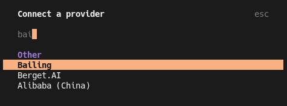

# 2026-02-28
## Overall Progress
- [ ] swapping out gpt5.3 codex for implementation
- [ ] transcript generation

## swapping out gp55.3 codex for coding
After seeing @progressEdd's demo with OpenCode and experiencing Opus 4.6 at work, I wanted to look for an equivalent service that would give similar performance and was compatible with OpenCode. I started with my GPT codex plan, but I wasn't super impressed with the past plan implementations and also I frequently reached the rate limit. I considered upgrading to the business plan, but it didn't reduce the rate limits on codex, and the pro plan of $200/month was too expensive for my use.

While browsing the opencode subreddit for other plans I came across this post which had this table
<blockquote>
# Plan Ranking (as of Feb 22, 2026)

| Rank | Plan                                  | Mentions | Sentiment           | Key Signal                                 |
| ---- | ------------------------------------- | -------- | ------------------- | ------------------------------------------ |
| 1    | Opencode Black/Zen                    | 5        | ✅ Positive          | Best value; multi-model; cheap entry       |
| 2    | Codex Plan                            | 4        | ✅ Strongly Positive | "The best"; 272K context; top performance  |
| 3    | Alibaba Cloud (Qwen)                  | 2        | ✅ Positive          | $5-10/mo; relaxed quotas; multi-model      |
| 4    | [Chutes.ai](http://Chutes.ai)         | 5        | ⚠️ Mixed+            | Cheap; unreliable for real-time use        |
| 5    | Copilot                               | 5        | ⚠️ Mixed             | Broad access; 100K context limit           |
| 6    | Minimax                               | 3        | ✅ Positive          | Best secondary/budget execution plan       |
| 7    | OpenRouter API                        | 2        | ✅ Positive          | Fair PAYG pricing; transparent             |
| 8    | Ollama Cloud                          | 2        | ➡️ Neutral           | Good quotas; slow under load               |
| 9    | ChatGPT Plus                          | 2        | ➡️ Neutral           | Needed for Codex 5.3 only                  |
| 10   | [Synthetic.new](http://Synthetic.new) | 2        | ⚠️ Mixed             | Over-capacity; low community validation    |
| 11   | [Z.AI](http://Z.AI) Coding Plan       | 1        | ➡️ Neutral           | No signal                                  |
| 12   | Claude Max/Pro                        | 3        | ❌ Negative          | Expensive; session limits; weak coding     |
| 13   | Kilocode API                          | 2        | ❌ Negative          | Accused proxy/copycat; skip for OpenRouter |
</blockquote>
https://old.reddit.com/r/opencodeCLI/comments/1rba64a/best_bang_for_your_bucks_plan/

Cursor and Claude code were other options I considered, but my cowokers complained that they frequently reached the rate limit for their side projects. Furthermore, I dislike anthropic and view them as virtue signaling hypocrites. I do not want to give my money to a company that is openly hostile to open source models, and would prefer companies public with their models and research
If you are interested in learning more: 
- [Anthropic Drops Its Huge Safety Pledge That Was Supposedly the Whole Point of the Company](https://futurism.com/artificial-intelligence/anthropic-drops-safety-pledge)
- [Anthropic confirms software engineering is NOT dead](https://youtu.be/Te2I2muO-4c?si=LthULyq2ZaYTALZZ)
- [Yann LeCun Isn’t Buying Anthropic’s Cyberattack Story](https://aimmediahouse.com/generative-ai/yann-lecun-questions-anthropic-cyberattack-claim)
  - [Yann LeCun: "You're being played by people who want regulatory capture. They are scaring everyone with dubious studies so that open source models are regulated out of existence."](https://x.com/ylecun/status/1989364612651966788?s=20)
- [Anthropic joins OpenAI in flagging 'industrial-scale' distillation campaigns by Chinese AI firms](https://www.cnbc.com/2026/02/24/anthropic-openai-china-firms-distillation-deepseek.html)
- [ Researchers question Anthropic claim that AI-assisted attack was 90% autonomous](https://arstechnica.com/security/2025/11/researchers-question-anthropic-claim-that-ai-assisted-attack-was-90-autonomous/)

I considered opencode's black/zen, but it looks like it is api/ use based. I don't want to get stuck with a potential $1000 bill, so I went with alibaba cloud. 


The [instructions](https://www.alibabacloud.com/help/en/model-studio/opencode-coding-plan?spm=a2c63.p38356.help-menu-2400256.d_0_2_2_1.a0301105qJQ8d7) for getting it setup with opencode was really confusing

to get it working I renamed the provider key

```diff
diff --git a/ali-opencode.json b/opencode.json
index 7edfa92..629f088 100644
--- a/ali-opencode.json
+++ b/opencode.json
@@ -1,6 +1,6 @@
 {
-`    "provider": {
-        "bailian-coding-plan": {
+    "provider": {
+        "model-studio-coding": {
             "npm": "@ai-sdk/anthropic",
             "name": "Model Studio Coding Plan",
             "options": {

```
as when I tried bailing, I kept getting api errors


If I followed their suggested config, it would throw the aforementioned api errors.
```json
{
  "$schema": "https://opencode.ai/config.json",
  "provider": {
    "bailian-coding-plan": {
      "npm": "@ai-sdk/anthropic",
      "name": "Model Studio Coding Plan",
      "options": {
        "baseURL": "https://coding-intl.dashscope.aliyuncs.com/apps/anthropic/v1",
        "apiKey": "YOUR_API_KEY"
      },
      "models": {
        "qwen3.5-plus": {
          "name": "Qwen3.5 Plus",
          "modalities": {
            "input": [
              "text",
              "image"
            ],
            "output": [
              "text"
            ]
          },
          "options": {
            "thinking": {
              "type": "enabled",
              "budgetTokens": 1024
            }
          }
        },
        "qwen3-max-2026-01-23": {
          "name": "Qwen3 Max 2026-01-23"
        },
        "qwen3-coder-next": {
          "name": "Qwen3 Coder Next"
        },
        "qwen3-coder-plus": {
          "name": "Qwen3 Coder Plus"
        },
        "MiniMax-M2.5": {
          "name": "MiniMax M2.5",
          "options": {
            "thinking": {
              "type": "enabled",
              "budgetTokens": 1024
            }
          }
        },
        "glm-5": {
          "name": "GLM-5",
          "options": {
            "thinking": {
              "type": "enabled",
              "budgetTokens": 1024
            }
          }
        },
        "glm-4.7": {
          "name": "GLM-4.7",
          "options": {
            "thinking": {
              "type": "enabled",
              "budgetTokens": 1024
            }
          }
        },
        "kimi-k2.5": {
          "name": "Kimi K2.5",
          "modalities": {
            "input": [
              "text",
              "image"
            ],
            "output": [
              "text"
            ]
          },
          "options": {
            "thinking": {
              "type": "enabled",
              "budgetTokens": 1024
            }
          }
        }
      }
    }
  }
}
```

This is what I ultimately used.
```json
{
  "$schema": "https://opencode.ai/config.json",
  "permission": {
    "read": {
      "~/.config/opencode/get-shit-done/*": "allow"
    },
    "external_directory": {
      "~/.config/opencode/get-shit-done/*": "allow"
    }
 },
 "provider": {
    "model-studio-coding": {
      "npm": "@ai-sdk/anthropic",
      "name": "Model Studio Coding Plan",
      "options": {
        "baseURL": "https://coding-intl.dashscope.aliyuncs.com/apps/anthropic/v1",
        "apiKey": "MY_API_KEY"
      },
      "models": {
        "qwen3.5-plus": {
          "name": "Qwen3.5 Plus",
          "modalities": {
            "input": [
              "text",
              "image"
            ],
            "output": [
              "text"
            ]
          },
          "options": {
            "thinking": {
              "type": "enabled",
              "budgetTokens": 1024
            }
          }
        },
        "qwen3-max-2026-01-23": {
          "name": "Qwen3 Max 2026-01-23"
        },
        "qwen3-coder-next": {
          "name": "Qwen3 Coder Next"
        },
        "qwen3-coder-plus": {
          "name": "Qwen3 Coder Plus"
        },
        "MiniMax-M2.5": {
          "name": "MiniMax M2.5",
          "options": {
            "thinking": {
              "type": "enabled",
              "budgetTokens": 1024
            }
          }
        },
        "glm-5": {
          "name": "GLM-5",
          "options": {
            "thinking": {
              "type": "enabled",
              "budgetTokens": 1024
            }
          }
        },
        "glm-4.7": {
          "name": "GLM-4.7",
          "options": {
            "thinking": {
              "type": "enabled",
              "budgetTokens": 1024
            }
          }
        },
        "kimi-k2.5": {
          "name": "Kimi K2.5",
          "modalities": {
            "input": [
              "text",
              "image"
            ],
            "output": [
              "text"
            ]
          },
          "options": {
            "thinking": {
              "type": "enabled",
              "budgetTokens": 1024
            }
          }
        }
      }
    }
  }
} 
```

## transcript generation
Once I got opencode setup, I used gsd to implement the transcript extraction. I used gpt 5.3 codex to discuss and create the plan, then I had GLM 5 implement it. I ran into some gpu issues using whisperx, so I had GLM swap it out for [moonshine](https://github.com/moonshine-ai/moonshine). If the results aren't as good, I was thinking of using whisper.cpp. I still need to inspect it though.

I'm pretty impressed with GLm 5, as it created a script that I could use to process a video. It took a couple of cycles, but since I wasn't rate limited, I was able to get the model to figure it out. 